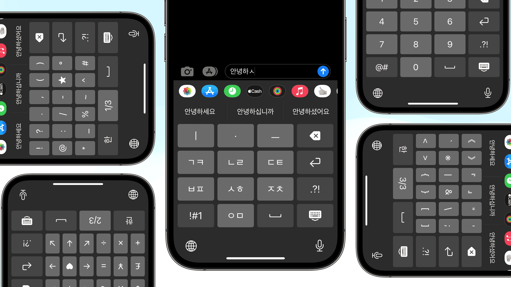
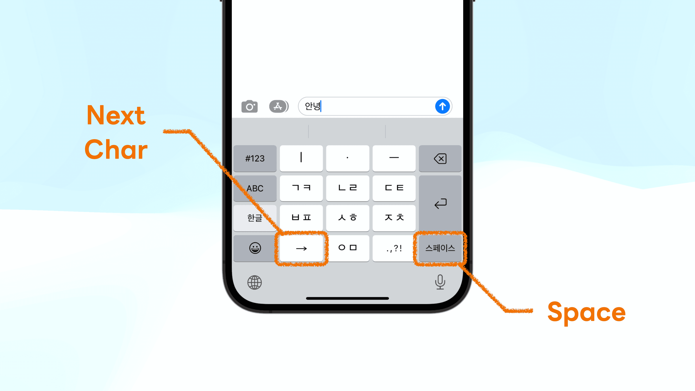
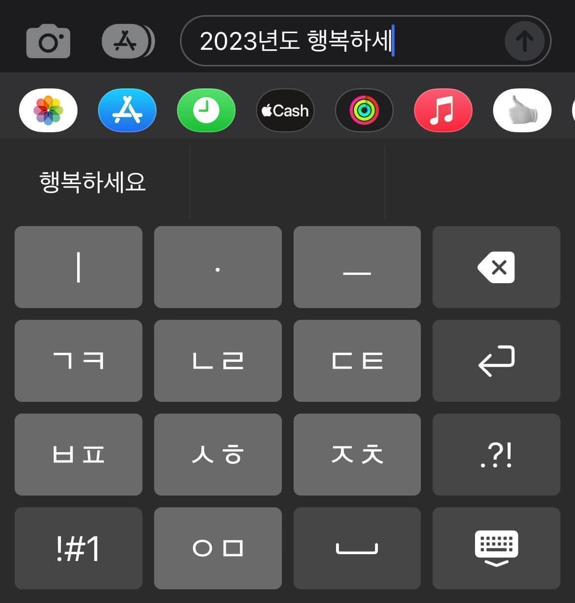
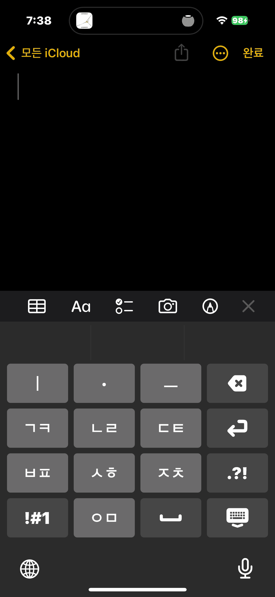
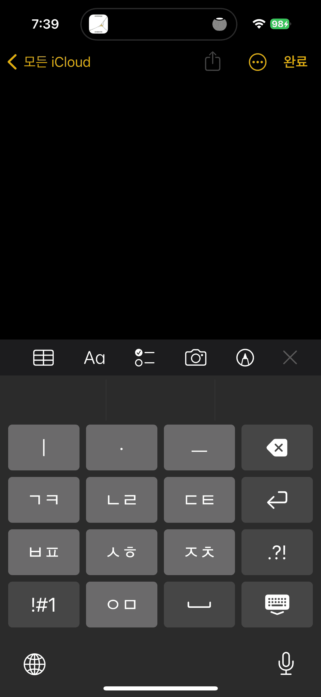
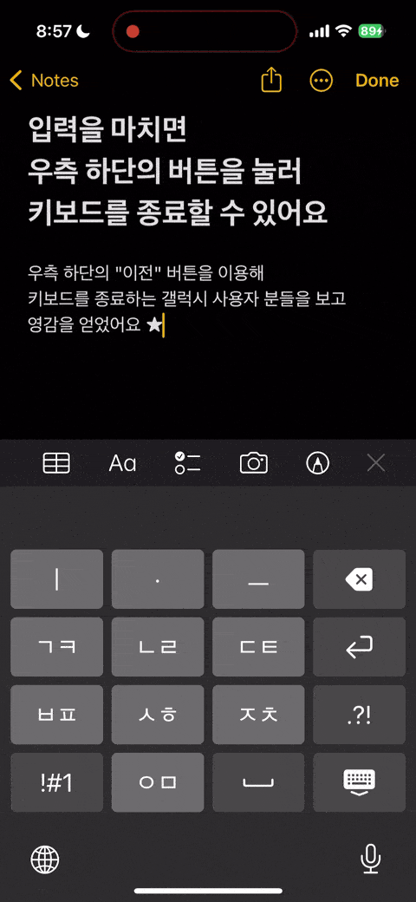
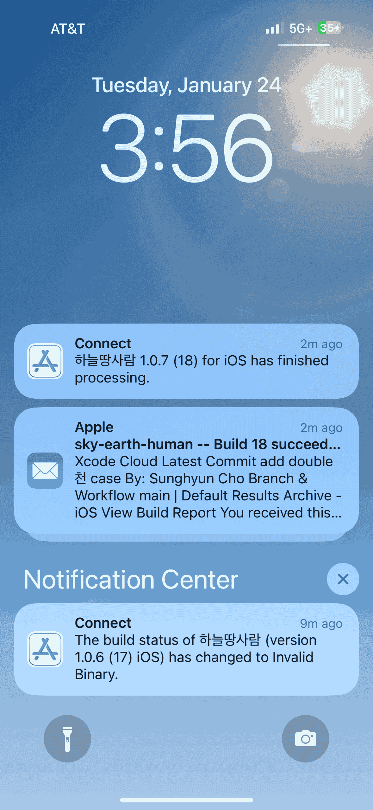

import YouTube from '@/components/youtube'



<Callout type="info" title="Give me the App Store Link first!" icon="💎">

Of course! Here is the [App Store Link](https://apps.apple.com/app/id/1666355842).
Also available on [GitHub](https://github.com/anaclumos/sky-earth-human).

</Callout>

More and more Korean citizens are considering iPhones. Interestingly, the elderly Korean generation is purchasing iPhones more than ever. While many state the primary reasons for choosing a Galaxy to be call recording and Samsung Pay, my observation after my parents switched to iPhones differed.

Unexpectedly, the most significant difficulty for older generations was the keyboard. Korean customers have had no problem typing Korean with a 10-key dial pad since the very early days because there has been a powerful input method known as "천지인" (Cheon-Ji-In, which translates to _"Sky, Earth, and Human"_) to input Hangul, the Korean characters. This was unlike Roman alphabet keyboards, which required several characters to be crammed onto a single button. Koreans had far less of a need to switch to QWERTY keyboards because of this. Many people still use Cheon-Ji-In unless they are members of Gen Z who grew up with smartphones.

The patent for Cheon-Ji-In entered the public domain in 2010. iPhone added support for Cheon-Ji-In in 2013, but its shape differed from that of the standard Cheon-Ji-In. The starkest difference was that the space button and the next character buttons were separate.



<Callout type="info" title='For example, to type "오 안녕"...' icon="💎">

- Galaxy: `ㅇ` `ᆞ` `ㅡ` → Space → `ㅇ` `ㅣ` `ᆞ` `ㄴ` → **Space** → `ㄴ` `ᆞ` `ᆞ` `ㅣ` `ㅇ`
- iPhone: `ㅇ` `ᆞ` `ㅡ` → Space → `ㅇ` `ㅣ` `ᆞ` `ㄴ` → **Next Character** → `ㄴ` `ᆞ` `ᆞ` `ㅣ` `ㅇ`

</Callout>

Moreover, the size of each button was smaller, making people produce more typos than ever. For these reasons, I decided to replicate the Galaxy Cheon-Ji-In experience on iPhones.

<Callout type="info" title="Goal" icon="💎">

Let's recreate the original Cheon-Ji-In for iPhones!

</Callout>

<Callout type="tip" title="Extra Tip" icon="🍯">

I also open-sourced the [research notes](/research/C222D1) for this project.

</Callout>

## 📜 Patents and Legal Rights

First of all, I checked the legal rights. I found that the patent holder, [조관현 (Cho Kwan-Hyeon)](https://doi.org/10.8080/1019960047925), had donated the patent to the Korean government, and Cheon-Ji-In had become the national standard for input methods, [publicizing the legal rights to the keyboard](https://www.korea.kr/news/policyBriefingView.do?newsId=148700827). So I confirmed these details and then moved on to the development process.

## 🛠 Readying the Tech

I first read through Apple's [Creating a Custom Keyboard](https://developer.apple.com/documentation/uikit/keyboards_and_input/creating_a_custom_keyboard) document. It was similar to creating a regular iOS app -- create ViewControllers and embed the logic inside. However, I wanted to try SwiftUI since it was my first time using it. Moreover, [SwiftUI Grid](https://developer.apple.com/documentation/swiftui/grid) would be a clean approach to organizing buttons. Still, I figured that this class is more suitable for things like the Photos app, which has numerous elements to lay out, and a simple HStack and VStack (similar to display: flex on the Web ecosystem) would suffice my needs.

iPhone third-party keyboards use a unique structure known as extensions. Anything not running on the main iOS app is an extension -- custom keyboards are extensions, iOS widgets are extensions, and parts of Apple Watch apps are extensions. I read through [Ray Wenderlich](https://www.kodeco.com/49-custom-keyboard-extensions-getting-started) and understood how keyboard extensions worked.


<Horizontal>


</Horizontal>


A few early prototypes


The gray background of "ㅇ" was iOS's NSRange and setMarkedText. It helped enter the text by marking the currently edited characters, but such methods seemed more suitable for Pinyin in Chinese, not Cheon-Ji-In for Hangul.

Another interesting observation was that the colors of the default iPhone keyboards differed from any default system colors provided with iOS. I had to extract the color with Color Meters one by one.

## 😶‍🌫️ But how do we make Cheon-Ji-In?


<Accordions>
<Accordion title="Supplementary YouTube video on how Hangul system works.">

<YouTube id="K53oCDZPPiw" />

</Accordion>
</Accordions>

I first thought of individual cases to figure out the input logic of Cheon-Ji-In, then figured that this is tremendously difficult. For example, take:

- To input `않`, we start with `안ㅅ` and press `ㅅㅎ` to acquire `않`. That is, we must check if the characters are "re-mergeable" with the character before.
- From `앉`, when we input `ㅡ`, it must be `안즈`. Therefore, we must check if the last consonant is extractable from the previous character.
- From `깚`, when we input `ㅂㅍ`, it should result in `깔ㅃ`. We must check if the consonants are extractable and switch between fortis and lenis (strong and weak sounds, like '/p/ and /b/', '/t/ and /d/', or '/k/ and /ɡ/' in English).
- From `갌`, when we input `ㅅㅎ`, it should result in `갏`. More than switching between `ㅅ`, `ㅎ`, and `ㅆ`, we must consider double consonant endings like `ㄽ`.

These are just a few examples. Even if we used [KS X 1001 Combinational Korean Encodings](https://en.wikipedia.org/wiki/KS_X_1001), it took a lot of work to consider all cases. I concluded that using a Finite State Machine required more than 20 data stacks and dozens of states. (I am unsure of this calculation because I guessed some parts of it; there may be a more straightforward implementation.) If you want to try building such an algorithm, refer to this [patent's diagrams](https://patents.google.com/patent/KR20000049347A/ko). I found some implementations online, but they were long and spaghettified. Translating them to the Swift language and understanding the codes would take significant time.

But then I came to an epiphany:

<Callout type="info" title='If there are too many cases...' icon="💎">

why don't I _hardcode_ every combination?

</Callout>

After all, aren't keyboards supposed to input the same character, given the input sequence is the same? What if I generate all possible combinations and put them into a giant JSON file? Korean character combinations are around 11,000. Even considering previous characters, the combinations seemed to be at most 100K levels. The size of the JSON file will not exceed 2MB.

We are not living in an era where we must golf with KBs of RAM on embedded hardware. As long as Hangul coexists with the human species, someone will recreate Cheon-Ji-In in the future, making constructing the complete Hangul map worth it.

## 🖨️ Hwalja: The most straightforward Cheon-Ji-In implementation

Therefore, I created Hwalja: the complete map 🗺️ of Hangul, containing all such states and combinations of Cheon-Ji-In. There are around 50,000 states, and the minified JSON is about 500 KB. (Note: Hwalja means movable type in Korean.)

To implement additional higher-level features (such as removing consonants, not characters, on backspace or using timers to auto-insert "next character" buttons), we need more functional workarounds; however, the critical input logic is as simple as the following:

```ts
const type = (prev: string, Hwalja: hwalja, key: string, editing: boolean) => {
  const last_two_char = prev.slice(-1)
  const last_one_char = prev.slice(-2)
  if (editing && last_one_char in Hwalja[key]) return prev.slice(0, -2) + Hwalja[key][last_one_char]
  if (editing && last_two_char in Hwalja[key]) return prev.slice(0, -1) + Hwalja[key][last_two_char]
  return prev + Hwalja[key]['']
}
```

I boldly claim this is the simplest implementation of Cheon-Ji-In, given its five-liner.

Some may ask how I preprocessed such large combinations; I set the 11,000 final Hangul characters as the destination and traced back what would've been the previous state and what button the user must have entered last. For example, to input `역,` the previous state must have been `여,` and the keypress must have been `ㄱ.` Of course, there were many more edge cases. [My work from four years ago helped a lot](https://github.com/anaclumos/hangulbreak/blob/master/Python/HangulDecomposeModule.py). The following is an interactive example of Cheon-Ji-In, made with Hwalja.

<Callout type="tip" title="Try it out!" icon="🧪">
  This is an interactive demo of Cheon-Ji-In, made with Hwalja.
</Callout>


<iframe src="https://hwalja.cho.sh/" title="Hwalja Demo" height="450" />


[I open-sourced Hwalja for platform-agnostic usage.](https://github.com/anaclumos/hwalja)<br/>Please try out the above demo!


<Callout type="info" title="Don't be mistaken..." icon="💎">
  Hwalja is the most <strong>simplest</strong> implementation, not the <strong>lightest</strong>.
</Callout>


<Accordions>
<Accordion title="Can't we use combinatory Hangul sets and normalize the combinations to reduce the case count?">

On the Hwalja project, Engineer 이성광 (Lee Sung-kwang) pointed out that [using Normalization Form D and decomposing consonants will reduce the case count](https://www.facebook.com/groups/codingeverybody/posts/8942515352455588/?comment_id=8946907612016362). I only considered Normalization Form D, but Engineer 이성광 is correct. For example, we decompose `안녕` as `안 ᄂᆞᆞㅣㅇ` and use Hwalja to gather `ᆞᆞㅣ` into `ㅕ` and then normalize `ㄴㅕㅇ` into `녕.`

I decided to maintain Hwalja's current approach because it aims for the easiest and simplest Cheon-Ji-In implementation. The current system enables developers to stick with "substring" and "replace." If I add dependencies on Normalization Form D and Unicode Normalization, the Hwalja project may be lighter, but the developers using Hwalja must add additional handlers for normalizations. I created Hwalja because using Automata and Finite State Machines had steep learning curves. Thus, requiring any learning curves to use Hwalja violates the original purpose. Also, the final minified version is already 500KB, which is manageable for a full-fledged input engine.

</Accordion>
</Accordions>

## 🤖 Implementing Keyboard Autocompletes

Cheon-Ji-In users can type at blazing speeds because of their active use of [autocompleted texts](https://support.apple.com/ko-kr/guide/iphone/iphd4ea90231/ios) (Apple QuickType). In addition, these autocompleted texts [continuously learn](https://developer.apple.com/design/human-interface-guidelines/technologies/machine-learning/roles/) from the user to assist with typing.

Fortunately, Apple's UIKit supports [UITextChecker](https://developer.apple.com/documentation/uikit/uitextchecker), which frees us from going down to Core ML and Neural Engine levels. Korean is also supported, and we can use `learnWord()` and `unlearnWord()` to record data on user activities.

```swift
import UIKit

let uiTextChecker = UITextChecker()
let input = "행복하"
let guesses = uiTextChecker.completions(
    forPartialWordRange: NSRange(location: 0, length: input.count),
    in: input,
    language: "ko-KR"
)

/*
[
  "행복한", "행복합니다", "행복하게", "행복할", "행복하다", "행복하고", "행복하지",
  "행복하다고", "행복하다는", "행복하기", "행복하면", "행복할까", "행복하길",
  "행복함을", "행복하기를", "행복함", "행복하니", "행복한테", "행복하자", "행복하네"
]
*/

```

I used such features to implement the autocomplete feature. Sometimes the flow feels unnatural, or the keyboard does not suggest anything, but this is a perfect implementation for an MVP.



## ⌨️ Advancing Keyboard Functionalities

Cheon-Ji-In, rooting from the 10-key keypad, has many higher-level functionalities, such as long-pressing backspace to delete multiple characters until you release the key or holding any key to input the corresponding number key. I used Swift's closure to extend the keyboard component.


```swift
struct KeyboardButton: View {
  var onPress: () -> Void
  var onLongPress: () -> Void
  var onLongPressFinished: () -> Void
  var body: some View {
    Button(action: {})
      .simultaneousGesture(
        DragGesture(minimumDistance: 0) // <-- A
          .onChanged { _ in
            // Code to be executed when long pressed or dragged
            onLongPress()
          }
          .onEnded { _ in
            // When long press or drag gesture finishes
            onLongPressFinished()
          }
      )
      .highPriorityGesture(
        TapGesture()
          .onEnded { _ in
            // Code to be executed on tap
            onPress()
          }
      )
  }
}
```


Code simplified for explanation. [KeyboardButton.swift](https://github.com/anaclumos/sky-earth-human/blob/main/keyboard/KeyboardButton.swift)


I found an ingenious implementation on the part marked A. With this, I can successfully implement two features with one code.

- Flicking (swiping) on a button to input numbers.
- Long-pressing on a button to input numbers.

It utilizes iOS's behavior that when the minimum distance of DragGesture is set to 0, iOS cancels the highPriorityGesture when it recognizes long-press and falls back to DragGesture.

Furthermore, I used [Combine](https://developer.apple.com/documentation/combine), introduced with iOS13. Combine Framework is a Declarative Swift API to implement asynchronous operations. With this, we can create timers to implement the "long press backspace" action.


```swift
struct DeleteButton: View {
  @State var timer: AnyCancellable?
  var body: some View {
    KeyboardButton(systemName: "delete.left.fill", primary: false, action: {
      // on tap, execute the default delete action.
      options.deleteAction()
    },
    onLongPress: {
      // when long pressed, create a timer that will trigger every 0.1 seconds.
      timer = Timer.publish(every: 0.1, on: .main, in: .common)
        .autoconnect()
        .sink { _ in
          // while pressing the button, execute the delete action every 0.1 seconds.
          options.deleteAction()
        }
    },
    onLongPressFinished: {
      // when the long press finishes, cancel the timer.
      timer?.cancel()
    })
  }
}
```


Code simplified for explanation. [HangulView.swift](https://github.com/anaclumos/sky-earth-human/blob/main/keyboard/HangulView.swift)


With these codes, I implemented particular functionalities using long-press or drag gestures.

## 🦾 Accessibility and usability

I added a few helpful accessibility features. For example, if the user enables "bold text," the keyboard button will reflect the change. The following code implements such behavior.

```swift
let fontWeight: UIAccessibility.isBoldTextEnabled ? .bold : .regular
```

<Horizontal>




</Horizontal>

Also, I found one feature particularly inspirational. This keyboard is primarily for those Galaxy android devices with a "back" button in the bottom right corner. Galaxy users are used to dismissing the keyboard with the "back" button. So I placed the keyboard's dismiss button in the bottom right corner to resemble this.



## 🧑🏻‍🎨 Using Midjourney to create the app icon


Images created with Midjourney


I used Midjourney, a text-to-image AI program, to create the app icon. This is called prompt engineering. Creating paintings with various keywords was amusing.

## ☁️ CI/CD with Xcode Cloud

Finally, I built CI/CD using Xcode Cloud (released in 2022).
When using this, if you push your React code to GitHub, Vercel will build and deploy it independently. iOS apps are compiled and stored on the Apple Xcode Cloud servers. For Apple iPhone apps, there is an App Store review process, so they are not automatically distributed. (You must select a build in the App Store console and hit the "request review" button.) Still, it's much easier than creating an archive file in Xcode and manually uploading it.

<Horizontal>





</Horizontal>

## 🏁 Finishing up

It has been a while since I did iOS development; it was a thrilling experience. The iOS platform has greatly matured. In particular, while working on Hwalja, I felt that Hangul was meticulously engineered. Most of all, I felt good because I made this app for my parents as a present. I will finish this article by attaching the links.

<Callout type="info" title="A five-star review on the App Store and a star on GitHub would really help me!" icon="💙">

- [App Store](https://apps.apple.com/app/id/1666355842)
- [GitHub Repo](https://github.com/anaclumos/sky-earth-human)
- [Subproject "Hwalja" GitHub Repo](https://github.com/anaclumos/hwalja)

</Callout>
