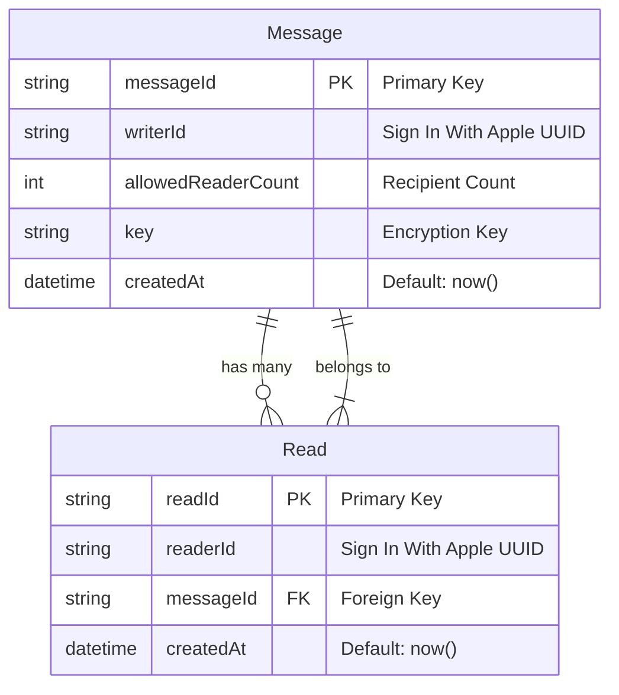

```mermaid
erDiagram
    Message {
        string messageId PK "Primary Key"
        string writerId "Sign In With Apple UUID"
        int allowedReaderCount "Recipient Count"
        string key "Encryption Key"
        datetime createdAt "Default: now()"
    }
    Read {
        string readId PK "Primary Key"
        string readerId "Sign In With Apple UUID"
        string messageId FK "Foreign Key"
        datetime createdAt "Default: now()"
    }

    Message ||--o{ Read : "has many"
    Read }|--|| Message : "belongs to"

```
