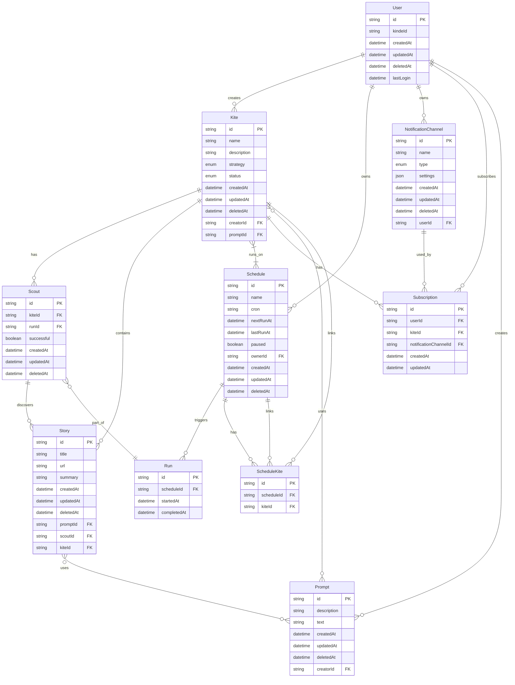

```mermaid
erDiagram
    User ||--o{ Kite : "creates"
    User ||--o{ Schedule : "owns"
    User ||--o{ NotificationChannel : "owns"
    User ||--o{ Subscription : "subscribes"
    User ||--o{ Prompt : "creates"

    Kite ||--o{ Scout : "has"
    Kite ||--o{ Story : "contains"
    Kite }|--|{ Schedule : "runs_on"
    Kite ||--o{ Subscription : "has"
    Kite }o--o{ Prompt : "uses"

    Schedule ||--o{ Run : "triggers"
    Schedule ||--o{ ScheduleKite : "has"

    Scout ||--o{ Story : "discovers"
    Scout }o--|| Run : "part_of"

    Story }o--o{ Prompt : "uses"

    NotificationChannel ||--o{ Subscription : "used_by"

    ScheduleKite }o--|| Kite : "links"
    ScheduleKite }o--|| Schedule : "links"

    User {
        string id PK
        string kindeId
        datetime createdAt
        datetime updatedAt
        datetime deletedAt
        datetime lastLogin
    }

    Kite {
        string id PK
        string name
        string description
        enum strategy
        enum status
        datetime createdAt
        datetime updatedAt
        datetime deletedAt
        string creatorId FK
        string promptId FK
    }

    Schedule {
        string id PK
        string name
        string cron
        datetime nextRunAt
        datetime lastRunAt
        boolean paused
        string ownerId FK
        datetime createdAt
        datetime updatedAt
        datetime deletedAt
    }

    Scout {
        string id PK
        string kiteId FK
        string runId FK
        boolean successful
        datetime createdAt
        datetime updatedAt
        datetime deletedAt
    }

    Story {
        string id PK
        string title
        string url
        string summary
        datetime createdAt
        datetime updatedAt
        datetime deletedAt
        string promptId FK
        string scoutId FK
        string kiteId FK
    }

    NotificationChannel {
        string id PK
        string name
        enum type
        json settings
        datetime createdAt
        datetime updatedAt
        datetime deletedAt
        string userId FK
    }

    Subscription {
        string id PK
        string userId FK
        string kiteId FK
        string notificationChannelId FK
        datetime createdAt
        datetime updatedAt
    }

    Prompt {
        string id PK
        string description
        string text
        datetime createdAt
        datetime updatedAt
        datetime deletedAt
        string creatorId FK
    }

    Run {
        string id PK
        string scheduleId FK
        datetime startedAt
        datetime completedAt
    }

    ScheduleKite {
        string id PK
        string scheduleId FK
        string kiteId FK
    }
```
