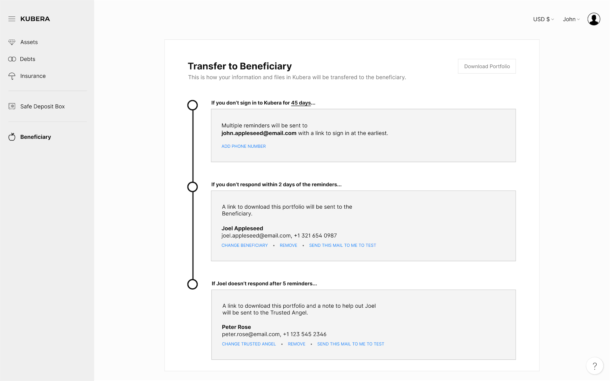

## Work Notes

- Learn more about [Atomics (JavaScript)](./../.././docs/pages/Atomics%20%28JavaScript%29.md) and [SharedArrayBuffer](./../.././docs/pages/SharedArrayBuffer.md)
- Confirm [WorkerDOM](./../.././docs/pages/WorkerDOM.md)'s Binary [DOM](./../.././docs/pages/DOM.md) Manipulation channel.

## Personal Notes

<figure>

</figure>

_Kubera has a unique sharing feature that ensures the safe transfer of your information to your loved ones if something unexpected happens to you. As a user of Kubera, you can nominate a contact as your Beneficiary. Kubera has a "life beat" check. If you're inactive for a certain number of days and don't respond to Kubera's attempt to reach you, a mail with all your information in downloadable format will be sent to the Beneficiary. A fallback contact \(Trusted Angel\), who you trust to help out in difficult times, can also be optionally nominated to receive this mail in case the Beneficiary fails to respond even after multiple reminders. _ - [Is Kubera better than Excel \(or Google Sheets\) as a Portfolio Tracker?](https://www.kubera.com/blog/using-excel-or-google-sheets-for-tracking-net-worth)

- Digital Will Services

<head>
  <html lang="en-US"/>
</head>
