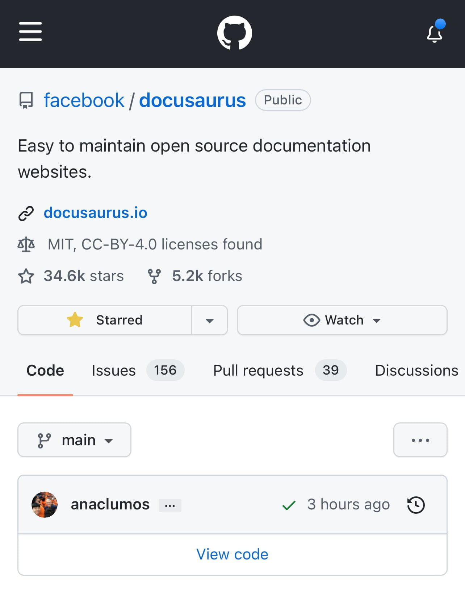
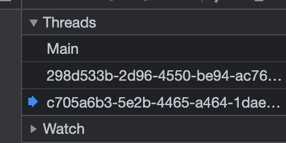
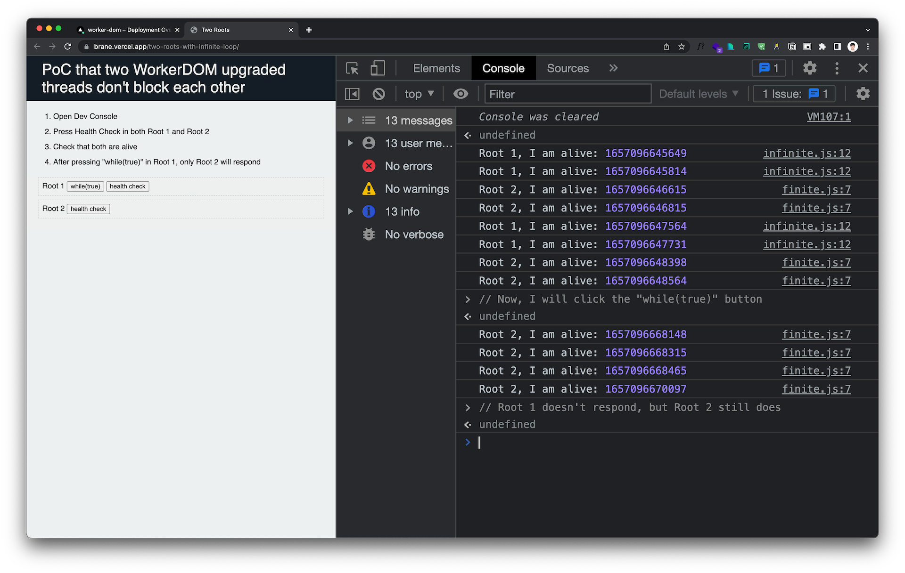

## Personal Notes

- [PARA](./../.././docs/pages/PARA.md)... might be worse than I thought?
  - The structure is unintuitive and redundant.
  - I might come up with my own structure.
  - Current idea: `Projects`, `Research`, `Readings`, `Journals`.
- contact mail and signup mail -- separation necessary?
- Merged! 
- A successful business sells lifestyles and dreams. Did they succeed by selling a dream, or did they rebrand themselves when they got enough cash?

## Work Notes

### [Brane](./../.././docs/pages/Brane.md)

- Decided with `two-roots.` Locally confirmed it operates correctly.

<figure>

<figcaption>Confirmed that two WorkerDOM threads and one main thread appear.</figcaption>
</figure>

- One thing to confirm: `two-roots` uses `getBoundingClientRectAsync`

<figure>

<figcaption>The above redundancy is for different browser supports for `module`.)</figcaption>
</figure>

### [Brane](./../.././docs/pages/Brane.md) [WorkerDOM](./../.././docs/pages/WorkerDOM.md) Non-blocking Example

<figure>

</figure>

- Implemented the Technical [Proof of Concept](./../.././docs/pages/Proof%20of%20Concept.md) and posted here: _[PoC](./../.././docs/pages/Proof%20of%20Concept.md) that two [WorkerDOM](./../.././docs/pages/WorkerDOM.md) upgraded threads don't block each other_ - [Two Roots](https://brane.vercel.app/two-roots-with-infinite-loop/)

1.  Open Dev Console.
2.  Press Health Check in both Root 1 and Root 2.
3.  Check that both are alive.
4.  After pressing "while(true)" in Root 1, only Root 2 will respond.

## Interesting Webs

### [Bun is a fast all-in-one JavaScript runtime](https://bun.sh/)

- Bun is a fast all-in-one [JavaScript](./../.././docs/pages/JavaScript.md) runtime
- Bundle, transpile, install and run [JavaScript](./../.././docs/pages/JavaScript.md) & [TypeScript](./../.././docs/pages/TypeScript.md) projects — all in Bun. Bun is a new [JavaScript](./../.././docs/pages/JavaScript.md) runtime with a native bundler, transpiler, task runner and npm client built-in

<head>
  <html lang="en-US"/>
</head>
