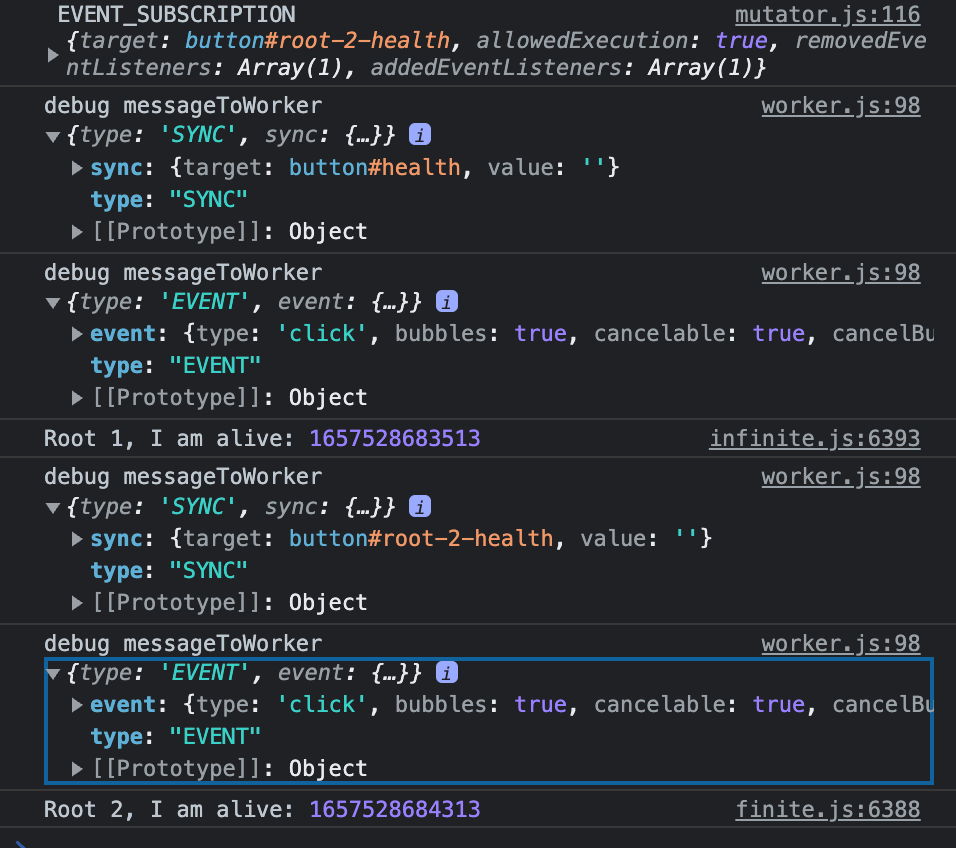
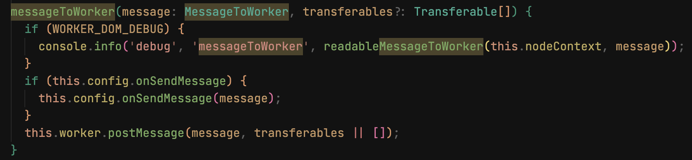

## [Brane](./../.././docs/pages/Brane.md) Notes

In easy words, [Brane](./../.././docs/pages/Brane.md) is about making a pseudo-ATM.
First, make a giant [JavaScript](./../.././docs/pages/JavaScript.md) object.
This giant object has lots of APIs which look exactly like [DOM](./../.././docs/pages/DOM.md) APIs.
Give this object to a [Web Worker](./../.././docs/pages/Web%20Worker.md) which includes third-party codes.

<figure>

<figure>

</figure>

<figcaption>

ATM = Real [DOM](./../.././docs/pages/DOM.md).
Client = Third-party codes.
Person behind the ATM = [Brane](./../.././docs/pages/Brane.md).

</figcaption>
</figure>

### Progress

- Used `debug/main.js` to find `console` printouts.

<figure>

<figure>

</figure>

<figcaption>

Confirmed a demo script created on [2022-07-06](./../.././docs/journals/2022-07-06.md) yields logs as above.

</figcaption>
</figure>

<figure>

<figure>

</figure>

<figcaption>

Source of these `console` printouts.

</figcaption>
</figure>

### Naïve plan — Drop-and-Replace `postMessage`

What if we drop-and-replace `postMessage` with `postViaSab`?
Make `postViaSab` that follows the same interface as `postMessage` but is internally made with [SharedArrayBuffer](./../.././docs/pages/SharedArrayBuffer.md).
Wouldn't this yield much higher [throughput](./../.././docs/pages/Throughput.md)? (No, it wouldn't.)

### Shortcomings of [SharedArrayBuffer](./../.././docs/pages/SharedArrayBuffer.md)

- **Fixed in Size**
- **Thread-Unsafe**
- **Synchronous**

[Brane](./../.././docs/pages/Brane.md) requires explicit **[schedulers](./../.././docs/pages/Scheduler.md)** and **abstractions** to overcome these shortcomings.
Drop-and-replace will not be that easy.
But what do I mean by this?

### [Schedulers](./../.././docs/pages/Scheduler.md)

Currently, [WorkerDOM](./../.././docs/pages/WorkerDOM.md) only has asynchronous data channels.
[WorkerDOM](./../.././docs/pages/WorkerDOM.md) batch processes requests between agents (i.e., it collects operations and sends them at once.)
[WorkerDOM](./../.././docs/pages/WorkerDOM.md) will have [Scheduler](./../.././docs/pages/Scheduler.md) support for general tasks, extended tasks, etc.
What kinds of data channels does [WorkerDOM](./../.././docs/pages/WorkerDOM.md) have?

> Would it be efficient to change all asynchronous data channels to synchronous [SharedArrayBuffer](./../.././docs/pages/SharedArrayBuffer.md)?

In easy words, [Brane](./../.././docs/pages/Brane.md) implements a premium-tier [SharedArrayBuffer](./../.././docs/pages/SharedArrayBuffer.md) fast lane that will handle priority tasks.
It might block user interaction because [SharedArrayBuffer](./../.././docs/pages/SharedArrayBuffer.md) is synchronous. This is why we need a proper **_[Scheduler](./../.././docs/pages/Scheduler.md)_**.

:::info
Priority: ① User Interaction ② Layout Operations ③ Other Operations
:::

### Abstractions

The reason for such [SharedArrayBuffer](./../.././docs/pages/SharedArrayBuffer.md) is to eradicate any compatibility issues.
For example, one incompatible operation is `Element.prototype.getClientBoundingRect()`.
Animation in [JavaScript](./../.././docs/pages/JavaScript.md) requires synchronous layout calculation because it depends on values that could only be found after [DOM Reflow](./../.././docs/pages/DOM%20Reflow.md).
This calculation _must_ process in a blocking condition.
This blocking condition _must_ happen in [SharedArrayBuffer](./../.././docs/pages/SharedArrayBuffer.md).
[WorkerDOM](./../.././docs/pages/WorkerDOM.md) cannot handle animation libraries because it lacks synchronous API support.

We aim to build [Cooperative Multitasking](./../.././docs/pages/Cooperative%20Multitasking.md).
However, a guest app should look as [Preemptive Multitasking](./../.././docs/pages/Preemptive%20Multitasking.md) as if blocking APIs blocks a thread.
Blocking in [JavaScript](./../.././docs/pages/JavaScript.md) can be done in two ways.
[Brane](./../.././docs/pages/Brane.md) should use either of the above to attain [Cooperative Multitasking](./../.././docs/pages/Cooperative%20Multitasking.md).

1. **Synchronous XMLHttpRequest**.
2. **[Atomics (JavaScript)](./../.././docs/pages/Atomics%20%28JavaScript%29.md) API**. Use `wait()` and `notify()` for blocking constructs.

To automatically use [Atomics (JavaScript)](./../.././docs/pages/Atomics%20%28JavaScript%29.md) API for every third-party app, [Brane](./../.././docs/pages/Brane.md) should **_abstract_** this process.

### Final Goal

- Replace all unofficial implementation of `getClientBoundingRect` in [WorkerDOM](./../.././docs/pages/WorkerDOM.md) with `Element.prototype.getClientBoundingRect()`.
- Geolocation _might_ be easier, because it is an asynchronous API.
- The hard part is transports and [schedulers](./../.././docs/pages/Scheduler.md).

### Codecs

We will need a codec to share data on [SharedArrayBuffer](./../.././docs/pages/SharedArrayBuffer.md).
Candidates include [MessagePack](./../.././docs/pages/MessagePack.md) and [CBOR](./../.././docs/pages/CBOR.md).
We could also make our codec.

## Personal Notes

- [Better Docusaurus](./../.././docs/pages/Better%20Docusaurus.md)
- Fortune Cookie: Collaborate with those who possess both intelligence and integrity.

<head>
  <html lang="en-US"/>
</head>
