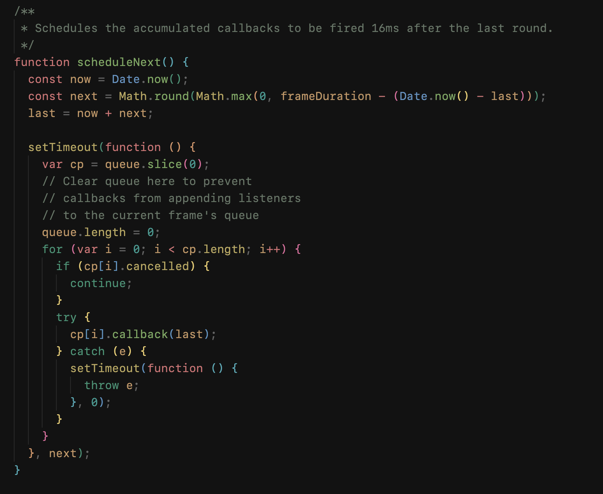
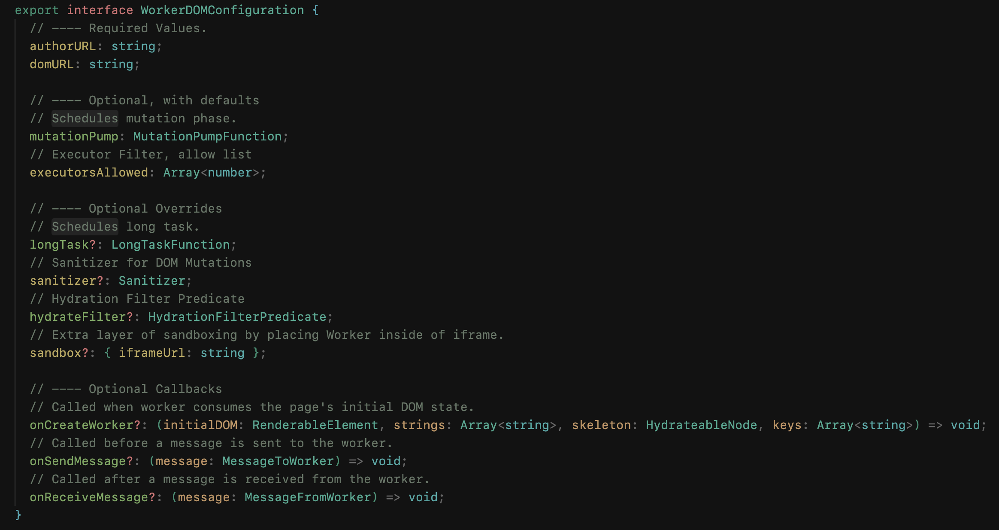
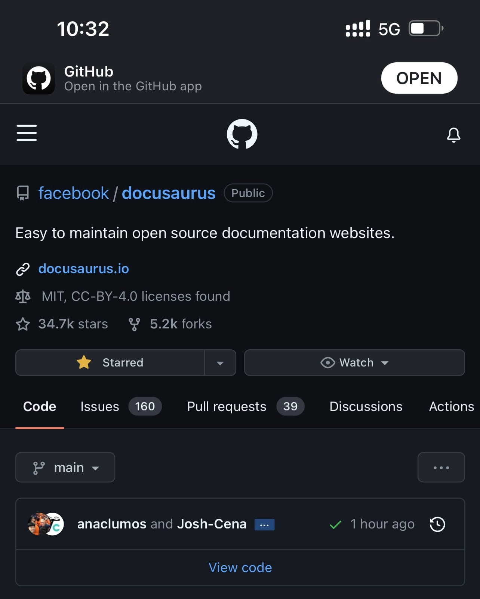

## Work Notes

**Status Quo**.
On [2022-07-11](./../.././docs/journals/2022-07-11.md), I analyzed that [Brane](./../.././docs/pages/Brane.md) is harder than it seems.
Thus I now need to reassess our goals.
[Brane](./../.././docs/pages/Brane.md)'s previous demo goals were:

1. Demo [JavaScript](./../.././docs/pages/JavaScript.md) animation works as expected.
   - This involves [SAB](./../.././docs/pages/SharedArrayBuffer.md)
2. Demo Isolation
3. Demo Multitasking (and Preloading)

Everything above seems possible.
However, I don't know how long it will take nor how hard it will be.
It is like a black box.
And typically, black-box situations take at least 4x more time.

### [Schedulers](./../.././docs/pages/Scheduler.md) in [WorkerDOM](./../.././docs/pages/WorkerDOM.md)

<figure>

<figcaption>Worker Thread AnimationFrame</figcaption>
</figure>

<figure>

<figcaption>Main Thread WorkerDOM Configuration</figcaption>
</figure>

## Personal Notes

- [Better Aldehyde](./../.././docs/pages/Better%20Aldehyde.md)
- [Better Obsidian](./../.././docs/pages/Better%20Obsidian.md)
- [Better Docusaurus](./../.././docs/pages/Better%20Docusaurus.md)
- [Better Hacker News](./../.././docs/pages/Better%20Hacker%20News.md)
- [chore\(theme-translations\): complete ko translations](https://github.com/facebook/docusaurus/pull/7762) Merged!

<figure>

</figure>

<head>
  <html lang="en-US"/>
</head>
