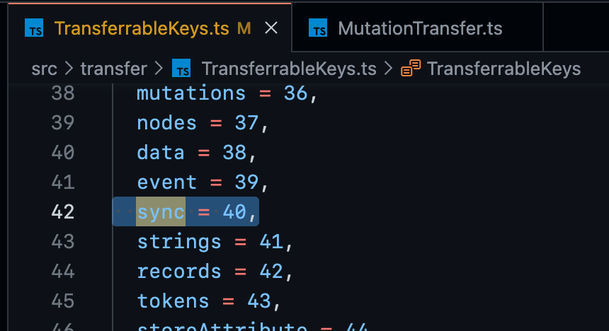
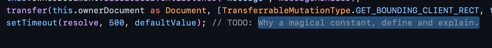

## Work Research

See [2022-07-19](./../.././docs/journals/2022-07-19.md).

- (Unconfirmed)
- Inside [Web Worker](./../.././docs/pages/Web%20Worker.md) Thread `MutationTransfer.ts`, create a `transferSync` layer.
- Add a key `TransferrableKeys.sync`.
- Whenever we need a synchronous operation,
  - Allocate a [SharedArrayBuffer](./../.././docs/pages/SharedArrayBuffer.md) inside `transferSync`.
  - Run `Atomic.wait()` at the main thread.
  - Run the calculation at the corresponding processor on the main thread.
  - Pass the data into the received [SharedArrayBuffer](./../.././docs/pages/SharedArrayBuffer.md).
  - Unfreeze the [Web Worker](./../.././docs/pages/Web%20Worker.md) thread with `Atomic.notify()`.

### Progress

Wait... `TransferrableKeys.sync` already exists. Why?

<figure>

</figure>

### [Google](./../.././docs/pages/Google.md), really? Come on.

FYI, it's been aa couple of years.

<figure>

</figure>

## Personal Research

_Isaac Newton, while studying, first wrote down the title he was interested in, then filled up the note by reading and experimenting.
He was a self-taught Note-aholic, and his discovery of gravity originated from such immense curiosity.
Would there be any historical figure who succeeded from pure intellect without the help of note-taking or some second brain?_

<head>
  <html lang="en-US"/>
</head>
