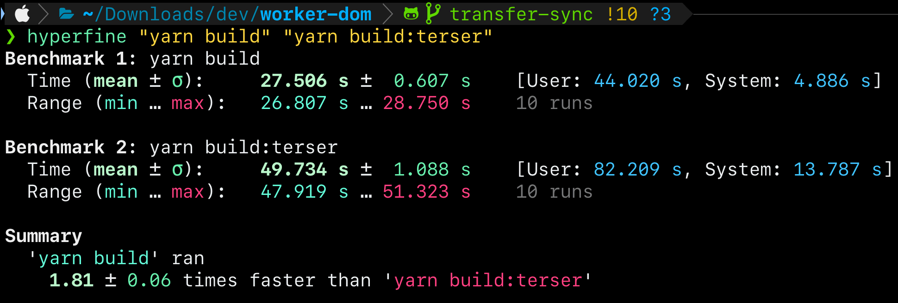

## Work Research

Replaced Terser with ESBuild.
Improved build speed by 81%!
Knowing that Terser does slightly more optimization under the hood, we can imagine a build flow where we use ESBuild for developer build and Terser for Production builds.

<figure>

</figure>

Also, I succeeded on fooling `getBoundingClientRect()` on top of [WorkerDOM](./../.././docs/pages/WorkerDOM.md).
This happens synchronously using [Atomics (JavaScript)](./../.././docs/pages/Atomics%20%28JavaScript%29.md) and [SharedArrayBuffer](./../.././docs/pages/SharedArrayBuffer.md).
For my internship's next and final step, I will containerize React Flip Toolkit on top of [WorkerDOM](./../.././docs/pages/WorkerDOM.md) using the same technique.

<figure>

</figure>

- [anaclumos/worker-dom at d6704c1cc0548b1f3eacfda969789e4e16455a92](https://github.com/anaclumos/worker-dom/tree/d6704c1cc0548b1f3eacfda969789e4e16455a92)

## Personal Research

### [S/MIME](./../.././docs/pages/SMIME.md) Certificates

Integrated Actalis [S/MIME](./../.././docs/pages/SMIME.md) certificate with iCloud Custom Email Domain.
Now shows a verified checkmark.

import DisplayFlex from '@site/src/components/DisplayFlex'

<DisplayFlex>

<figure>

</figure>

<figure>

</figure>

</DisplayFlex>

### [iiframe](./../.././docs/pages/iiframe.md)

Life drives you to places you never expected...
I never expected to get an internship at Karrot four months ago.
[Brane](./../.././docs/pages/Brane.md) is a vast [project](./../.././docs/pages/Project.md) that a single intern can't finish.
However, I have some regrets about engineering and time management.
I did reach a milestone in implementing synchronicity inside [WorkerDOM](./../.././docs/pages/WorkerDOM.md), but now I finally realize various advanced use cases exist in such a framework.
One straightforward use case [iiframe](./../.././docs/pages/iiframe.md) — improved iframe — that specializes in containerizing iframes in [Web Workers](./../.././docs/pages/Web%20Worker.md).

<head>
  <html lang="en-US"/>
</head>
