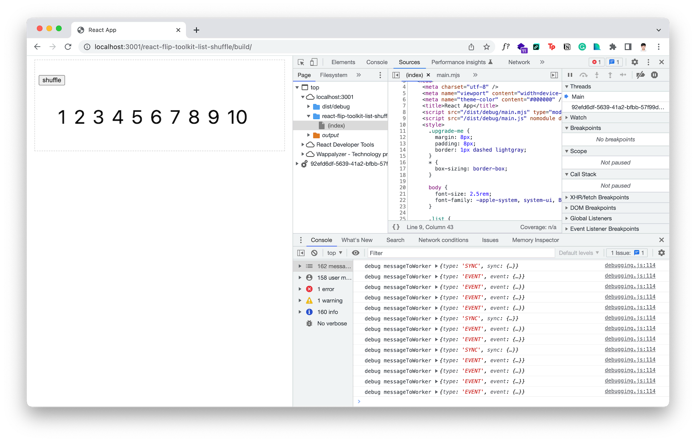
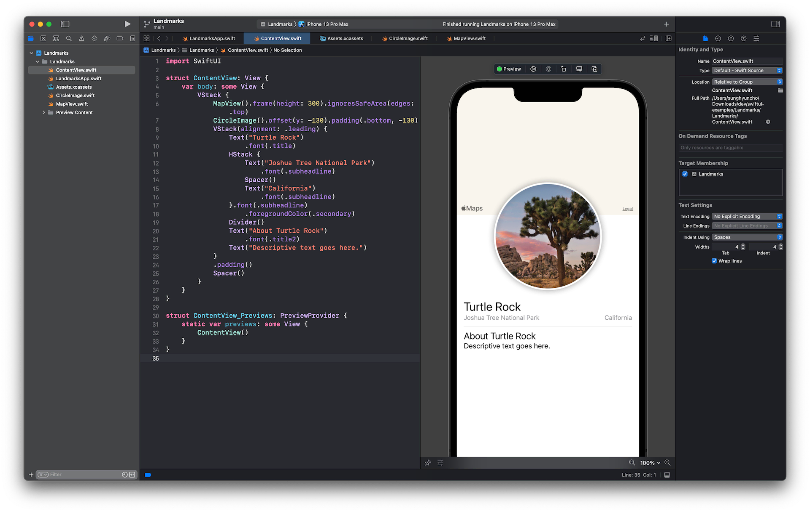

## Work Research

[React](./../.././docs/pages/React.md) Flip Toolkit List Shuffle를 띄우는 중이다.
다음 커밋에서 [React](./../.././docs/pages/React.md) App을 렌더링하는 것까지는 성공했다.

- [anaclumos/worker-dom at f8c18c2f6d8ab92b17eb17e18f647388e5129917](https://github.com/anaclumos/worker-dom/tree/f8c18c2f6d8ab92b17eb17e18f647388e5129917)

다만 Shuffle 버튼을 눌러도 Elements들이 움직이지는 않는다.
`demo` 폴더의 해당 [React](./../.././docs/pages/React.md) 앱에 들어가서 `npm run build` 해주고 `build/index.html`에서 첨부되는 [React](./../.././docs/pages/React.md) `script`를 삭제해야한다.

<figure>

</figure>

## Personal Research

### Explored [SwiftUI](./../.././docs/pages/SwiftUI.md).

1. I Love the declarative interface.
2. It Feels like using [React](./../.././docs/pages/React.md) (or even better.)
3. Xcode is still heavy.
4. Happy to quit fiddling with Storyboard. Every change happens in code but in a declarative way. Huge fan.
5. Creating a component-based view is easier than ever.

I will continue to explore.

- [SwiftUI Tutorials | Apple Developer Documentation](https://developer.apple.com/tutorials/swiftui)

<figure>

</figure>

### [Optimistic Nihilism](./../.././docs/pages/Optimistic%20Nihilism.md)

Optimistic nihilism views the belief that there is no underlying meaning to life from a perspective of hope. It's not that we're doomed to live in a meaningless universe-it's that we get the chance to experience ourselves and the universe we share.

### IconBrew

- [Tools I will use one day](./../.././docs/pages/Tools%20I%20will%20use%20one%20day.md)

### [CELLO (Product)](./../.././docs/pages/CELLO%20%28Product%29.md)

- Intermediary [PoC](./../.././docs/pages/Proof%20of%20Concept.md) Product: [ULLO](./../.././docs/pages/ULLO.md)

<head>
  <html lang="en-US"/>
</head>
