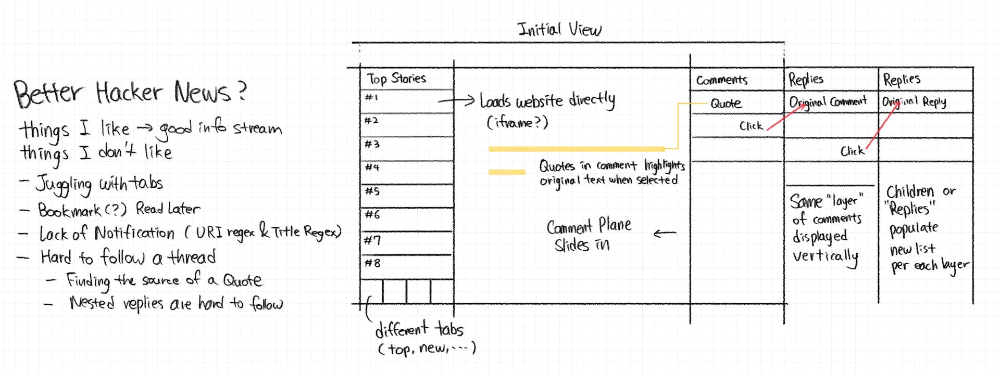
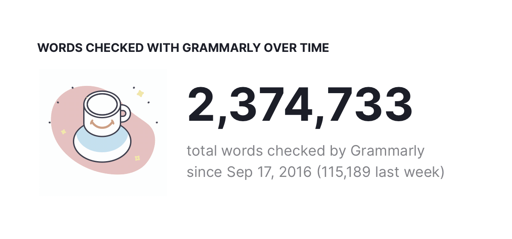

> As the 120-ton space shuttle sits surrounded by almost 4 million pounds of rocket fuel, exhaling noxious fumes, visibly impatient to defy gravity, its onboard computers take command. [They Write the Right Stuff](https://www.fastcompany.com/28121/they-write-right-stuff)

## Personal Research

- [Dynamic Island on the Web](./../.././docs/pages/Dynamic%20Island%20on%20the%20Web.md)
- [Handwriting Tools for Thoughts](./../.././docs/pages/Handwriting%20Tools%20for%20Thoughts.md)
- [Slow Down Your Clock Cycle Speed](./../.././docs/pages/Slow%20Down%20Your%20Clock%20Cycle%20Speed.md)
- [Letter to Mr. Alexander Obenauer on 2022-10-12](./../.././docs/pages/Letter%20to%20Mr.%20Alexander%20Obenauer%20on%202022-10-12.md)
- [Personal Training Corpus](./../.././docs/pages/Personal%20Training%20Corpus.md)
- [Cosmic noises of life](./../.././docs/pages/Cosmic%20noises%20of%20life.md)
- [Better Hacker News](./../.././docs/pages/Better%20Hacker%20News.md)

<figure>

</figure>

<figure>

<figcaption>My Grammarly Stat as of Oct 10, 2022</figcaption>
</figure>

## Noteworthy

- [Jetbrains Fleet](./../.././docs/pages/Jetbrains%20Fleet.md) is [GA](./../.././docs/pages/GA.md): [Introducing the Fleet Public Preview](https://blog.jetbrains.com/fleet/2022/10/introducing-the-fleet-public-preview)

## [TODO](./../.././docs/pages/TODO.md)

- [x] Reply to [Grammarly](./../.././docs/pages/Grammarly.md) Recruiter
- [x] Revert Toggle Design
  - [x] Archived [iOS Style Toggle in CSS](./../.././docs/pages/iOS%20Style%20Toggle%20in%20CSS.md)
- [x] Review Midterm Results
- [x] Finish PayPal's OA
  - [x] [Real Exams](./../.././docs/pages/Real%20Exams.md)
- [x] Merge Academics and Research

<head>
  <html lang="en-US"/>
</head>
