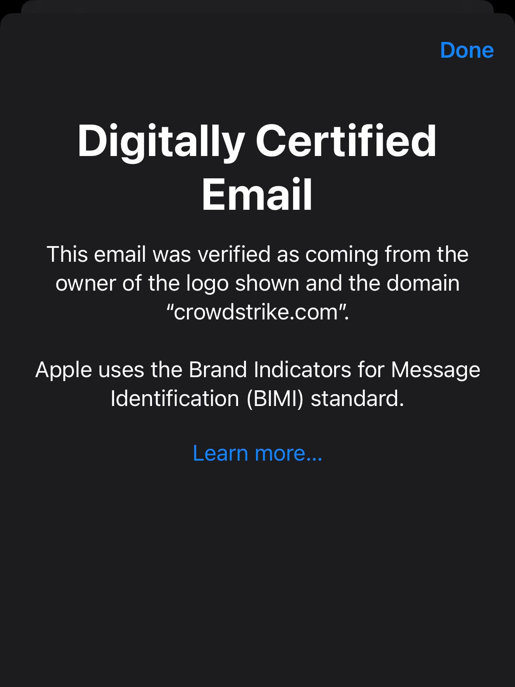

Today I got this email (although it seems like it was sent by mistake)

import DisplayFlex from '@site/src/components/DisplayFlex'

<DisplayFlex>

<figure>

</figure>

<figure>

</figure>

</DisplayFlex>

<figure>

</figure>

### References

- [About BIMI support in Apple Mail - Apple Support](https://support.apple.com/en-us/HT213155)
- [BIMI](./../.././docs/pages/BIMI.md)

## Personal Research

- [Linear: "This is not a manifesto. This is not a codex. This is not a whitepaper. This is not a secret master plan. This is just a simple story. A story about magic. README"](https://twitter.com/linear/status/1504485344355381254)
  - [Linear](./../.././docs/pages/Linear.md) has been popping up on my Twitter threads.
  - Especially [Linear README](./../.././docs/pages/Linear%20README.md)
- [Biden-Harris Administration's National Security Strategy.pdf](https://www.whitehouse.gov/wp-content/uploads/2022/10/Biden-Harris-Administrations-National-Security-Strategy-10.2022.pdf)
- [Toss Product Sans](./../.././docs/pages/Toss%20Product%20Sans.md)
- [WebAssembly](./../.././docs/pages/WebAssembly.md)

<head>
  <html lang="en-US"/>
</head>
