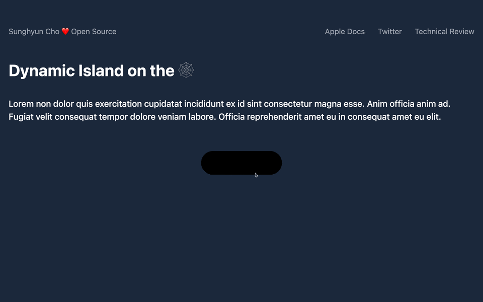

## Inspecting [Assembly](./../.././docs/pages/Assembly.md)

- [Inspecting Assembly](./../.././docs/pages/Inspecting%20Assembly.md)

## Personal Research

- [Dynamic Island on the Web](./../.././docs/pages/Dynamic%20Island%20on%20the%20Web.md)
- [Letter to Mr. Stephan Ango on 2022-10-19](./../.././docs/pages/Letter%20to%20Mr.%20Stephan%20Ango%20on%202022-10-19.md)
- [Memex is more than a Memex](./../.././docs/pages/Memex%20is%20more%20than%20a%20Memex.md)

<figure>

</figure>

## [HN](./../.././docs/pages/Hacker%20News.md)

- [AI replaces expensive jobs first](./../.././docs/pages/AI%20replaces%20expensive%20jobs%20first.md)
- [Tailscale](./../.././docs/pages/Tailscale.md)
- [Is DevOps Overrated](./../.././docs/pages/Is%20DevOps%20Overrated.md)
- [FFMpeg for iPad](./../.././docs/pages/FFMpeg%20for%20iPad.md)

### [EasyList is in trouble, and so are many ad blockers](https://adguard.com/en/blog/easylist-filter-problem-help.html)

1.  There's an [open-source Android browser](https://github.com/hazuki0x0/YuzuBrowser) (now seemingly abandoned) that implements ad-blocking functionality.
2.  This [browser](./../.././docs/pages/Web%20Browser.md) is forked by a couple of other [browsers](./../.././docs/pages/Web%20Browser.md) that are very popular in India.
3.  The problem is that this [browser](./../.././docs/pages/Web%20Browser.md) has a severe flaw. It tries to download filter updates on **every startup**, and on [Android](./../.././docs/pages/Android.md), it may happen many times daily. It can even happen when the [browser](./../.././docs/pages/Web%20Browser.md) is running in the background.

### Others

- [How to use the watch as a Compass (Northern Hemisphere, for instance) | CITIZEN WATCH Global Network](https://www.citizenwatch-global.com/support/exterior/direction.html)
  - Using that Sun's apex is toward complete south.

<head>
  <html lang="en-US"/>
</head>
