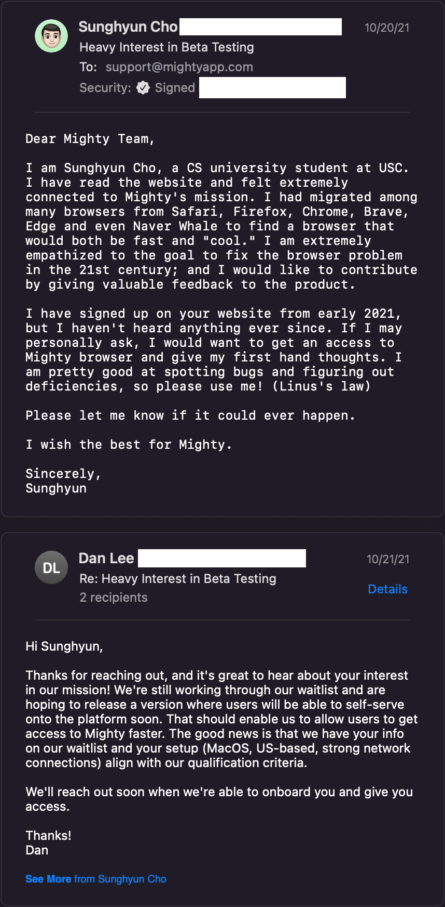

## Personal Research

## [HN](./../.././docs/pages/Hacker%20News.md)

- [Satori](./../.././docs/pages/Satori.md): [Create OG images for your blog with Next.js](https://scastiel.dev/create-og-images-for-your-blog-with-nextjs)
- [Synthote](./../.././docs/pages/Synthote.md): [LLMs for Code](https://matt-rickard.ghost.io/llms-for-code/): [LLMs](./../.././docs/pages/LLM.md)
- [Tools for Thought](./../.././docs/pages/Tools%20for%20Thought.md)

## Mighty shuts down

<blockquote class="twitter-tweet">
1/ A bit of news: last week I decided to stop working on Mighty after 3.5 years 😓. If anyone is interested in buying the IP, please reach out.  This week our team will begin work on making new kinds of creative tools using advances in AI. A new kind of Adobe Creative Suite.
&mdash; Suhail (@Suhail) <a href="https://twitter.com/Suhail/status/1591813110230568963?ref_src=twsrc%5Etfw">November 13, 2022</a></blockquote>

They really should've used me ;)

<figure>

</figure>

## [Project](./../.././docs/pages/Project.md)

- [x] 2022년 11월 한 달간 일기 쓰기

<head>
  <html lang="en-US"/>
</head>
