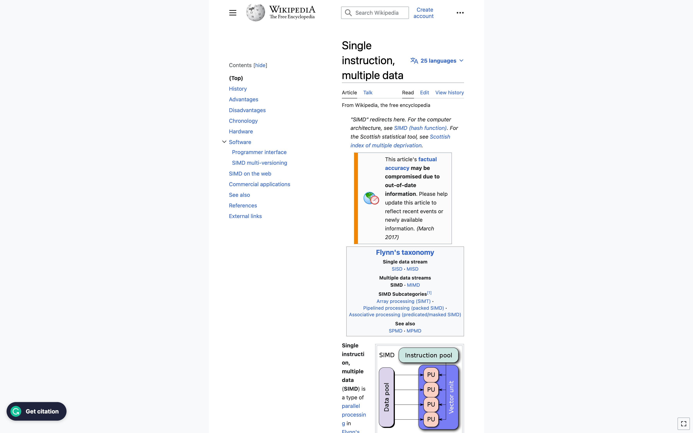

It seems like [Wikipedia](./../.././docs/pages/Wikipedia.md) updated its [CSS](./../.././docs/pages/CSS.md)...
Now I have to rewrite my flavored [CSS](./../.././docs/pages/CSS.md)!

<figure>

</figure>

## Research

- [SIMD](./../.././docs/pages/SIMD.md)
- [HLSL](./../.././docs/pages/HLSL.md)
- [Vertex Buffer](./../.././docs/pages/Vertex%20Buffer.md)
- [Petersburg](./../.././docs/pages/Petersburg.md)
- [Readings](./../.././docs/pages/Readings.md)
- [Conditional Probability](./../.././docs/pages/Conditional%20Probability.md)
- [Independence](./../.././docs/pages/Independence.md)
- [Multiplication Theorem](./../.././docs/pages/Multiplication%20Theorem.md)
- [Markovity](./../.././docs/pages/Markovity.md)
- [Partition Problem](./../.././docs/pages/Partition%20Problem.md)
- [Total Probability](./../.././docs/pages/Total%20Probability.md)
- [Bayes Theorem](./../.././docs/pages/Bayes%20Theorem.md)
- [Odds](./../.././docs/pages/Odds.md)

## [Building Habit](./../.././docs/pages/Building%20Habit.md)

- [x] 2023년 1월과 2월에 하루 25분 조깅하기

<head>
  <html lang="en-US"/>
</head>
