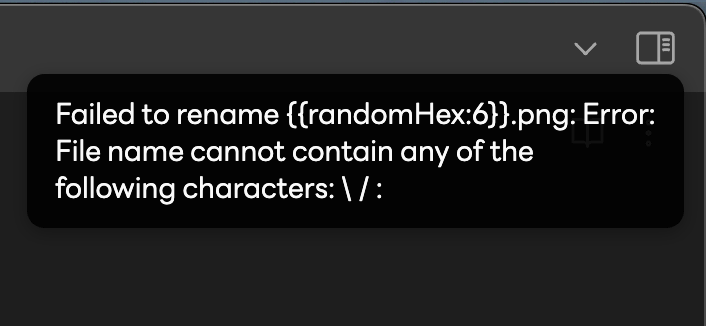

## Research

- [Project Core ML](./../.././docs/pages/Project%20Core%20ML.md)
- [Cool GPT Applications](./../.././docs/pages/Cool%20GPT%20Applications.md)
- [Debugging CSS](./../.././docs/pages/Debugging%20CSS.md)
- [Aldehyde Outage (January 2023)](./../.././docs/pages/Aldehyde%20Outage%20%28January%202023%29.md)

I had to migrate Extracranial to Cloudflare Pages for Vercel for now...

<blockquote class="twitter-tweet">
Can you DM me the Deployment Overview URL so we can take a look?
&mdash; Sam Ko (@samsisle) <a href="https://twitter.com/samsisle/status/1619009653408681984?ref_src=twsrc%5Etfw">January 27, 2023</a></blockquote> 

It turns out to be it was Docusaurus's recent bug: [Using Tabs will break with React 18 and Docusaurus v2.3 #8592](https://github.com/facebook/docusaurus/issues/8592)

Tried to contribute to [add /6DB9AA and {{uuid}} #23](https://github.com/reorx/obsidian-paste-image-rename/pull/23)

<figure>

</figure>

## [Building Habit](./../.././docs/pages/Building%20Habit.md)

- [ ] 2023년 1월과 2월에 하루 25분 조깅하기

<head>
  <html lang="en-US"/>
</head>
