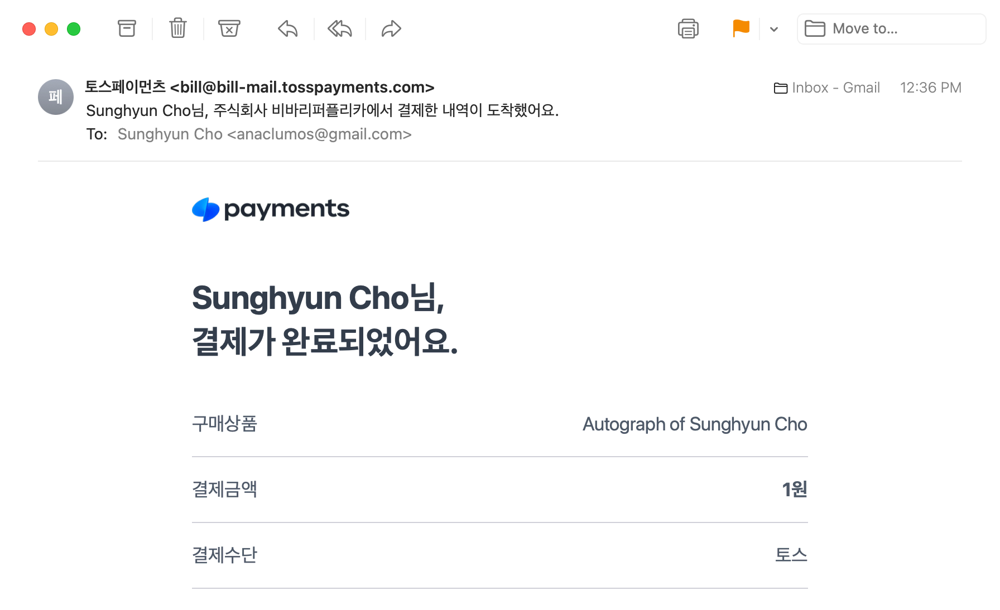

Created a basic outline of a payment demo. I imagined Toss as a Stripe replacement, but it turns out it was more heavily tied to the [Korean](./../.././docs/pages/%EB%8C%80%ED%95%9C%EB%AF%BC%EA%B5%AD.md) Market.

<figure>

</figure>

<figure>

</figure>

<figure>

</figure>
