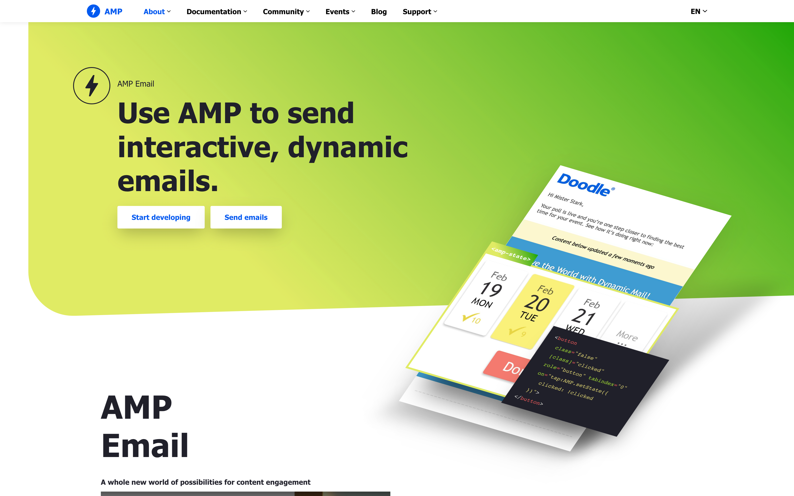

> AMP for email allows senders to include AMP components inside rich, engaging emails, making modern app functionality available within the email. The AMP email format provides a subset of [AMP](./../.././docs/pages/AMP.md) [HTML](./../.././docs/pages/HTML.md) components for use in email messages, allowing recipients of AMP emails to interact dynamically with content directly in the message. [AMP Email](https://amp.dev/about/email)

- [Spellbound](./../.././docs/pages/Spellbound.md)
- [Bringing the power of AMP to Gmail](https://www.blog.google/products/g-suite/bringing-power-amp-gmail/)

<figure>

</figure>

<head>
  <html lang="en-US"/>
</head>
