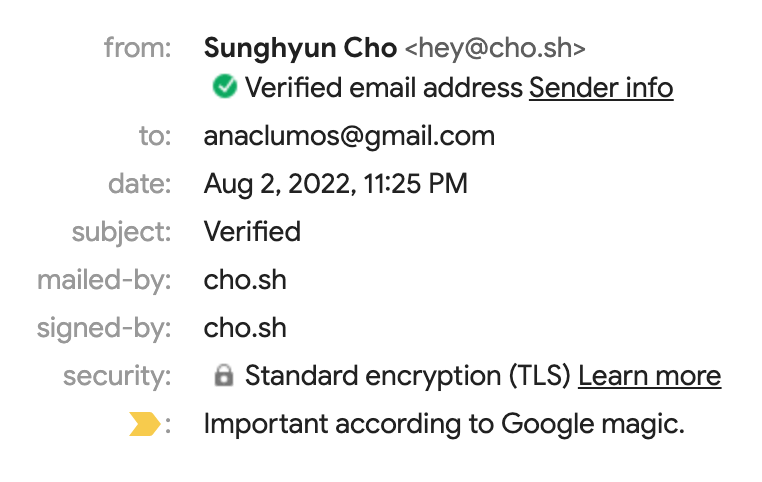
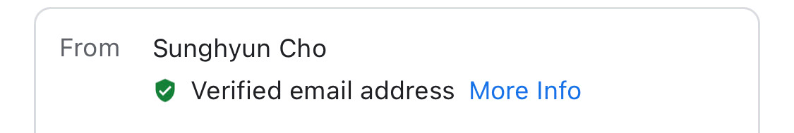
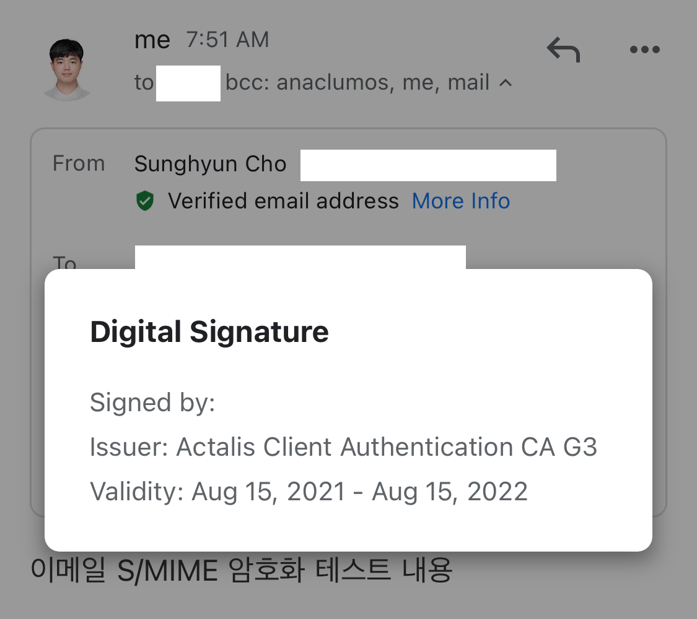

- Use a [S/MIME](./../.././docs/pages/SMIME.md) certificate to sign an email

<DisplayFlex>

<figure>

</figure>

<figure>

</figure>

</DisplayFlex>

<figure>

</figure>

<figure>

</figure>

<figure>

</figure>

<figure>

</figure>

<head>
  <html lang="en-US"/>
</head>
