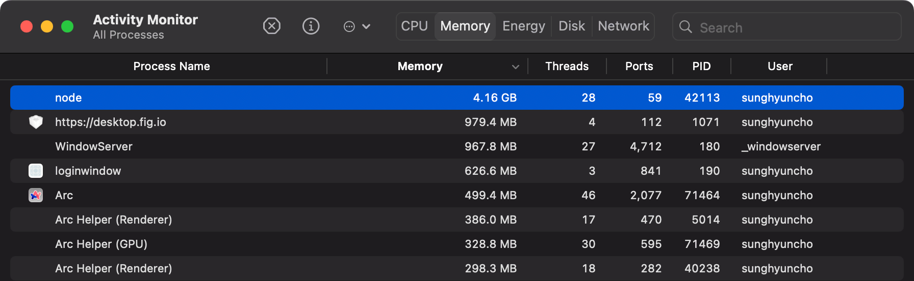

Multiple issues are combined.

## [Docusaurus](./../.././docs/pages/Docusaurus.md) 2.3.0 `useSyncExternalStore` Bug

[Using Tabs will break with React 18 and Docusaurus v2.3 · Issue #8592 · facebook/docusaurus](https://github.com/facebook/docusaurus/issues/8592#event-8378524686)

## [Vercel](./../.././docs/pages/Vercel.md) and [Cloudflare](./../.././docs/pages/Cloudflare.md) Build Errors

On [Cloudflare](./../.././docs/pages/Cloudflare.md)'s side:

```
16:49:17.136    ✔ Server: Compiled successfully in 3.74m
16:50:22.579    Segmentation fault
16:50:22.595    Failed: build command exited with code: 139
16:50:23.859    Failed: an internal error occurred
```

On [Vercel](./../.././docs/pages/Vercel.md)'s Side:

```
[success] [webpackbar] Server: Compiled successfully in 3.49m
Error: Command "yarn run build" exited with 129
```

Why..? I changed no config

<figure>


</figure>

## [2023-01-29](./../.././docs/journals/2023-01-29.md)

Investigating RAM Options. Supported a ticket to [Cloudflare](./../.././docs/pages/Cloudflare.md)

```
--max-old-space-size=4096
```

Did not help.

OH FIGURED IT OUT.
It was because of insufficient RAM.
When [Docusaurus](./../.././docs/pages/Docusaurus.md) seals the assets (at the end of the build cycle), the RAM usage spikes to ~4.5 GB.

<figure>



</figure>

Configuring [Cloudflare Pages](./../.././docs/pages/Cloudflare%20Pages.md) and [Vercel](./../.././docs/pages/Vercel.md) with the following argument fixed the problem!

```
--max-old-space-size=8192
```

-- Nope. Did not solve the problem.

<figure>


</figure>

So I ended up using [Cloudflare](./../.././docs/pages/Cloudflare.md) Wrangler to build on my device and then sending the build result to [Cloudflare](./../.././docs/pages/Cloudflare.md). Anyways, the issue seems to be resolved.
