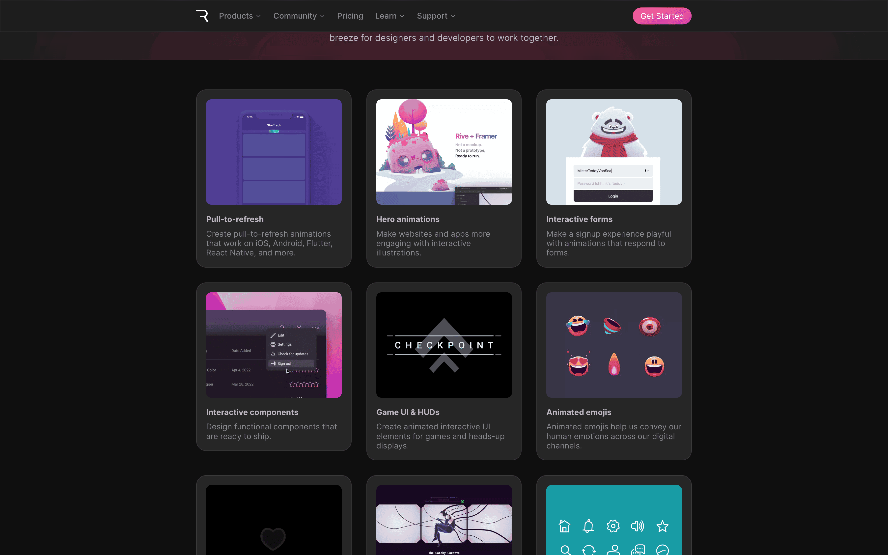
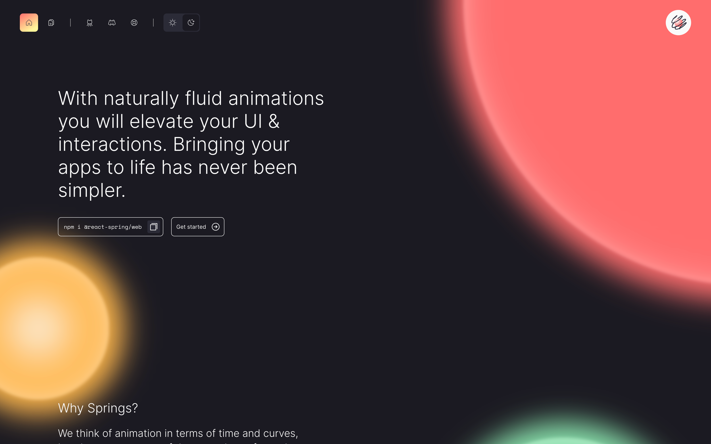
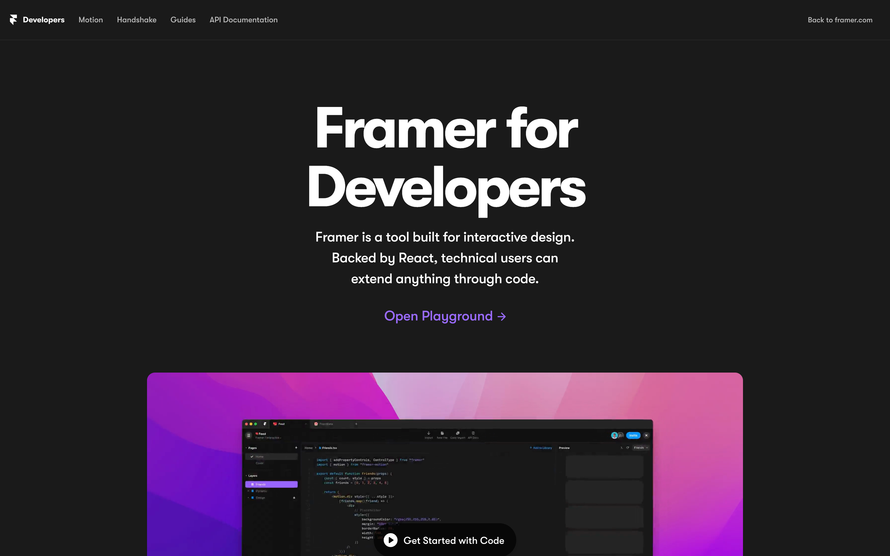
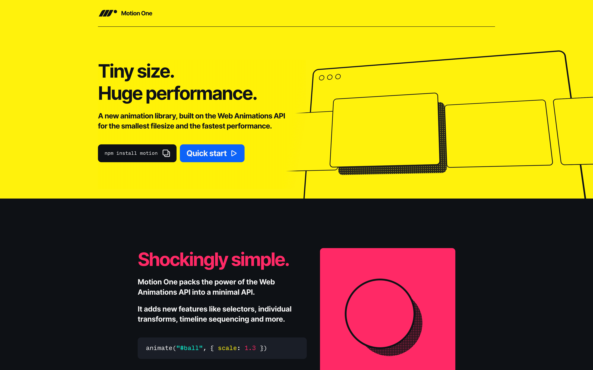

### [Rive Use Cases](https://rive.app/use-cases)

<figure>

</figure>

### [react-spring](https://beta.react-spring.dev/)

<figure>

</figure>

### [Framer Motion](./../.././docs/pages/Framer%20Motion.md)

<figure>

</figure>

### [Motion One: The Web Animations API for everyone](https://motion.dev/)

<figure>

</figure>

<head>
  <html lang="en-US"/>
</head>
