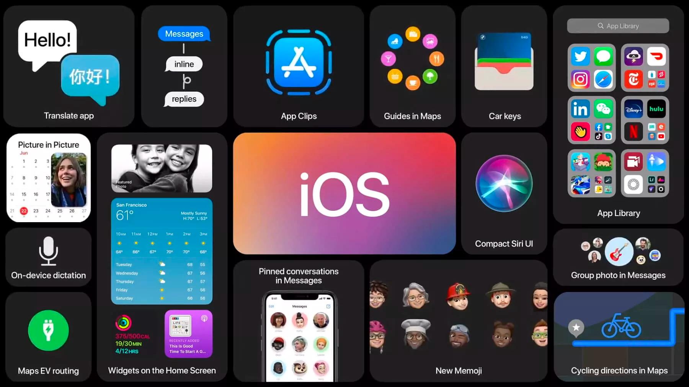
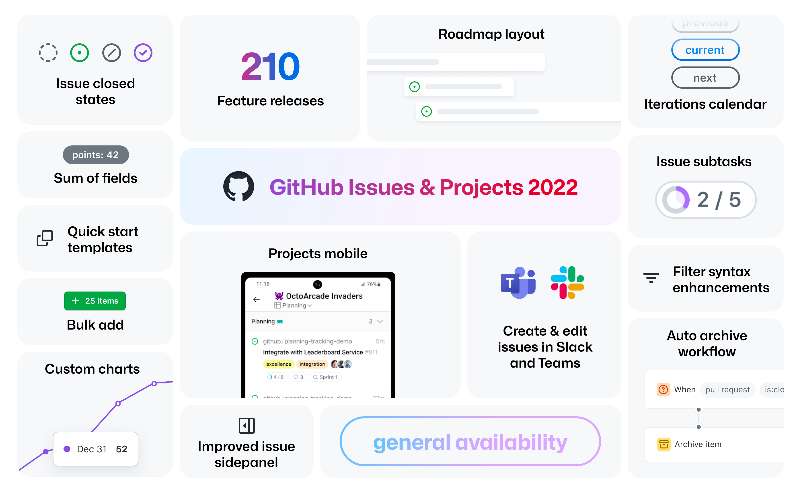
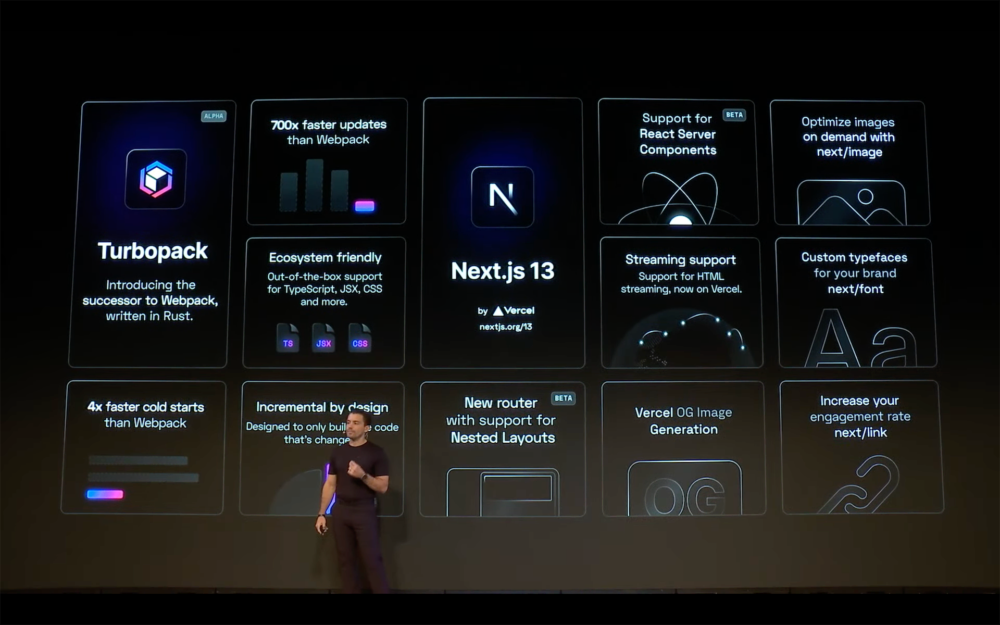
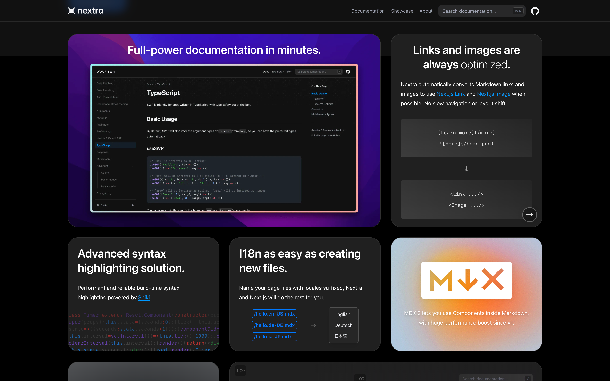
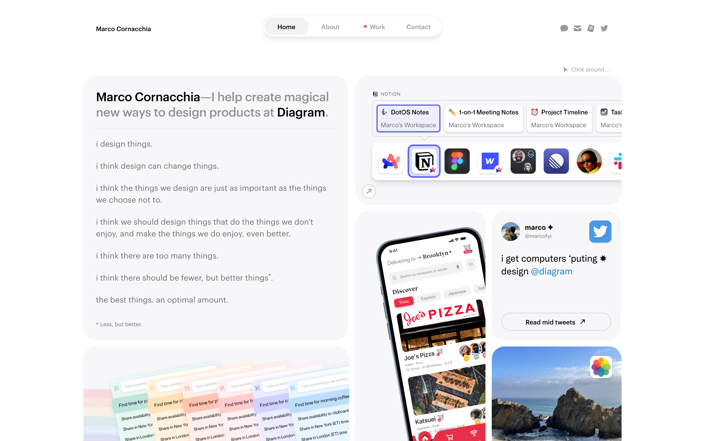
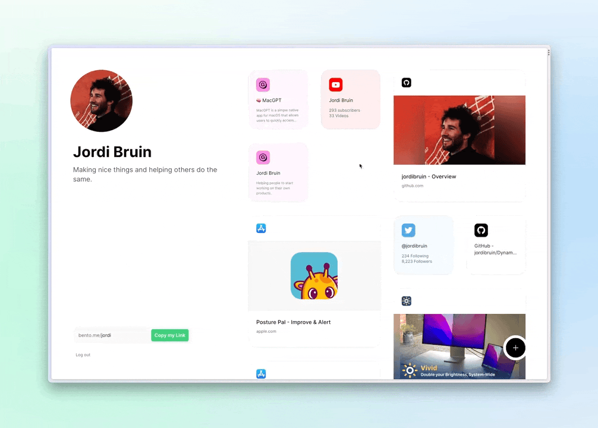

<figure>

</figure>

## [GitHub](./../.././docs/pages/GitHub.md)

<figure>

</figure>

## [Next.js](./../.././docs/pages/Next.js.md)

<figure>

</figure>

## [Nextra](./../.././docs/pages/Nextra.md)

<figure>

</figure>

## [Marco Cornacchia—Product Designer in SF](https://www.marco.fyi/)

<figure>

</figure>

## [Bento](https://bento.me/en/home)

<figure>

</figure>

<head>
  <html lang="en-US"/>
</head>
