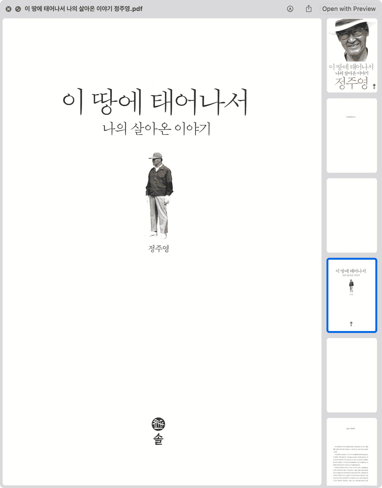
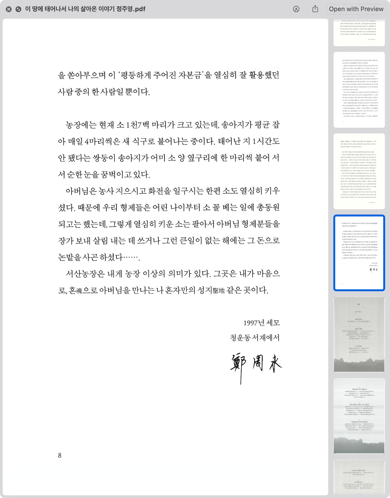

import DisplayFlex from '@site/src/components/DisplayFlex'

<DisplayFlex>

<figure>

</figure>

<figure>

</figure>
</DisplayFlex>

As a note, purchasing a book is technically the permit to use the information inside, so scanning books for personal use does not break any legal borders.

<head>
  <html lang="en-US"/>
</head>
