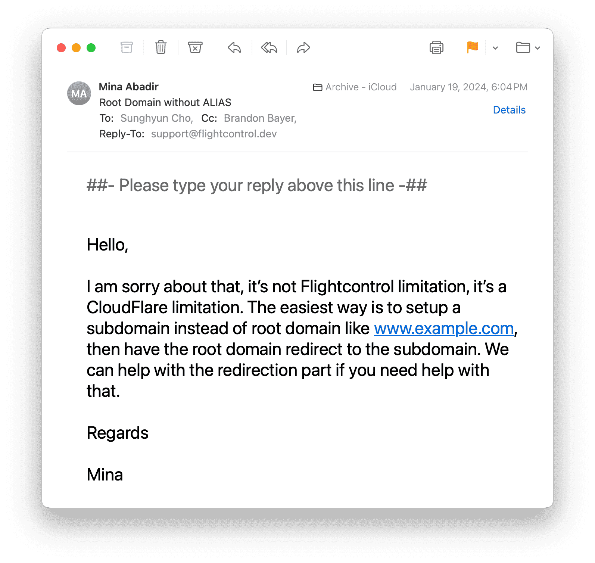

Instead of `ALIAS -> Root Domain`, setup `CNAME -> Root Domain` on [Cloudflare](./../.././docs/pages/Cloudflare.md). [CNAME flattening · Cloudflare DNS docs](https://developers.cloudflare.com/dns/cname-flattening/) [FlightControl](./../.././docs/pages/FlightControl.md)

Apparently FlightControl team didn't know this was possible

<figure>

</figure>

I reported this, and then they replied:

<figure>

</figure>

Well, I guess this is the charm of working with an early stage engineering product team! You also contribute to the product as a early adopter.
