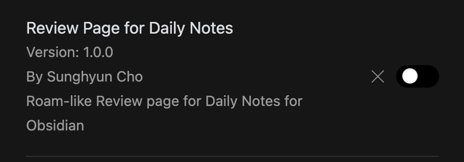
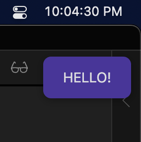
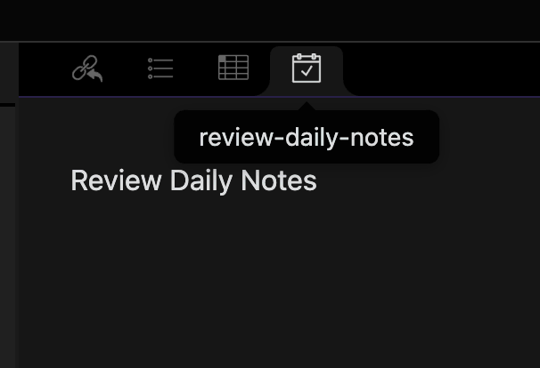
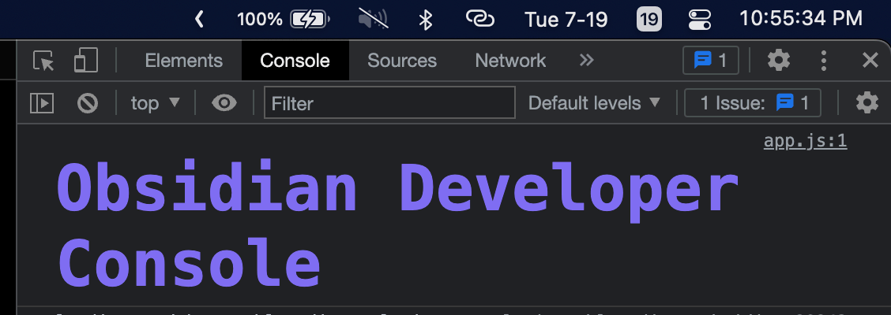
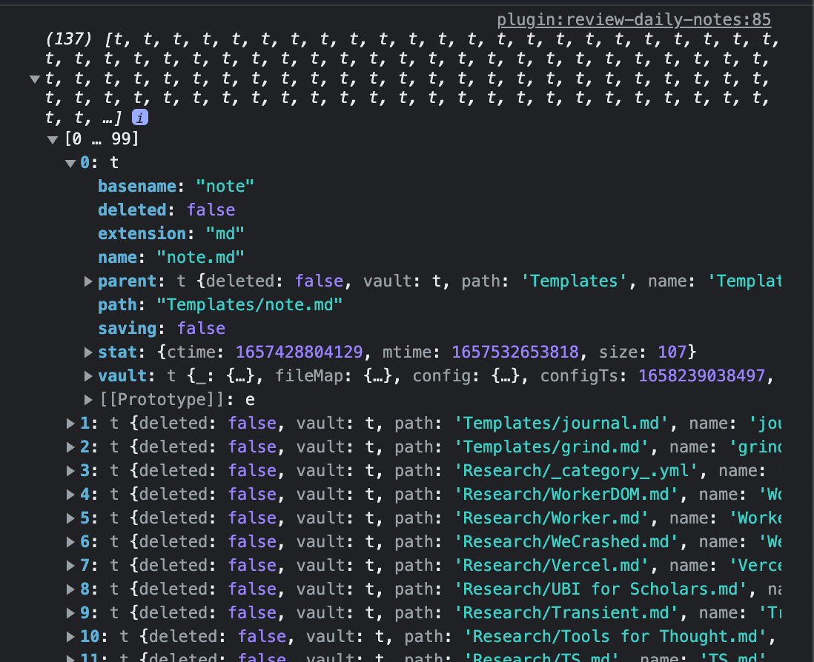
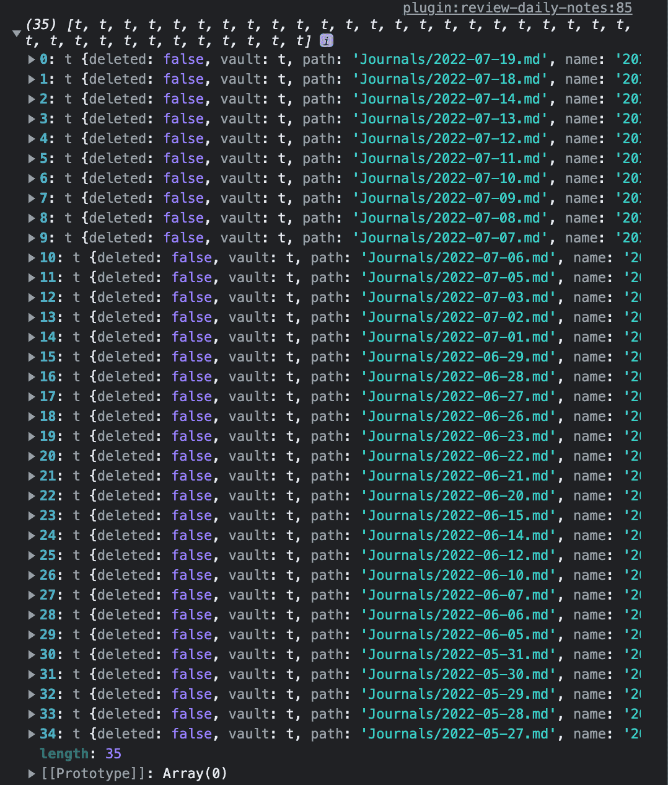
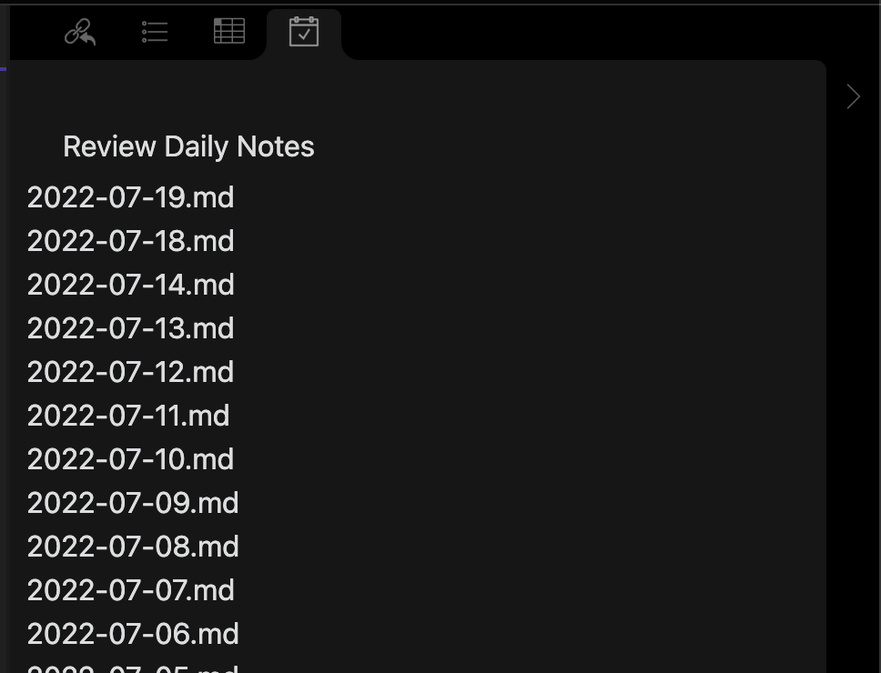
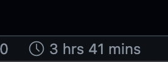
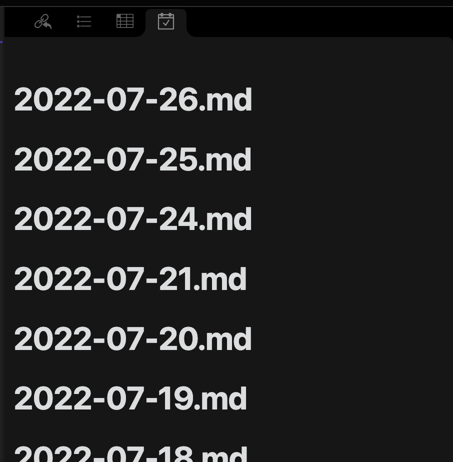

[2022-07-19](./../.././docs/journals/2022-07-19.md) 저녁에 적당히 공허한 느낌이 들어 미뤄왔던 사이드 [프로젝트](./../.././docs/pages/Project.md)를 해본다.
이 문서는 [Obsidian](./../.././docs/pages/Obsidian.md)을 스캐폴딩하는 방법에 대해 다루며 옵시디언 API 문서를 탐독하면서 이런 저런 발견 사항들을 기록할 것이다.
영어로 작성하려다가 옵시디언 플러그인 개발 자료는 한국어로 거의 없어 그냥 한국어로 작성한다.

우선 이 2가지 링크를 확인한다.

- [obsidianmd/obsidian-sample-plugin](https://github.com/obsidianmd/obsidian-sample-plugin)
- [obsidianmd/obsidian-api](https://github.com/obsidianmd/obsidian-api)

[Better Obsidian](./../.././docs/pages/Better%20Obsidian.md) 문서를 보면 알 수 있듯이 별별 아이디어들을 다 쌓아뒀는데 오늘 저녁에 적당히 끝낼 수 있을만한 작업이 뭐가 있을까 고민하다가 *Review Page for Daily Notes*를 선택했다. Logseq를 쓸 당시 굉장히 유용하게 썼었는데 옵시디언에는 비슷한 기능이 없어서 아쉬웠다.

## 시작

일단 옵시디언에서 제공하는 템플릿을 복제해서 저장소를 만들었다.

- [anaclumos/daily-notes-review-for-obsidian: Roam-like Review page for Daily Notes on Obsidian](https://github.com/anaclumos/daily-notes-review-for-obsidian)

스토어에 올라온 몇몇 플러그인을 보니 다음과 같은 간단한 구조였다. Chrome Extension과 유사하게 번들된 `main.js`와 `manifest.json`으로 이루어져 있다.

```bash
/plugin
├── main.js
└── manifest.json
```

패키징을 쉽게 할 수 있도록 `yarn run package` 스크립트를 추가했다.
내 디렉토리 구조에서만 동작하겠지만 당장은 뭐 이 정도로 충분할 것 같다.

```json
{
  "package": "yarn build && rm -rf dist && mkdir dist && cp main.js dist/main.js && cp manifest.json dist/manifest.json && rm -rf ../www/Brain/.obsidian/plugins/review-page-for-daily-notes && mkdir ../www/Brain/.obsidian/plugins/review-page-for-daily-notes && cp -r dist/* ../www/Brain/.obsidian/plugins/review-page-for-daily-notes"
}
```

`manifest.json`에는 다음과 같이 플러그인의 메타데이터를 넣을 수 있다.

```json
{
  "id": "review-page-for-daily-notes",
  "name": "Review Page for Daily Notes",
  "version": "1.0.0",
  "minAppVersion": "0.12.0",
  "description": "Roam-like Review page for Daily Notes for Obsidian",
  "author": "Sunghyun Cho",
  "authorUrl": "https://cho.sh",
  "isDesktopOnly": false,
  "js": "main.js"
}
```

이렇게 하면 다음과 같이 옵시디언이 플러그인을 인식한다.


<figure>




</figure>

- [등록할 수 있는 아이콘 리스트](https://forum.obsidian.md/t/list-of-available-icons-for-component-seticon/16332/4)

## Ribbon 등록

우선 이와 같이 기본 코드를 작성했다.

```ts
import { App, Editor, MarkdownView, Modal, Notice, Plugin, PluginSettingTab, Setting } from 'obsidian'

interface CustomSettings {
  // relative path to daily notes folder
  dailyNotesFolder: string

  // format of the daily notes file, e.g. 'YYYY-MM-DD'
  dailyNotesFormat: string

  // how many files to load at once?
  dailyNotesOffset: number
}

const DEFAULT_SETTINGS: CustomSettings = {
  dailyNotesFolder: 'Journals',
  dailyNotesFormat: 'YYYY-MM-DD',
  dailyNotesOffset: 10,
}

export default class CustomPlugin extends Plugin {
  settings: CustomSettings
  async onload(): Promise<void> {
    await this.loadSettings()
    this.createRibbon()
  }
  async loadSettings() {
    this.settings = Object.assign({}, DEFAULT_SETTINGS, await this.loadData())
  }
  createRibbon(): HTMLElement {
    const ribbon = this.addRibbonIcon('calendar-with-checkmark', 'Review Daily Notes', (evt: MouseEvent) => {
      new Notice('HELLO!')
    })
    return ribbon
  }
}
```

왼쪽 리본 버튼을 누르면 다음과 같이 옵시디언 안내 문구가 나타난다.


<figure>




</figure>

Advanced Tables의 컴파일된 JS를 보면서 리버스 엔지니어링 하고 있었는데 오픈소스였다.
살짝 억울했다.

- [tgrosinger/advanced-tables-obsidian: Improved table navigation, formatting, and manipulation in Obsidian.md](https://github.com/tgrosinger/advanced-tables-obsidian)

## Leaf 구성

아무튼 다음과 같은 코드로 우측에 렌더링된 페이지를 띄우는데 성공했다.

```ts
import { CustomSettings } from 'main'
import { Editor, ItemView, MarkdownView, Notice, WorkspaceLeaf } from 'obsidian'

export const ReviewDailyNotesViewType = 'review-daily-notes'

export class ReviewDailyNotesView extends ItemView {
  private readonly settings: CustomSettings

  constructor(leaf: WorkspaceLeaf, settings: CustomSettings) {
    super(leaf)
    this.settings = settings
  }

  public getViewType(): string {
    return 'Review Daily Notes'
  }

  public getDisplayText(): string {
    return ReviewDailyNotesViewType
  }

  public getIcon(): string {
    return 'calendar-with-checkmark'
  }

  public load(): void {
    super.load()
    this.draw()
  }

  private readonly draw = (): void => {
    const container = this.containerEl.children[1]
    const rootEl = document.createElement('div')
    const navHeader = rootEl.createDiv({
      cls: 'nav-header',
    })
    navHeader.createDiv({
      cls: 'nav-header-title',
    }).textContent = 'Review Daily Notes'
    container.empty()
    container.appendChild(rootEl)
  }
}
```


<figure>




</figure>

## 옵시디언 안의 파일 접근

옵시디언 API 문서를 읽다 다음과 같이 파일 구조가 정의됨을 알 수 있었다.

```ts
/**
 * @public
 */
export class TFile extends TAbstractFile {
  /**
   * @public
   */
  stat: FileStats
  /**
   * @public
   */
  basename: string
  /**
   * @public
   */
  extension: string
}
```

참고로 옵시디언은 [Chromium](./../.././docs/pages/Chromium.md)이기 때문에 다음과 같이 Dev Console을 열 수 있다.


<figure>




</figure>

옵시디언 API 문서를 더 읽었다.
다음과 같은 방식으로 내부 파일들에 접근할 수 있다.

```ts
const files = this.app.vault.getFiles()
console.log(files)
```


<figure>




</figure>

즉 다음과 같이 Daily Notes만 분리할 수 있다.

```ts
public loadDailyNotes(): TFile[] {
	const { dailyNotesFolder } = this.settings;
	const files = this.app.vault.getFiles();
	const dailyNotes = files.filter(
		(file) =>
			file.path.startsWith(dailyNotesFolder) &&
			file.path.endsWith(".md")
	);
	console.log(dailyNotes);
	return dailyNotes;
}
```

더 나아가 Daily Notes를 정렬할 수 있다.

```ts
dailyNotes.sort((a, b) => {
  const aDate = new Date(a.path.substring(dailyNotesFolder.length + 1))
  const bDate = new Date(b.path.substring(dailyNotesFolder.length + 1))
  return aDate.getTime() - bDate.getTime()
})
```


<figure>




</figure>

그렇게 해서 페이지를 추출하면 다음과 같이 List View를 만들 수 있다.


<figure>




</figure>

일단 오늘([2022-07-19](./../.././docs/journals/2022-07-19.md))은 밤이 늦었으니 내일 계속하도록 한다. 3시간 41분 했다.


<figure>




</figure>

## [2022-07-26](./../.././docs/journals/2022-07-26.md)

일주일 만에 다시 진행해본다.
우선 옵시디안으로 개발하는 것은 HMR — Hot Module Reload가 안 되는 듯 하다.
매번 익스텐션을 삭제하고 다시 설치해야 한다.
수정: `yarn package` 이후 옵시디언 개발자 메뉴에서 새로고침하면 된다.

### [React](./../.././docs/pages/React.md) 전환

일단 위 예시처럼 `document.createElement` 할 수 없으니 템플릿화 할 수 있는 방법을 알아본다.

약간의 시간 투자를 하여 다음과 같이 [React](./../.././docs/pages/React.md)로 전환하였다.


<figure>




</figure>

```tsx
async onOpen() {
  const root = createRoot(this.containerEl.children[1])
  root.render(
    <React.StrictMode>
      <ListView files={this.loadDailyNotes()} />
    </React.StrictMode>
  )
}
```

### MD 렌더링

옵시디언 API 문서를 찾아보다가 다음과 같은 부분을 찾았다.

```ts
export class MarkdownPreviewView extends MarkdownRenderer implements MarkdownSubView, MarkdownPreviewEvents {
  /**
   * @public
   */
  containerEl: HTMLElement
  /**
   * @public
   */
  get(): string
  /**
   * @public
   */
  set(data: string, clear: boolean): void
  /**
   * @public
   */
  clear(): void
  /**
   * @public
   */
  rerender(full?: boolean): void
  /**
   * @public
   */
  getScroll(): number
  /**
   * @public
   */
  applyScroll(scroll: number): void
}
```

근데 여기서 인자로 받는 것은 `HTMLElement`이니까 변환기를 찾아야 한다.
옵시디언의 API 문서가 자료가 전혀 없이 `obsidian.d.ts`를 API 문서라고 부르고 있는 상태라 이해에 어려움이 있다.
Discord 서버에 물어보았다.
일단 답변이 올 때까지 오늘은 여기까지 하겠다.
[React](./../.././docs/pages/React.md)로 변환이 2시간 정도로 오래 걸렸다.

## 잠정 중단

- [Aldehyde](./../.././docs/pages/Aldehyde.md)의 기술적 발전으로 인해 옵시디언 내부보다 [Aldehyde](./../.././docs/pages/Aldehyde.md)를 더 많이 사용하게 됨
- 옵시디언에서도 단축키가 익숙해져 굳이 필요함을 못 느끼게 됨
- 옵시디언 API 문서의 [DX](./../.././docs/pages/DX.md) 매우 불친절

<head>
  <html lang="ko-KR"/>
</head>
