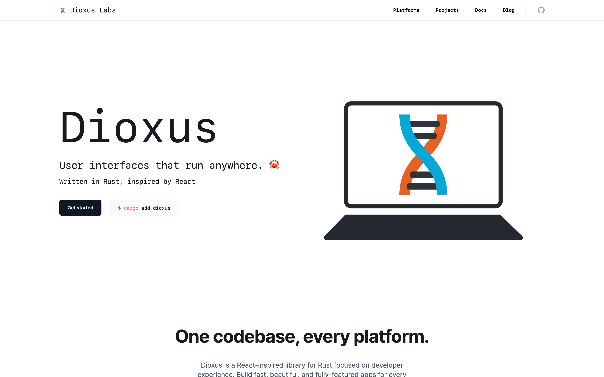

<figure>

</figure>

User interfaces that run anywhere. 🦀.
They are written in [Rust](./../.././docs/pages/Rust.md), inspired by [React](./../.././docs/pages/React.md).
Use [WASM](./../.././docs/pages/WebAssembly.md)
[Write Once Run Everywhere](./../.././docs/pages/Write%20Once%20Run%20Everywhere.md)

<head>
  <html lang="en-US"/>
</head>
