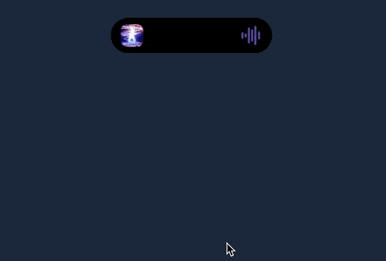
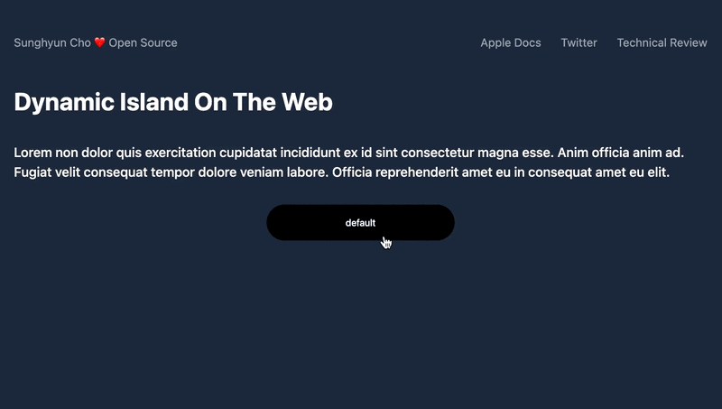
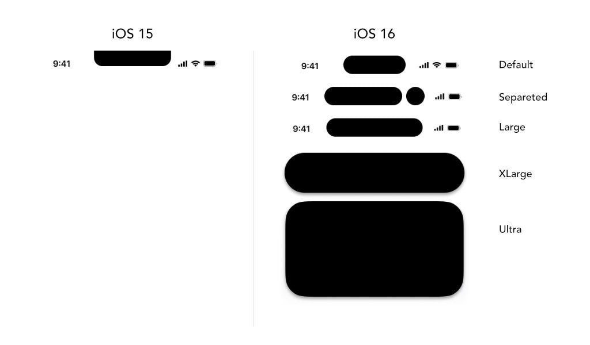

- [Done](./../.././docs/pages/Done.md) [Project](./../.././docs/pages/Project.md)
- [Dynamic Island](./../.././docs/pages/Dynamic%20Island.md) on the Web
- [iPhone Playground](https://iphone.junho.io/)

## [2022-11-11](./../.././docs/journals/2022-11-11.md)

- Applied [Squircle](./../.././docs/pages/Squircle.md)
- Applied Quick Clipping with [Framer Motion](./../.././docs/pages/Framer%20Motion.md) for performance

<figure>

</figure>

<figure>

</figure>

<figure>

</figure>

<figure>

</figure>

## [2022-11-10](./../.././docs/journals/2022-11-10.md)

- Equalizer
  - Base Length System
- Optimize Animations (css `will-change`)
- Removed Scrubber Toggle
- Squircle — failed

<figure>

</figure>

<figure>

</figure>

<figure>

</figure>

<figure>

</figure>

<figure>

</figure>

<figure>

</figure>

<figure>

</figure>

<figure>

</figure>

<figure>

</figure>

## [2022-11-09](./../.././docs/journals/2022-11-09.md)

- Finally, as the last step, the only thing left is the integration with my website!

<figure>

</figure>

## [2022-10-28](./../.././docs/journals/2022-10-28.md)

- [Reverse Engineering Apple Music API](./../.././docs/pages/Reverse%20Engineering%20Apple%20Music%20API.md)
- I can now make API requests to find out what I was listening to.

<figure>

</figure>

## [2022-10-20](./../.././docs/journals/2022-10-20.md)

I finally got the knack for how to animate and accelerate things.
All I need to do now is to pack them with an API-style [JSON](./../.././docs/pages/JSON.md) payload.
That way, anyone can put whatever data they want...

<figure>

</figure>

## [2022-10-16](./../.././docs/journals/2022-10-16.md)

<figure>

</figure>

## Stack

- [Framer Motion](./../.././docs/pages/Framer%20Motion.md) seems appropriate.

## Rough Idea

<figure>

</figure>

## Different Sizes

<figure>

</figure>

## Resources

- [jhaemin/dynamic-island: A web implementation of the Dynamic Island](https://github.com/jhaemin/dynamic-island)
- [Live Activities - System experiences - Components - Human Interface Guidelines - Design - Apple Developer](https://developer.apple.com/design/human-interface-guidelines/components/system-experiences/live-activities)

<head>
  <html lang="en-US"/>
</head>
