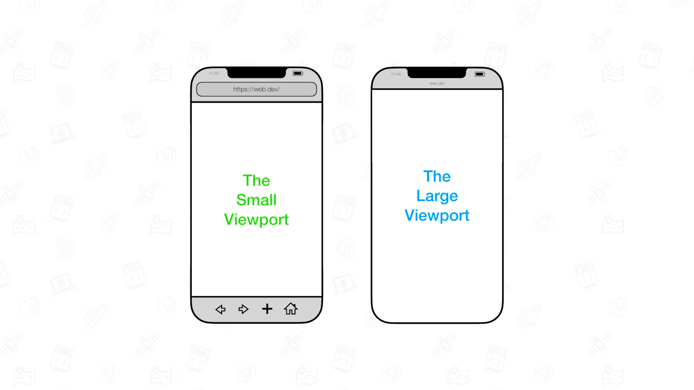
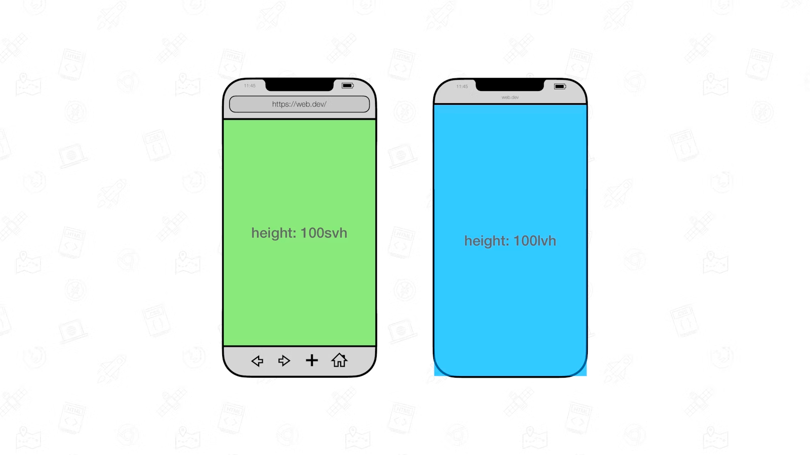
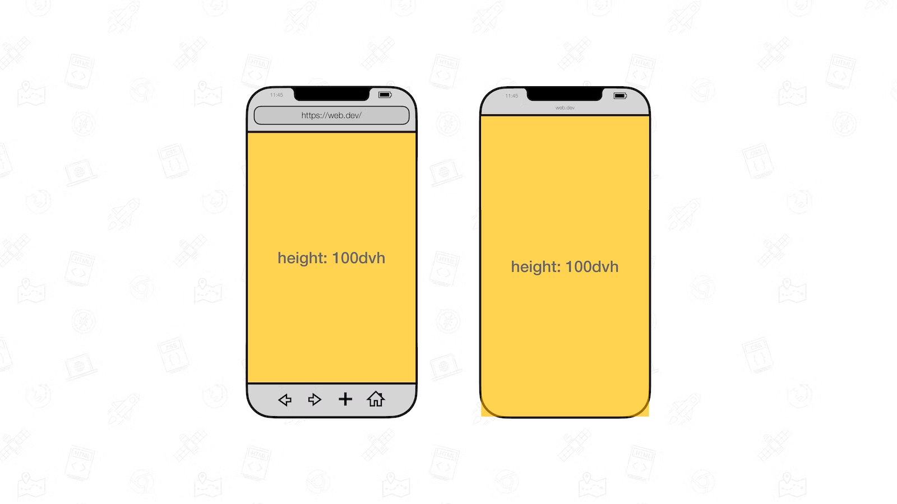

### [The large, small, and dynamic viewport units](https://web.dev/viewport-units/)

- To size something as tall as the viewport, you can use the `vw` and `vh` units.
- There, the viewport size is influenced by the presence or absence of dynamic toolbars. These are user interfaces such as address bars and tab bars
- To solve this problem, the various states of the viewport have been specified at the CSS Working Group.
- Large viewport: The viewport sized assuming any UA interfaces that are dynamically expanded and retracted to be retracted.
- Small Viewport: The viewport sized assuming any UA interfaces that are dynamically expanded and retracted to be expanded
- Units representing the large viewport have the `lv` prefix. The units are `lvw`, `lvh`, `lvi`, `lvb`, `lvmin`, and `lvmax`.
- Units representing the small viewport have the `sv` prefix. The units are `svw`, `svh`, `svi`, `svb`, `svmin`, and `svmax`
- Its accompanied units have the `dv` prefix: `dvw`, `dvh`, `dvi`, `dvb`, `dvmin`, and `dvmax`. Their sizes are clamped between their `lv*` and `sv*` counterparts
- None of the viewport units take the size of scrollbars into account. On systems that have classic scrollbars enabled, an element sized to `100vw` will therefore be a little bit too wide
- The values for the dynamic viewport do not update at 60fps. In all [browsers](./../.././docs/pages/Web%20Browser.md) updating is throttled as the UA [UI](./../.././docs/pages/UIUX.md) expands or retracts. Some [browsers](./../.././docs/pages/Web%20Browser.md) even debounce updating entirely depending on the gesture (a slow scroll versus a swipe) used
- The on-screen keyboard (also known as the virtual keyboard) is not considered part of the UA [UI](./../.././docs/pages/UIUX.md)

<figure>

</figure>

<figure>

</figure>

<figure>

</figure>

<head>
  <html lang="en-US"/>
</head>
