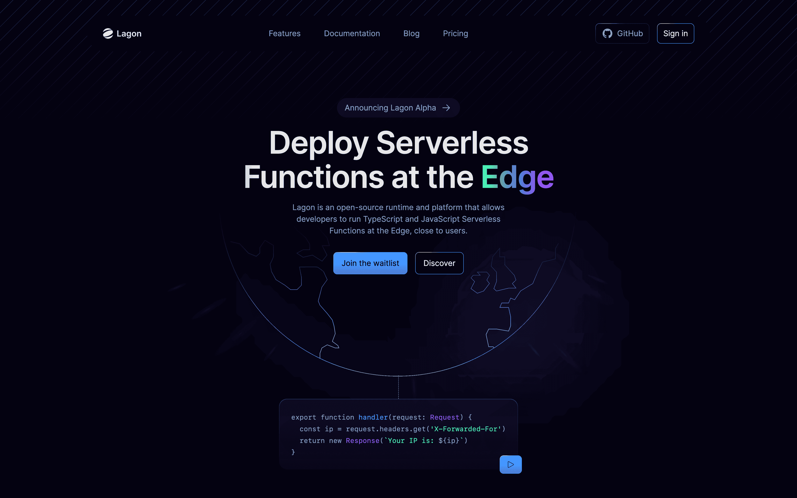

- [Trying Cloudflare Pages: Best Server Tech Since cgi-bin - Perf and other stuff](https://taras.glek.net/post/cloudflare-pages-kind-of-amazing/)
- [Vercel](./../.././docs/pages/Vercel.md) & [Vercel](./../.././docs/pages/Vercel.md) Edge Functions
- [Cloudflare](./../.././docs/pages/Cloudflare.md) Pages & [Cloudflare](./../.././docs/pages/Cloudflare.md) Functions
- Netlify
- etc

### [val town](https://www.val.town/)

- Write Scripts, Deploy, Run
- Skip all the configuration and setup needed to get your cloud scripts going.

### [Deploy Serverless Functions at the Edge - Lagon](https://lagon.app/)

<figure>

</figure>
