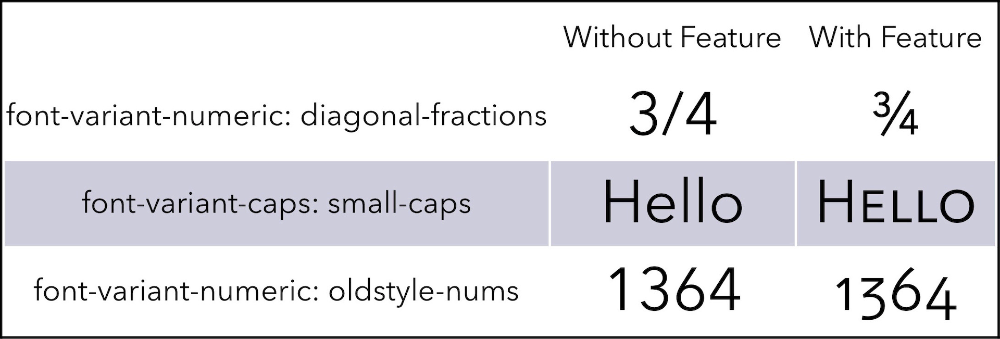

> [Font features](https://www.w3.org/TR/css-fonts-3/#font-rend-props) are a way to enable advanced text styles and effects as designed by the font author. A font may support several features: some examples include different kinds of ligatures, tabular numbers, or small caps. Because the designer explicitly created forms for these variants in the font file, using font features is the highest quality way of achieving these effects. [CSS Font Features | WebKit](https://webkit.org/blog/5735/css-font-features/#:~:text=Font%20features%20are%20a%20way,tabular%20numbers%2C%20or%20small%20caps.)

<figure>

</figure>

- [CSS](./../.././docs/pages/CSS.md) property to enhance legibilities of a [Font](./../.././docs/pages/Font.md).
- [San Francisco](./../.././docs/pages/San%20Francisco.md), [Inter](./../.././docs/pages/Inter.md), and [Pretendard](./../.././docs/pages/Pretendard.md) has awesome support.

<figure>

</figure>

<head>
  <html lang="en-US"/>
</head>
