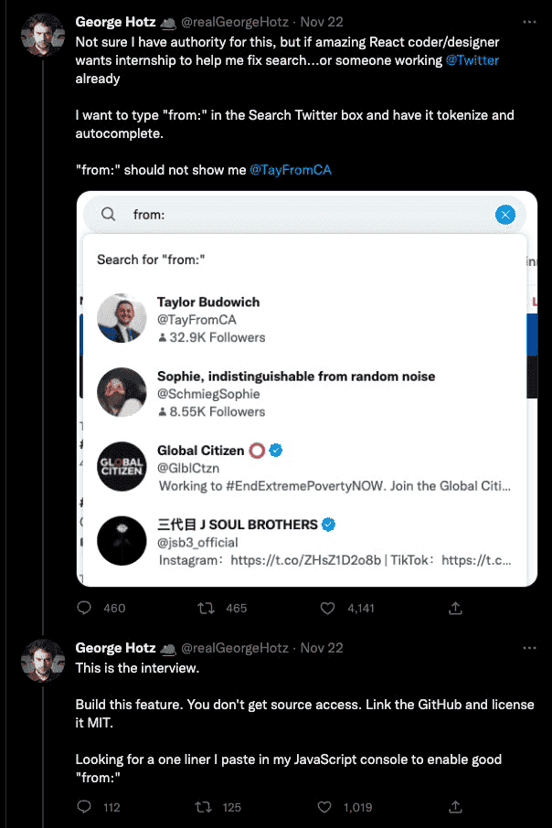

**Twitter's Missing Search [Engine](./../.././docs/pages/Engine.md)**.

George Hotz, also known as Geohot, is a famous [hacker](./../.././docs/pages/Hacker.md) and founder of Comma.[ai](./../.././docs/pages/AI.md). [Elon Musk](./../.././docs/pages/Elon%20Musk.md) hired him to work on Twitter to improve its search functionality. However, after only a month, he resigned from his Twitter internship, saying he was unhappy with the work environment and lack of freedom.

- Geohot said as if he could solve all the issues,
- Then looked for a one-liner [front-end](./../.././docs/pages/Front-end.md) solution for "fixing the search problem"
- and eventually quit without delivering any of the solutions.

It's not that Geohot is overrated. But it still poses a question for ① being a superintelligent [10x](./../.././docs/pages/10x.md) developer and ② being a cooperative team player developer. Geohot was the first, whereas Twitter needed the second.

<figure>

</figure>

<figure>

</figure>
