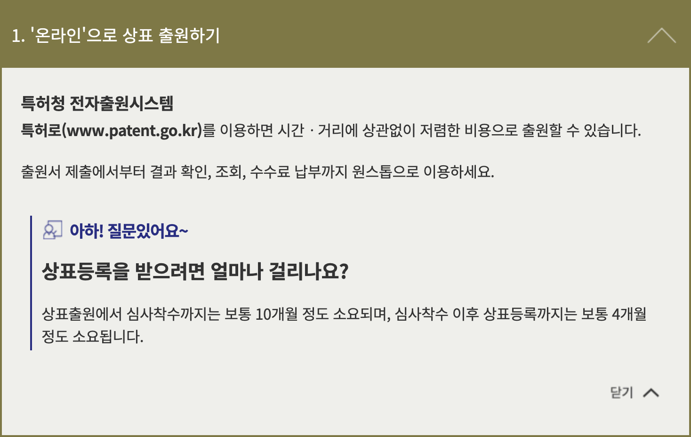

While we have previously discussed [Adding a Verified Mark on Apple Mail and Gmail](./../.././docs/pages/Adding%20a%20Verified%20Mark%20on%20Apple%20Mail%20and%20Gmail.md), getting a [checkmark](./../.././docs/pages/Checkmark.md) on Gmail requires a VMC -- [Verified Mark](./../.././docs/pages/Checkmark.md) Certificate. There are two issuers for now for VMCs, [DigiCert](https://www.digicert.com/tls-ssl/verified-mark-certificates) and [Entrust](https://www.entrust.com/digital-security/certificate-solutions/products/digital-certificates/verified-mark-certificates) ([VMC Issuers - BIMI Group](https://bimigroup.org/vmc-issuers/)). Digicert does support [Korean](./../.././docs/pages/%EB%8C%80%ED%95%9C%EB%AF%BC%EA%B5%AD.md) [Intellectual Property](./../.././docs/pages/IP.md) Office, but...

<figure>

</figure>

<figure>

</figure>

I neither have that much money nor time 😅 Well, there goes my chance.
