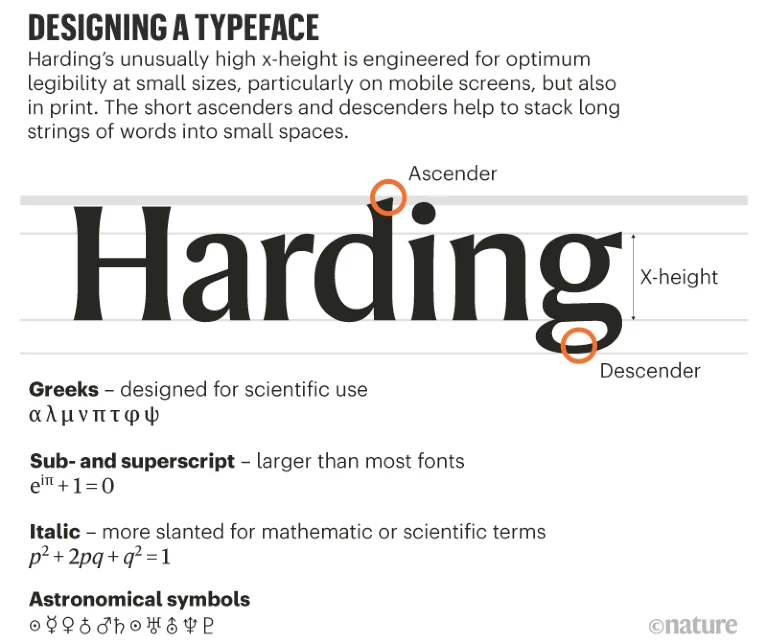
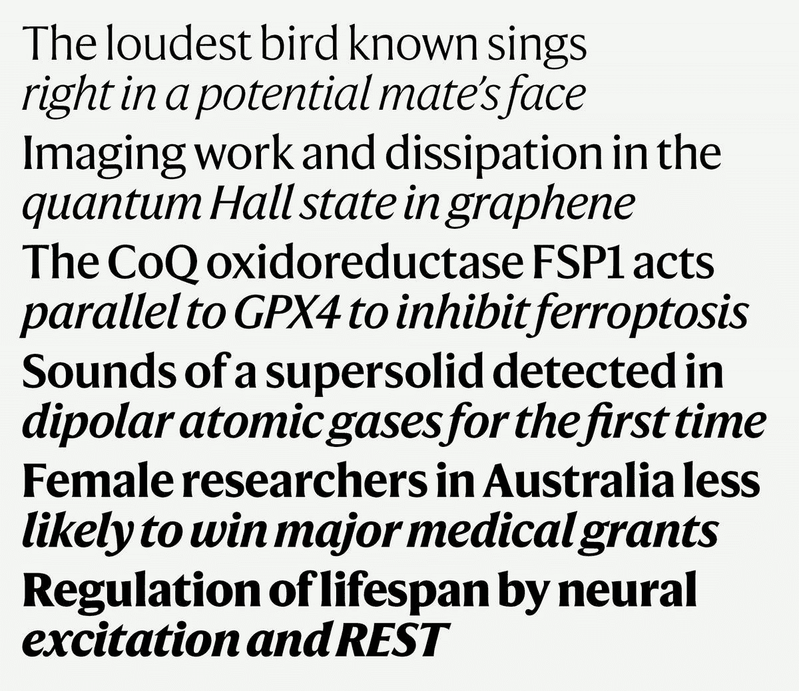
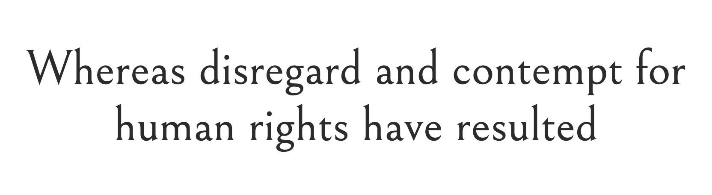
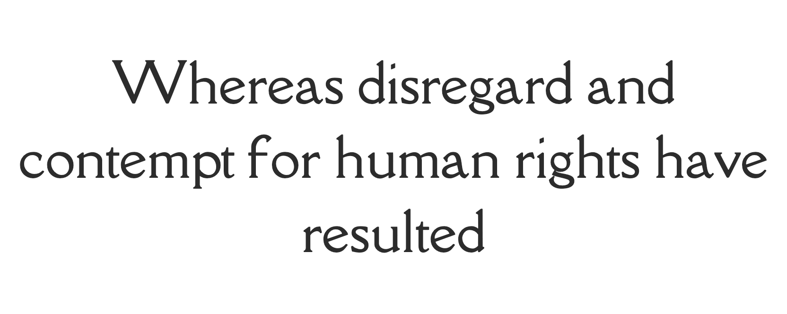

- [The design decisions behind Nature's new look](https://www.nature.com/articles/d41586-019-03083-5)
- similar: [NYT Cheltenham in use - Fonts In Use](https://fontsinuse.com/typefaces/7802/nyt-cheltenham)

<figure>

</figure>

<figure>

</figure>

[oneday](./../.././docs/pages/Oneday.md)

## Alternatives

Ivar-Headline?

Calena

[Alegreya - Google Fonts](https://fonts.google.com/specimen/Alegreya)

<figure>

</figure>

[Asul - Google Fonts](https://fonts.google.com/specimen/Asul)

<figure>

</figure>

[Marcellus - Google Fonts](https://fonts.google.com/specimen/Marcellus)

<figure>

</figure>

[Bellefair - Google Fonts](https://fonts.google.com/specimen/Bellefair)

<figure>

</figure>

[Della Respira - Google Fonts](https://fonts.google.com/specimen/Della+Respira)

<figure>

</figure>
