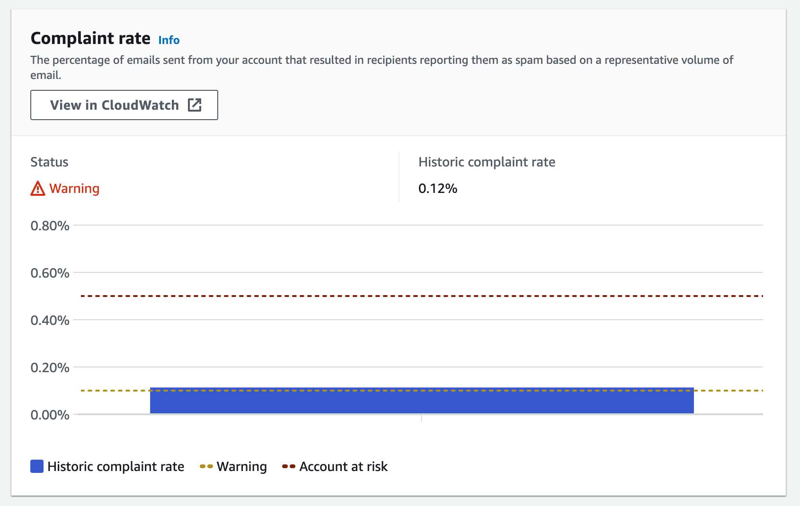

- Happened from [2023-07-30](./../.././docs/journals/2023-07-30.md)-[2023-08-01](./../.././docs/journals/2023-08-01.md), or something like that
- Bunch of bots started to sign up for [Simplified Chinese](./../.././docs/pages/%EC%A4%91%EA%B5%AD%EC%96%B4.md), like 300 people
- Felt great, yeah, here we go
- So I moved forward with the [Project Heimdall](./../.././docs/pages/Project%20Heimdall.md) migration, added new languages
- Now I got a bunch of people signing up for `ta` Tamil. Like 40 people
- Something was off.
- One thing in common was that both lists that got tons of subscribers were the last list on [Listmonk](./../.././docs/pages/Listmonk.md).
- Seemed like an attack of some sort. I tried emailing a handpicked few, but none replied.
- The [emails](./../.././docs/pages/Mail.md) were very authentic-looking, though. So it took a lot of work to tell which one was bogus or not.
- So I tried adding an empty list and explicitly said "do not subscribe" on the list. Sure enough, a bunch of people still signed up. Look at these messes. Also, don't they look so authentic?
- 
- One odd thing was that usually when a subscriber signs up for [Heimdall](./../.././docs/pages/Project%20Heimdall.md), the name field was the handle from the [email](./../.././docs/pages/Mail.md) company. These bogus subscribers had something like [UUID](./../.././docs/pages/UUID.md).
- Anyways, so I had to inspect all subscribers and batch-delete 400 subscribers.
- Also, blocked public subscription page.
- [Under Attack? Spike in Bot Users · Issue #1413 · knadh/listmonk](https://github.com/knadh/listmonk/issues/1413)
- Why did anyone do this?
- I am not sure, but one thing for sure is that now I got a warning from [AWS](./../.././docs/pages/AWS.md). A competitor in the space?
- 
