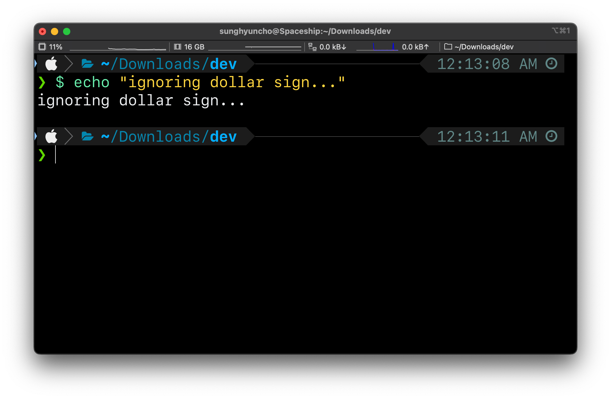

I was extremely surprised and glad that this worked.

```bash
alias "$"=""
```

Add this to your `.bashrc` or `.zshrc`. Restart Terminal.


<figure>




</figure>

<head>
  <html lang="en-US"/>
</head>
