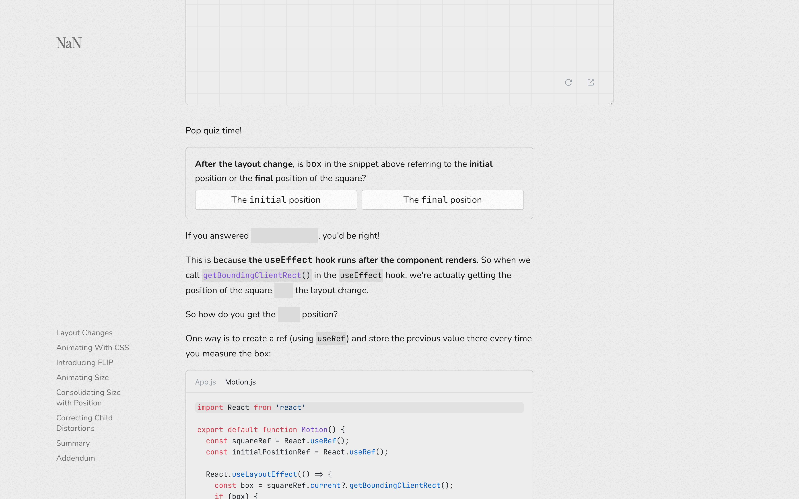
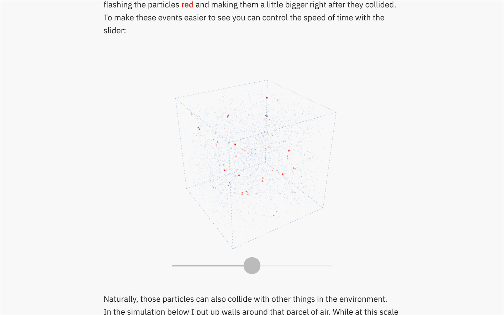
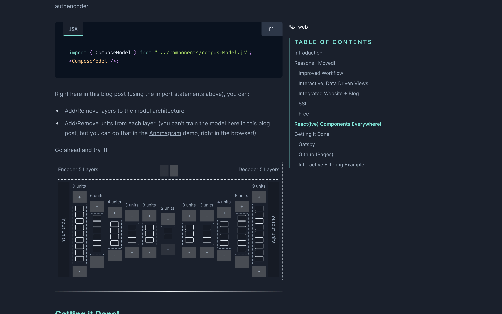
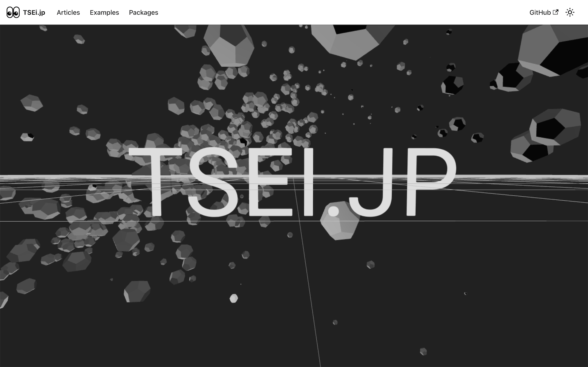
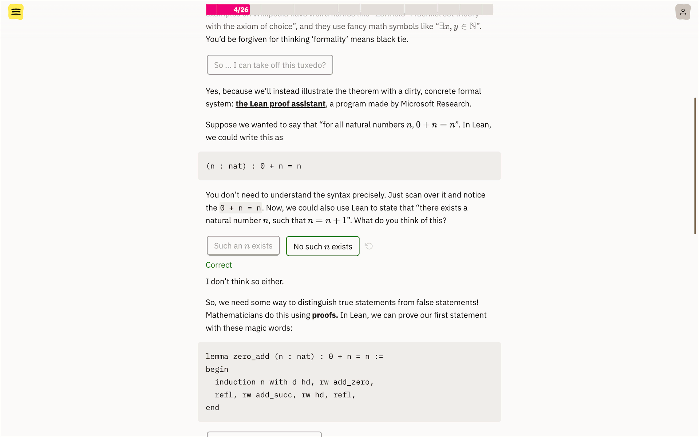

### [Inside Framer's Magic Motion](https://www.nan.fyi/magic-motion)

<figure>

</figure>

### [Sound - Bartosz Ciechanowski](https://ciechanow.ski/sound/)

<figure>

</figure>

### [Victor Dibia](https://victordibia.com/)

<figure>

</figure>

### [TSEI.JP](https://tsei.jp/)

<figure>

</figure>

### [Gödel's first incompleteness theorem](https://tigyog.app/d/H7XOvXvC_x/r/goedel-s-first-incompleteness-theorem)

<figure>

</figure>
