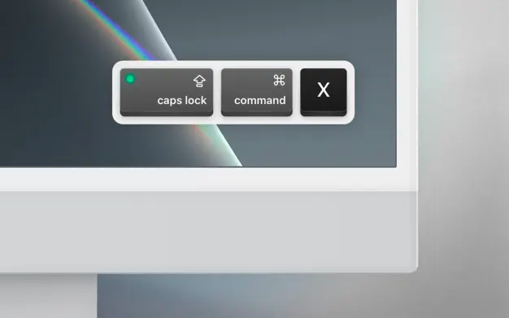

- why isn't there a good mac screen recording app with audio?
- [ffmpeg](./../.././docs/pages/FFMpeg.md) optimization for sharing
- [fiercely overpriced](./../.././docs/pages/Fiercely%20Overpriced.md): time limit for recording. watermarks?

## [Keystroke Pro on the Mac App Store](https://apps.apple.com/us/app/keystroke-pro/id1572206224?mt=12)

<figure>

</figure>

There are also similar bundle sets for cursor, keystrokes, and camera self-view.

<head>
  <html lang="en-US"/>
</head>
