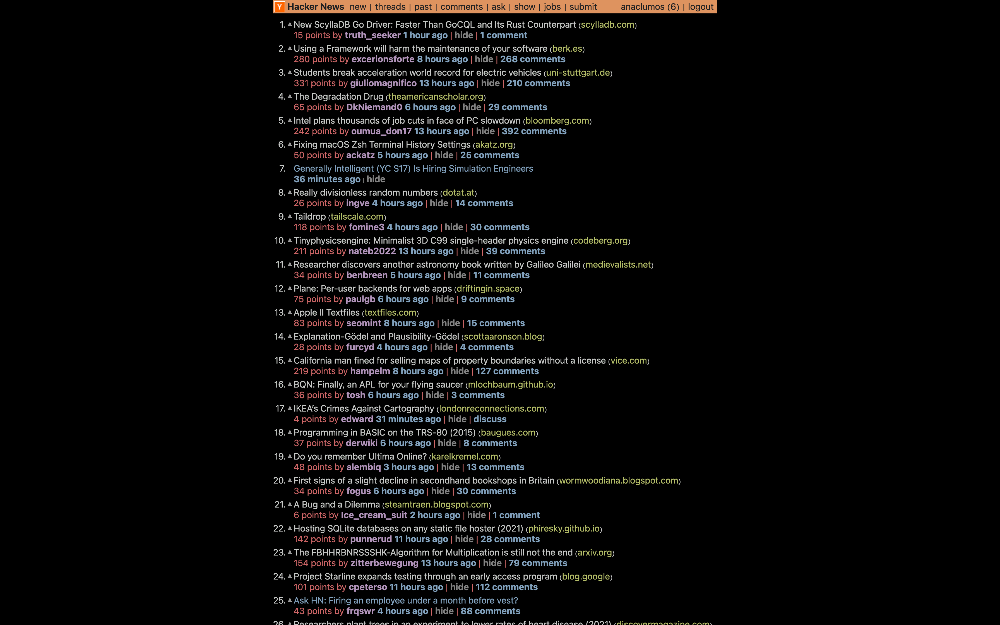
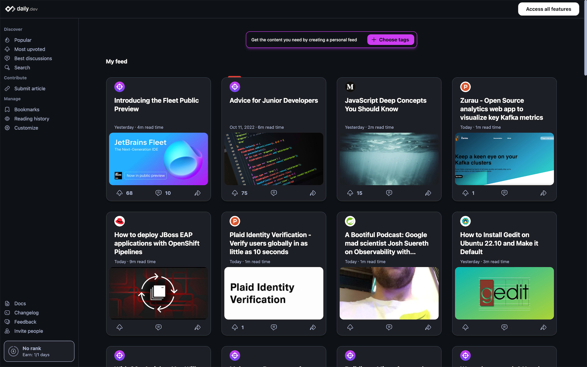
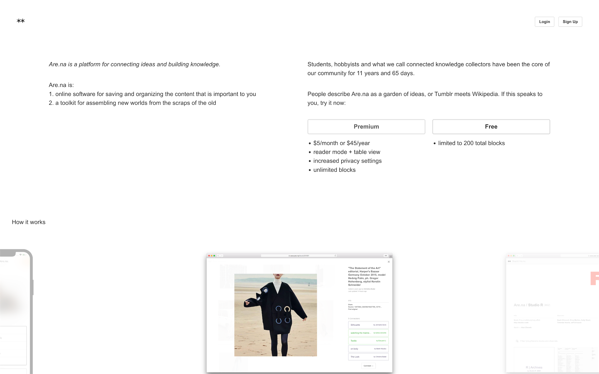

Jumpsite Service, or Web Linking Network Service, is a collective term for a [Social Network Service](./../.././docs/pages/Social%20Network%20Service.md) mainly consisting of links to outside content.

- [Interface (Jumpsite)](./../.././docs/pages/Interface%20%28Jumpsite%29.md)

## [Panda — The homepage for your favorite websites](https://usepanda.com/)

<figure>

</figure>

## [Hacker News](./../.././docs/pages/Hacker%20News.md)

<figure>

</figure>

## [Daily Dev](./../.././docs/pages/Daily%20Dev.md)

<figure>

</figure>

## [Surfit](./../.././docs/pages/Surfit.md)

<figure>

</figure>

## [Are.na (Service)](./../.././docs/pages/Are.na%20%28Service%29.md)

<figure>

</figure>

## [Mood.surf](./../.././docs/pages/Mood.surf.md)

!42DC28.png

<head>
  <html lang="en-US"/>
</head>
