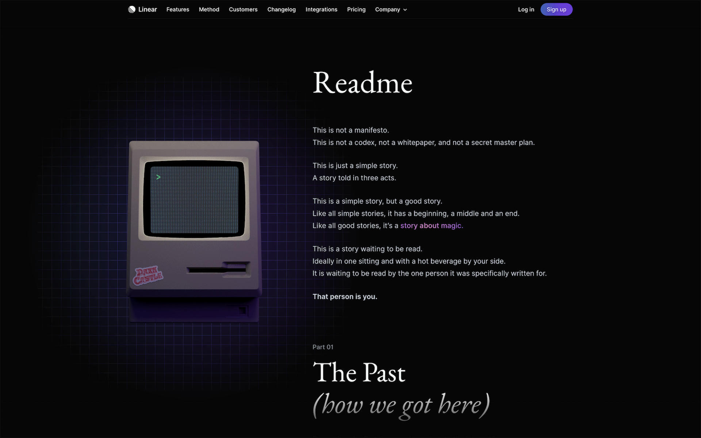

- [README - A story of magic](https://linear.app/readme)

<figure>

</figure>

## The Past _(how we got here)_

Computers are not magic in themselves. It's the software that runs on them, the interaction between bits and atoms, that makes them magical.

> The early pioneers of modern computing described computers as "dream machines"

We look back at these magical moments with nostalgia. What happened to them?

## The Present _(the status quo)_

- Noise and Distraction
- Lack of creativity
- Tools and principles with which we build the future are stuck in the past.

> Error 404: Utopian future not found.
> The magic of software was lost along the way.

## The Future _(the quest we are on)_

> If technology is an expression of humanity's dreams, then the future of technology is only bound by the limits of our dreams.
> We need to bring back the magic of software because it is the only way to push the boundaries of our dreams.
> Because it is the only way to give our dream machines back their real meaning.

<head>
  <html lang="en-US"/>
</head>
