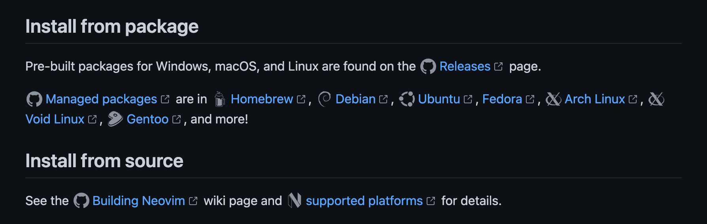
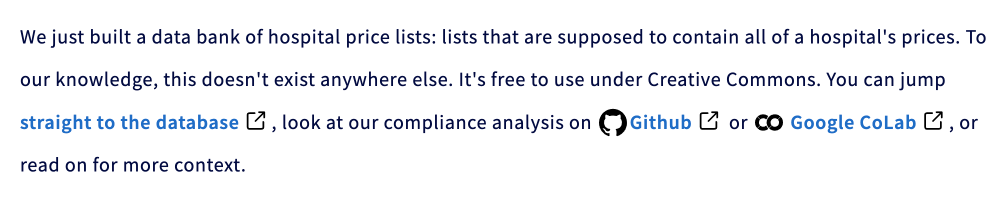
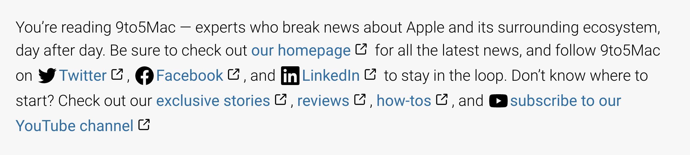
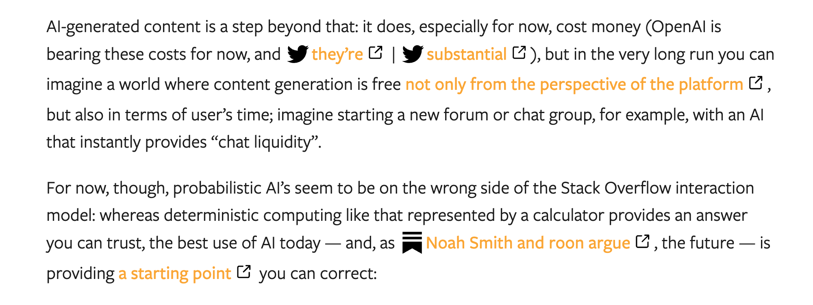
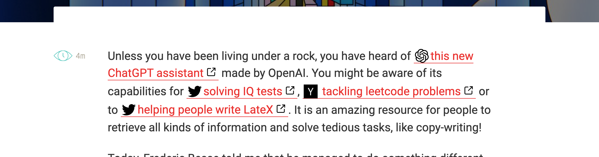
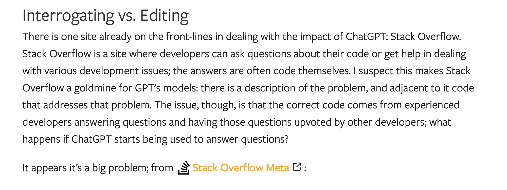
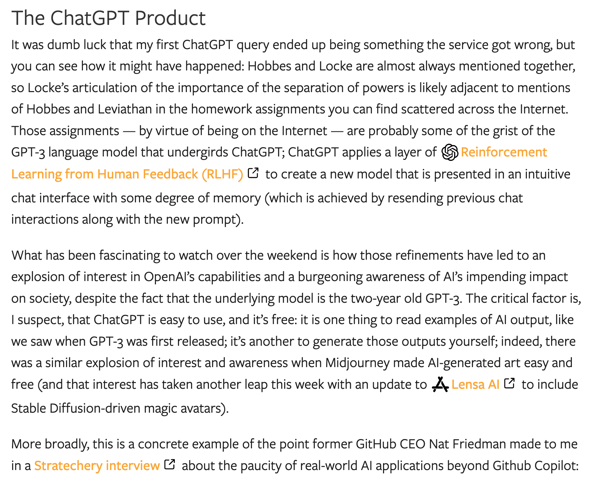
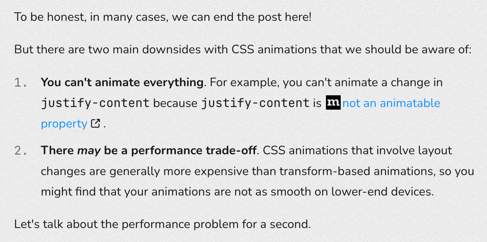
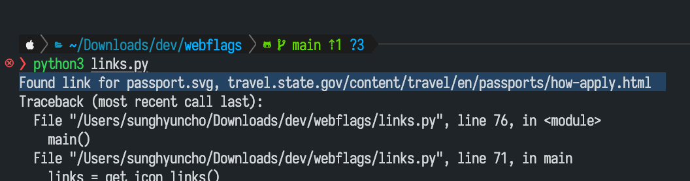
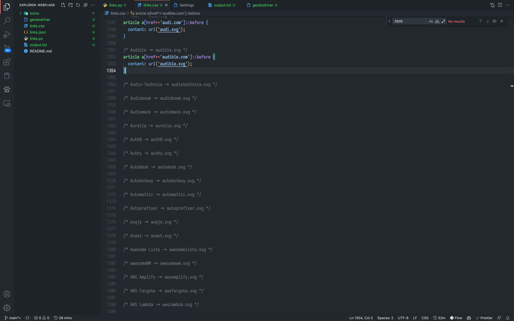

- [Hashflags](./../.././docs/pages/Hashflags.md) for the web
- [anaclumos/linkflags](https://github.com/anaclumos/linkflags)
- [Linkflags Demo](https://youtu.be/Ar9XeVMFXN0)


<figure>




</figure>

<figure>




</figure>

<figure>




</figure>

<figure>




</figure>

<figure>




</figure>

<figure>




</figure>

<figure>




</figure>

<figure>




</figure>

## Process

```applescript
repeat 10000 times
	tell application "Visual Studio Code" to activate
	tell application "System Events"
		key code 125
		key code 125
		key code 124 using command down
		key code 76
		delay 3
		key code 48
	end tell
end repeat
```


<figure>




</figure>

<figure>




</figure>

<head>
  <html lang="en-US"/>
</head>
