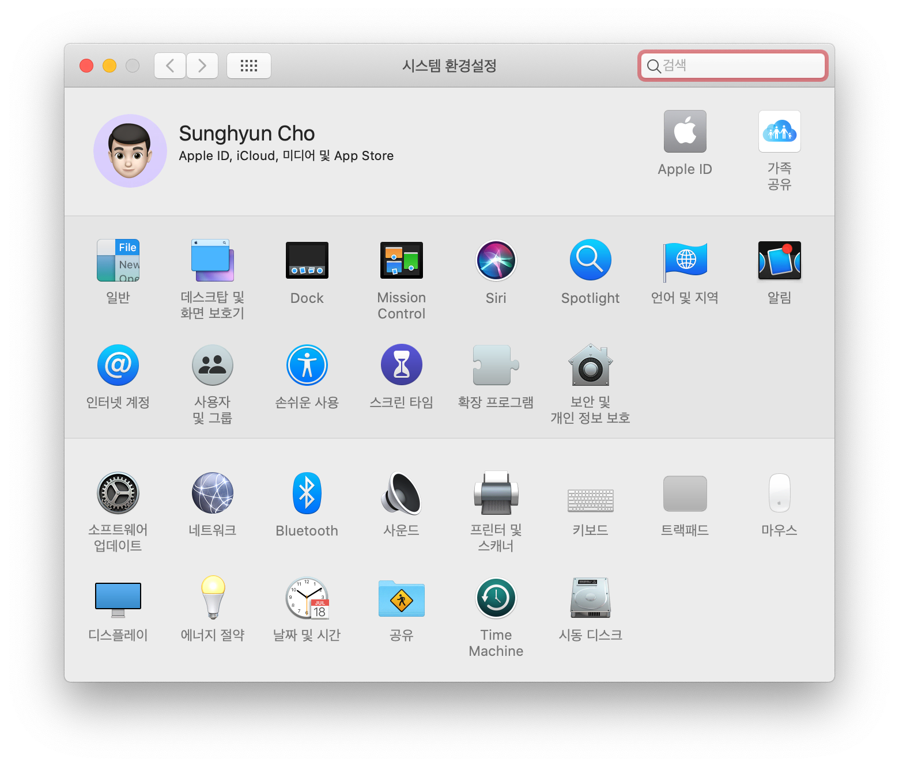
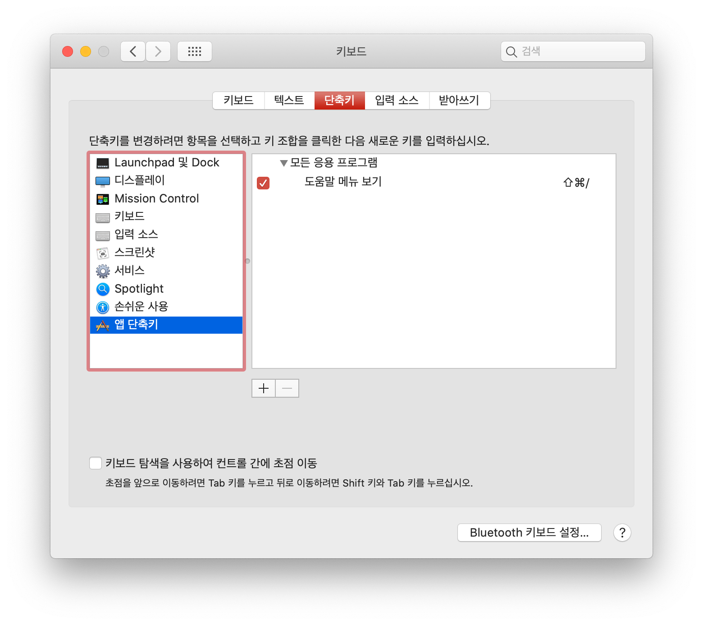
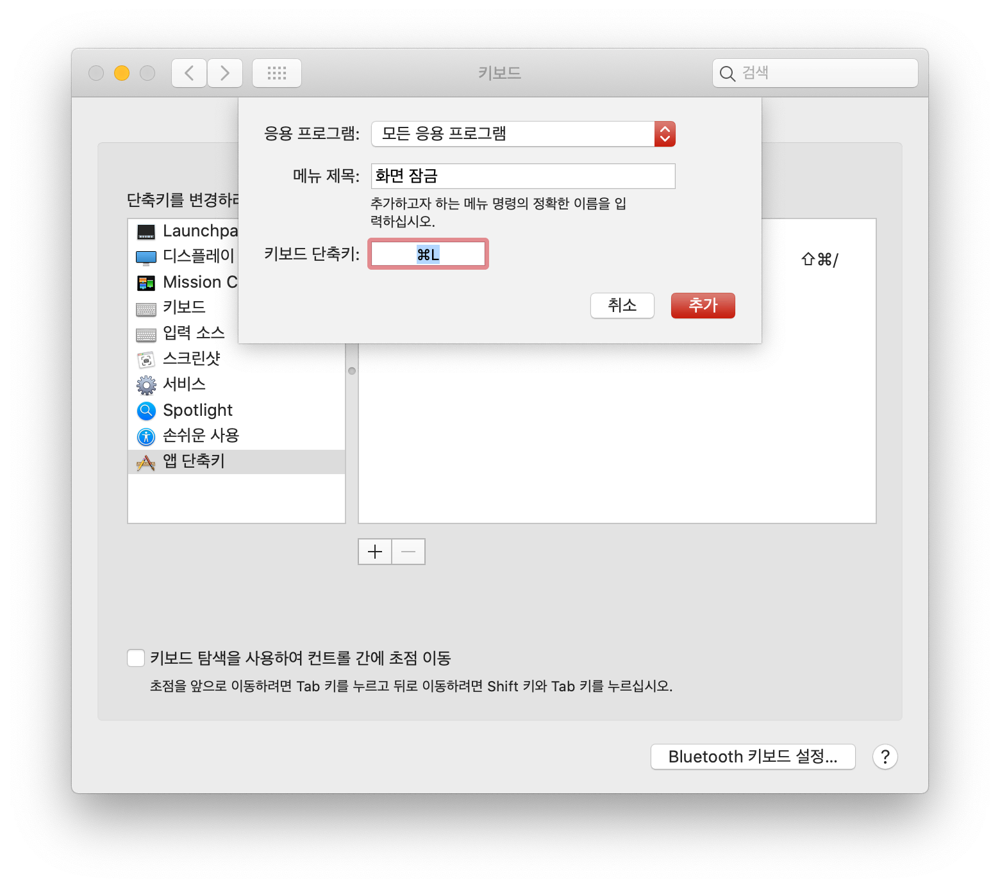

Mac을 사용하면서 유일하게 잘 적응이 되지 않은 부분이 바로 화면 잠금이다. 과거 Windows를 사용하면서 `⊞ Win`+`L`키로 화면을 잠구는 것이 습관이 되었기 때문이다. Mac에도 `핫 코너`라는 기능이 있었지만 `⊞ Win`+`L`처럼 직관적이고 빠르지 못했다. 하지만 macOS Mojave부터 Mac에서도 동일하게 `⌘ Command`+`L`을 사용하여 화면을 잠글 수 있다.

## 참고

이 방법은 macOS를 한글로 사용하는 경우에만 동작한다. macOS를 영문으로 사용하는 경우 아래 글대로 설정하면 된다.

- [Locking your Mac with Command+L](./../.././docs/pages/Locking%20your%20Mac%20with%20Command%2BL.md)

## 방법

1. 시스템 환경설정에 들어간다.

<figure>

<figcaption>시스템 환경설정</figcaption>
</figure>

2. 키보드 → 단축키 → 앱 단축키 설정에 들어가 하단의 `+` 버튼을 누른다.

<figure>

<figcaption>키보드 → 단축키 → 앱 단축키 설정</figcaption>
</figure>

3. 키보드 → 단축키 → 앱 단축키 설정에 들어가 하단의 `+` 버튼을 누른다.3\. 응용 프로그램으로 모든 응용 프로그램을 선택하고, 메뉴 제목에 화면 잠금을 입력한다. 그 다음 키보드 단축키에 `⌘ Command`+`L`을 입력한다. 만약 다른 단축키로 화면을 잠그고 싶다면 그 단축키를 입력하면 된다. 마지막으로 추가 버튼을 누른다.

<figure>

<figcaption>키보드 → 단축키 → 앱 단축키 설정</figcaption>
</figure>

대부분 정상 동작하지만 앱 기본 단축키에 `⌘ Command`+`L`이 포함되어 있는 경우 일시적으로 동작이 되지 않을 수 있다. 대표적으로 시스템 환경설정은 `⌘ Command`+`L`을 환경 설정 전체 메뉴로 돌아가는 단축키로 사용한다. 전체 메뉴에서 다시 `⌘ Command`+`L` 을 누르면 화면이 잠긴다. 이 외에는 아직 `⌘ Command`+`L` 단축키가 동작하지 않는 경우는 보지 못했다.

- [카카오톡](./../.././docs/pages/Kakao.md) Mac 버전에서 ⌘ Command+L을 [카카오톡](./../.././docs/pages/Kakao.md) 잠금 단축키로 사용한다!
- 만약 어떤 앱에서 기본 단축키로 Command + L을 쓰는 바람에 맥이 제대로 잠기지 않는다면, 그 앱에서 Command + L을 쓰는 단축키를 찾아 다른 단축키로 설정해주면 된다.

<figure>

<figcaption>단축키 설정</figcaption>
</figure>

macOS Big Sur부터 Touch ID 버튼을 가볍게 클릭하면 화면을 잠글 수 있다.

<head>
  <html lang="en-US"/>
</head>
