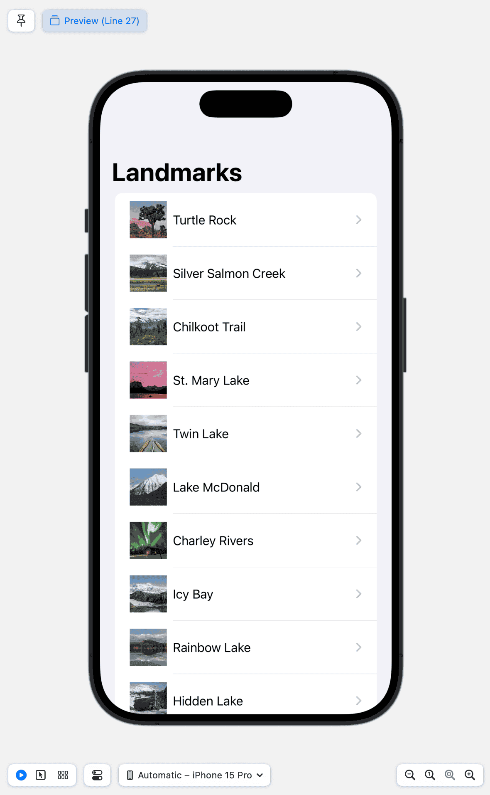

[Master-detail interface](https://en.wikipedia.org/wiki/Master%E2%80%93detail_interface)

Master Detail is a UI that displays various options with a hierarchy.

- [Horizontally Stacked Interface](./../.././docs/pages/Horizontally%20Stacked%20Interface.md)
- [Three Column Design](./../.././docs/pages/Three%20Column%20Design.md)
- [Sliding Master Master Detail](./../.././docs/pages/Sliding%20Master%20Master%20Detail.md)

Master Detail in mobile, tablet (or foldable), and desktop has been thoroughly researched, most notably Apple's:

<figure>

</figure>

;

<Horizontal>

<figure>

</figure>

<figure>

</figure>

</Horizontal>

<Horizontal>

<figure>

</figure>

<figure>

</figure>

</Horizontal>

You get the idea.
