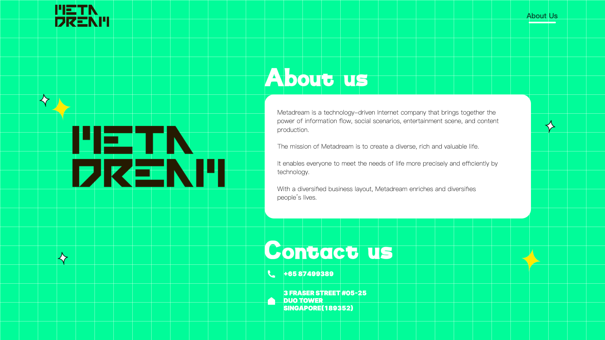

Metadream is a private company in [Singapore](./../.././docs/pages/Singapore.md), established on September 9, 2022, and has offices and data centers in [Singapore](./../.././docs/pages/Singapore.md), [Japan](./../.././docs/pages/%EC%9D%BC%EB%B3%B8.md), [Korea](./../.././docs/pages/%EB%8C%80%ED%95%9C%EB%AF%BC%EA%B5%AD.md), and the [United States](./../.././docs/pages/United%20States%20of%20America.md). One of Metadream's directors is [Chinese](./../.././docs/pages/%EC%A4%91%EA%B5%AD.md) national Yang Yuxiang, the CEO of Yidian Zixun, a [Chinese](./../.././docs/pages/%EC%A4%91%EA%B5%AD.md) news aggregator. Metadream also acquired the [intellectual property](./../.././docs/pages/IP.md) rights of the app True.ly in May 2022 and has since given it a creative and international overhaul.

<figure>

</figure>
