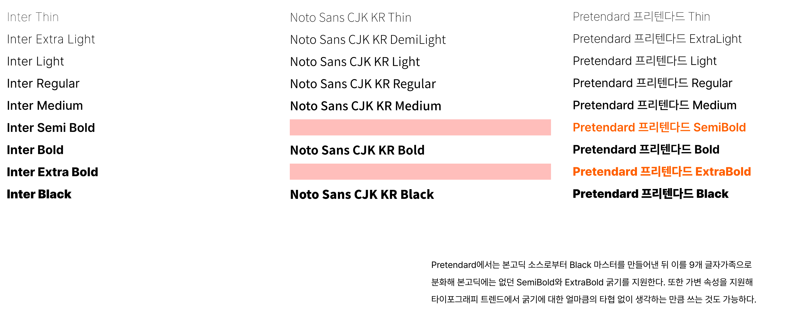
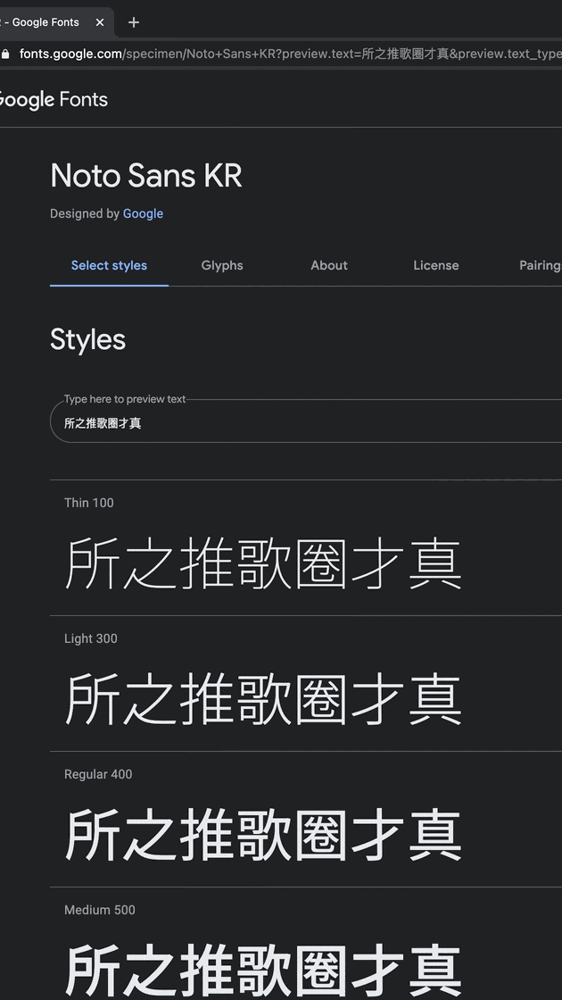

## 한글과 영문의 크기 격차

[Pretendard](./../.././docs/pages/Pretendard.md)를 자세하게 확인해보면, 한글 글자의 크기가 살짝 더 크다.
즉, [Pretendard](./../.././docs/pages/Pretendard.md)의 한글을 94% 정도로 축소하여야 맞다.
이는 유사한 폰트 Interop 및 [Toss Product Sans](./../.././docs/pages/Toss%20Product%20Sans.md)에는 반영되어 있는 사항이다.

- [jhaemin/Interop: The Interop font family](https://github.com/jhaemin/Interop)

## [Font](./../.././docs/pages/Font.md) Family의 Font Weight 매칭 문제

<figure>

</figure>

[Pretendard](./../.././docs/pages/Pretendard.md)에서는 위와 같이 Semibold와 Extrabold 굵기를 지원한다.
자세하게 보면 Noto Sans [CJK](./../.././docs/pages/CJK.md) KR Black은 [Inter](./../.././docs/pages/Inter.md) Extra Bold와 무게가 비슷하다.
즉 스케일이 반대로 되어 있다. Extra Bold에서 Black을 생성했어야 한다.
다만 한글의 경우 영문과 달리 2D로 정보가 전개돼 weight를 늘리면 가독성을 해칠 수 있음을 고려해야 한다.
그럴 경우 Noto의 Black에 맞추어 [Inter](./../.././docs/pages/Inter.md)을 Scale Down하는 방법을 고려할 수 있다.

## [한중일](./../.././docs/pages/CJK.md)의 한문 문제

이는 자세하게 확인하지 못했으나 서울 프로를 개발할 때 알아보고 고려하려고 했던 문제이다.
[Pretendard](./../.././docs/pages/Pretendard.md)가 이 문제를 어떻게 해결하는지 모른다.
Interop의 경우는 아예 처리하지 않은 문제이다.

일반적으로 알려지지 않은 사항이지만, [한중일](./../.././docs/pages/CJK.md)의 한문은 모두 조금씩 다르다.

<figure>

</figure>

허나 한국 한문은 자주 사용되지 않는다는 이유로 일본 한문을 그대로 가져오는 경우가 빈번하다.
이를 한국 한문 → 일본 한문 → 중국 한문 순으로 Fallback 처리하려 했다.

<head>
  <html lang="ko-KR"/>
</head>
