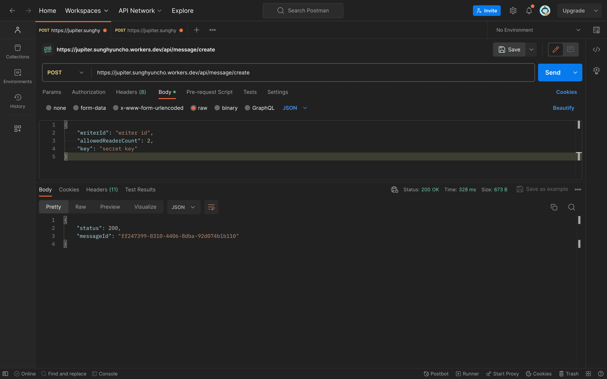
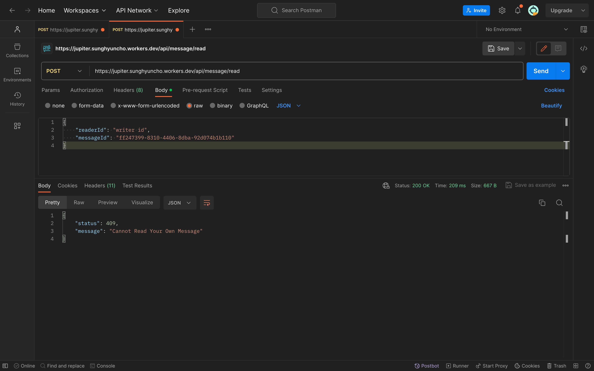

;

- [The Paradoxical Moon Philosophy](./../.././docs/pages/The%20Paradoxical%20Moon%20Philosophy.md)
- [Send Separately](./../.././docs/pages/Send%20Separately.md)
- Callisto is the code name for MessagesExtension
- Europa is the code name for Encryption Key Exchange Server

## [2024-06-12](./../.././docs/journals/2024-06-12.md)

- [Complete Reconsideration of Project Ganymede](./../.././docs/pages/Complete%20Reconsideration%20of%20Project%20Ganymede.md)

## [2024-04-14](./../.././docs/journals/2024-04-14.md)

- Added text placeholders. It was surprisingly hard to do it in UITextView and I'm surprised there's no easy way of doing this.
- Tried to modify ProgressBar but failed
- Completed Read View.

<figure>


</figure>

## [2024-03-19](./../.././docs/journals/2024-03-19.md)

Wrote a simple read view. Added timer for sending action. The send screen is done; all we need to do is the read screen.

Also, AI-gile could be another programming pattern. [Gen Z does not know file directories](./../.././docs/pages/Gen%20Z%20does%20not%20know%20file%20directories.md). The gist is that we don't need to "organize" files as semantic search improves because whatever we search will pop up automatically. Just have a giant file-pile and semantic search when you need something. These searches have now become so smart that they search for synonyms and deeply nested contexts and text inside images.

## [2024-03-15](./../.././docs/journals/2024-03-15.md)

- Added LogTail to Europa
- Implemented Encryption and Attaching

## [2024-03-07](./../.././docs/journals/2024-03-07.md)

<figure>


</figure>

Rewriting Callisto with UIKit. Primarily because of the extensive jumble mess with SwiftUI.

## [2024-02-10](./../.././docs/journals/2024-02-10.md)

Restored server with [FlightControl](./../.././docs/pages/FlightControl.md)

## [2024-01-04](./../.././docs/journals/2024-01-04.md)

Server Crashed. migrating to Fly.io... Because I wanted a Vercel-like experience for backends. However migrating is a pain... because originally I wrote everything as CF workers functions. Such a stress, app is getting delayed and delayed

## [2023-12-24](./../.././docs/journals/2023-12-24.md)

<Horizontal>

<figure>


</figure>

<figure>


</figure>

</Horizontal>

## [2023-12-15](./../.././docs/journals/2023-12-15.md)

<figure>


</figure>

## [2023-11-22](./../.././docs/journals/2023-11-22.md)

- There was a property in `MSMessage` of [shouldExpire](https://developer.apple.com/documentation/messages/msmessage/1649741-shouldexpire). The problem is that the recipient can override to keep the message, which we don't want.
- Implemented Message Reading Functionality
- I implemented proper loading view features, with fade-in and fade-out.

<figure>


</figure>

- Refactored a lot of files

```
Callisto
├── Assets.xcassets
│   ├── Contents.json
│   └── iMessage App Icon.stickersiconset
│       └── Contents.json
├── Base.lproj
│   └── MainInterface.storyboard
├── Callisto.entitlements
├── CallistoLoadingView.swift
├── CallistoMessageReadingView.swift
├── CallistoMessageWritingView.swift
├── CallistoService.swift
├── CallistoView.swift
├── Info.plist
└── MessagesViewController.swift
```

## [2023-11-18](./../.././docs/journals/2023-11-18.md)

- Linked the client side to
  - request server
  - pack it as `MSMessage`
  - send the message
  - dismiss the keyboard & request a compact presentation style
- Pink Bubble?

<figure>


</figure>

## 2023-11-13

- Implemented [Vitest](./../.././docs/pages/Vitest.md) on [Prisma](./../.././docs/pages/Prisma.md) and [Cloudflare Workers](./../.././docs/pages/Cloudflare%20Worker.md)
  - It would be boring to name tests like "A [texts](./../.././docs/pages/Text%20Message.md) B, then C tries to read it" or so, right?

<figure>


</figure>

- Implemented CI on [GitHub Actions](./../.././docs/pages/GitHub%20Actions.md), so that
  - If the [Vitest](./../.././docs/pages/Vitest.md) passes, deploy it to [Cloudflare Workers](./../.././docs/pages/Cloudflare%20Worker.md)

### When Test Fails

- Refuses to Deploy

<figure>


</figure>

### When Test Passes

- Deploys

<figure>


</figure>

## [2023-11-11](./../.././docs/journals/2023-11-11.md)

Used [Prisma](./../.././docs/pages/Prisma.md), [Prisma Accelerate](./../.././docs/pages/Prisma%20Accelerate.md), [PlanetScale](./../.././docs/pages/PlanetScale.md), and [Cloudflare Workers](./../.././docs/pages/Cloudflare%20Worker.md) to create a simple server for the [Ganymede Table Structure](./../.././docs/pages/Ganymede%20Table%20Structure.md). [Prisma](./../.././docs/pages/Prisma.md) layer makes three requests to the [DB](./../.././docs/pages/Database.md) per 1 request to the server, albeit it probably would hit the [Prisma Accelerate](./../.././docs/pages/Prisma%20Accelerate.md) Layer, we can later optimize it with [this document.](https://planetscale.com/blog/integrate-cloudflare-workers-with-planetscale)

### Composing Messages with 3 People Group Chat (Writer, Reader 1, Reader 2)

<figure>



</figure>

### When the Writer Tries to Read (Invalid)

<figure>



</figure>

### When the Reader Tries to Read (Valid)

<figure>


</figure>

### When the Reader Re-requests to Read (Invalid)

<figure>


</figure>

### When Another Reader Requests to Read (Valid)

<figure>


</figure>

### When an Unauthorized User Requests to Read (Invalid)

<figure>


</figure>

### Also

- [PhotoPicker](./../.././docs/pages/PhotoPicker.md)
- Finished reading the Apple Sign-In [UUID](./../.././docs/pages/UUID.md) from the [iMessage App](./../.././docs/pages/iMessage%20App.md) side: had to use App Groups and UserDefaults

## [2023-11-10](./../.././docs/journals/2023-11-10.md)

<figure>


</figure>

## [2023-11-08](./../.././docs/journals/2023-11-08.md)

- It is **possible** to limit [iMessage](./../.././docs/pages/iMessage.md) forwarding for [iMessage Extensions](./../.././docs/pages/iMessage%20App.md)
- It is **possible** to mark the iMessage with `LocalParticipantIdentifier`
- `LocalParticipantIdentifier` is different on all devices
- The most straightforward way would be marking:
  - Set `LocalParticipantIdentifier` to `true` on reading (on the server)
  - Reject if `LocalParticipantIdentifier` is already `true.`
- Problem: If the user deletes and reinstalls the app, `LocalParticipantIdentifier` changes. So the user can read unlimited times if the uninstall & reinstall
- Mitigation: Assign UUID for each message. Each message will have `LocalParticipantIdentifier + RemoteParticipantIdentifiers` count as the `maxRead`. This will at least 'limit' the max read count.
- Problem: on a Group Chat setting, a user can read unlimited times instead of another participant.
- Solution: [Sign in with Apple](./../.././docs/pages/Sign%20in%20with%20Apple.md)?!

## [2023-10-20](./../.././docs/journals/2023-10-20.md)

I can attach many images

<figure>


</figure>

## [2023-10-19](./../.././docs/journals/2023-10-19.md)

- [SwiftUI Metal Shader Effects - iOS 17 - WWDC 2023](https://www.youtube.com/watch?v=yBdY0UKBIx0)
- [Embed the Photos Picker in your app - WWDC23 - Videos - Apple Developer](https://developer.apple.com/videos/play/wwdc2023/10107/)
- [Burn Paper with a Single Shader | Blender Tutorial](https://www.youtube.com/watch?v=i0NcvJtTZG8&t=120s)

<figure>


</figure>

<figure>


</figure>

## [2023-10-16](./../.././docs/journals/2023-10-16.md)

<figure>


</figure>

## [2023-10-13](./../.././docs/journals/2023-10-13.md)

In iOS 17, [Shortcuts](./../.././docs/pages/Shortcuts.md) can send [messages](./../.././docs/pages/Text%20Message.md) without confirmation. Can we use this for [Send Separately](./../.././docs/pages/Send%20Separately.md) or Ganymede?

## [2023-10-12](./../.././docs/journals/2023-10-12.md)

- Read notifications
- Screenshot notifications
- Broadcast
- App Clip + [Apple Login](./../.././docs/pages/Sign%20in%20with%20Apple.md)?
- Therefore, we name it [Project](./../.././docs/pages/Project.md) Ganymede. You can NEVER win [Apple](./../.././docs/pages/Apple.md). It is the most massive system, just like Jupiter. Therefore, we choose to become a moon. The moon of Jupiter. And a moon can be bigger than planets. Ganymede is bigger than Mercury.

## [2023-10-09](./../.././docs/journals/2023-10-09.md)

I finished some working prototypes. Some concerns: It seems like the transcript `MSMessage` is an immutable object. We might consider server approaches, such as KV storage.

<figure>


</figure>

I don't want to store any encrypted or decrypted [messages](./../.././docs/pages/Text%20Message.md) on the server. So we can consider something as:

- When sending a [message](./../.././docs/pages/Text%20Message.md)
  - encrypt [message](./../.././docs/pages/Text%20Message.md)
  - generate [UUID](./../.././docs/pages/UUID.md)
  - write to KV storage as `UUID` → `DecryptKey`
  - send [UUID](./../.././docs/pages/UUID.md) and encrypted [message](./../.././docs/pages/Text%20Message.md) to [iMessage](./../.././docs/pages/iMessage.md)
- When reading the [message](./../.././docs/pages/Text%20Message.md)
  - extract [UUID](./../.././docs/pages/UUID.md) and encrypted [message](./../.././docs/pages/Text%20Message.md)
  - read KV with [UUID](./../.././docs/pages/UUID.md) and delete the `DecryptKey` if any necessary condition is met
  - once it expires, the user cannot read the [message](./../.././docs/pages/Text%20Message.md) again

### Considerations

- How do you store different [strategies](./../.././docs/pages/Strategy.md) (After 5 seconds? 10 seconds? 15 seconds?)
- Group chats
- Photo / Video Payload
- Screenshot detections and notifications

## [Prehistoric](./../.././docs/pages/Prehistoric.md)

- [Project](./../.././docs/pages/Project.md). Disappearing [message](./../.././docs/pages/Text%20Message.md) for [iMessage](./../.././docs/pages/iMessage.md).
- every [message](./../.././docs/pages/Text%20Message.md) self-destructs in 10 seconds
