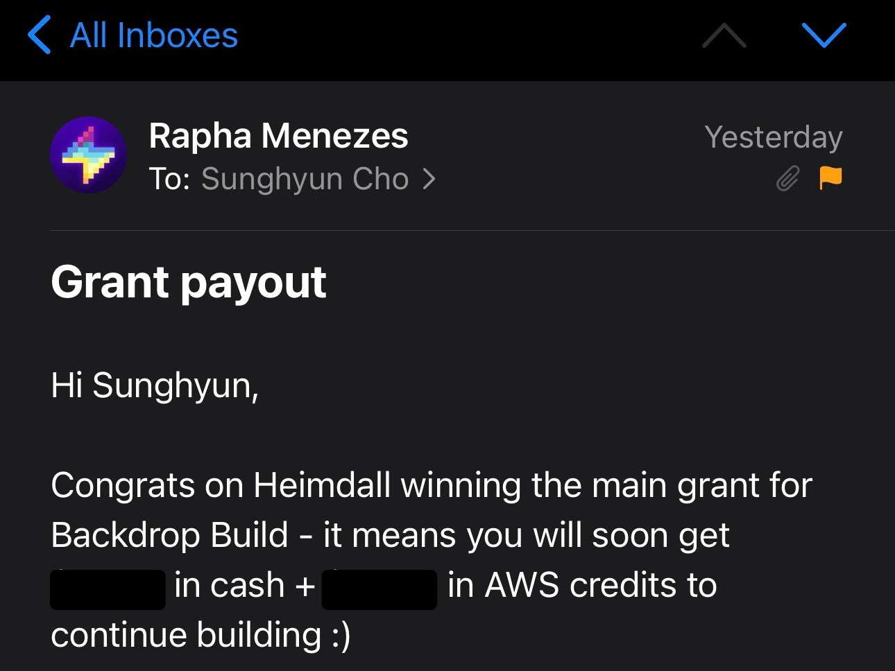

<figure>


</figure>

> Heimdall's All-Seeing Eyes -- Heimdall sees and hears, all thanks to his extrasensory capabilities. His sight can extend across all Nine Realms, and he can see 10 trillion souls from the Bifrost Observatory. Asgardians call him from other worlds, such as Earth, Jotunheim, and Sakaar. [Heimdall On Screen Powers, Enemies, History](https://www.marvel.com/characters/heimdall/on-screen)

## [2023-04-19](./../.././docs/journals/2023-04-19.md)

- [Project Heimdall Initial Planning](./../.././docs/pages/Project%20Heimdall%20Initial%20Planning.md)

## [2023-05-11](./../.././docs/journals/2023-05-11.md)

- [Boring Report](./../.././docs/pages/Boring%20Report.md)

## [2023-05-16](./../.././docs/journals/2023-05-16.md)

- [Project Heimdall Random Names](./../.././docs/pages/Project%20Heimdall%20Random%20Names.md)

## [2023-05-18](./../.././docs/journals/2023-05-18.md)

- [Simple Analytics War Room](./../.././docs/pages/Simple%20Analytics%20War%20Room.md) on [Hacker News](./../.././docs/pages/Hacker%20News.md)

## [2023-06-17](./../.././docs/journals/2023-06-17.md)

- [Project Heimdall Table Structure](./../.././docs/pages/Project%20Heimdall%20Table%20Structure.md)

## [2023-06-18](./../.././docs/journals/2023-06-18.md)

- Honestly, the [GTM](./../.././docs/pages/Go%20To%20Market.md) [strategy](./../.././docs/pages/Strategy.md) for Heimdall is a considerable concern. How are we going to do that?
- [Project Heimdall Locale Transition Strategy](./../.././docs/pages/Project%20Heimdall%20Locale%20Transition%20Strategy.md)
- [Project Linguine](./../.././docs/pages/Project%20Linguine.md)

## [2023-06-20](./../.././docs/journals/2023-06-20.md)

;

<Horizontal>

<figure>


</figure>

<figure>


</figure>

</Horizontal>

Implemented Nav bar!

## [2023-06-21](./../.././docs/journals/2023-06-21.md)

- Implemented Login with Clerk
- 
- The `useLocaleRedirect` caused some problems when a user landed on Heimdall in a non-English locale context and logged in
  - Clerk needs some initial load time, for example, 2s, for the Clerk Login SDK to load
  - After logging in, conditionally loading `<SignIn>` caused an Error on Clerk, that rendering `<SignIn>` when users are logged in is illegal. Thus, Clerk was redirected to the default locale. This happened within the next 2 seconds when Clerk figured that it was logged in and when [React](./../.././docs/pages/React.md) was unmounting the `<SignIn>` widget.
  - Because `useLocaleRedirect` sends to English by default, the original locale will be lost
  - To get over this, I created two features:
    - Save to local storage on the user's locale
    - [redirect](./../.././docs/pages/Redirect.md) within the `useEffect` hook (Warning: Cannot update during an existing state transition (such as within `render`). Render methods should be a pure function of props and state.)
    - 
- Also used HOC to inject callback when `<SignIn>` gets dismissed. Do I have to do this? Really?

  ````tsx
  const withUnmountFunction = (WrappedComponent, onUnmount) => {
    return function (props) {
      useEffect(() => {
        return () => {
          if (typeof onUnmount === 'function') {
            onUnmount()
          }
        }
      }, [])
      return <WrappedComponent {...props} />
    }
  }
  ```

  ```tsx
  const SignInWithUnmountFunction = withUnmountFunction(SignIn, () => {
    setSignInOpen(false)
  })
  ````

## [2023-06-26](./../.././docs/journals/2023-06-26.md)

- Implemented [Create PostgreSQL DB Tables and ORM · Issue #24 · anaclumos/heimdall](https://github.com/anaclumos/heimdall/issues/24)
- How can we scrape the web with [JavaScript](./../.././docs/pages/JavaScript.md) enabled? Problems are Access Restricted SPAs like [Twitter](./../.././docs/pages/Twitter.md).
- [Inngest - Effortless serverless queues, background jobs, and workflows](https://www.inngest.com/)
- [Turns websites into data -- Microlink](https://microlink.io/)
- [microlinkhq/browserless](https://github.com/microlinkhq/browserless): browserless is an efficient way to interact with a [headless](./../.././docs/pages/Headless.md) [browser](./../.././docs/pages/Web%20Browser.md) built in top of Puppeteer.
- [Creating a Background Worker with Exec and Faktory](https://redwoodjs.com/docs/how-to/creating-a-background-worker-with-exec-and-faktory)
- [adamschwartz/web.scraper.workers.dev](https://github.com/adamschwartz/web.scraper.workers.dev): Scrape websites for text by [CSS](./../.././docs/pages/CSS.md) selector.
- [anaclumos/parser-api](https://github.com/anaclumos/parser-api): 🚀 A drop-in replacement for the Postlight Parser API.

## [2023-06-27](./../.././docs/journals/2023-06-27.md)

Created an [MSA](./../.././docs/pages/Microservices%20Architecture.md)-style micro worker that will continuously fetch, load, and summarize [HN](./../.././docs/pages/Hacker%20News.md) contents!

<figure>


</figure>

## [2023-07-11](./../.././docs/journals/2023-07-11.md)

I was very close to shutting down all small locales. It costs too much while driving me so little value. People are spamming the [newsletter](./../.././docs/pages/Newsletter.md) mailing list by enrolling in all lists. I thought all small locale lists were like that so far. But then... I found one Danish user.

<figure>


</figure>

This person was the only one on the Danish list.

But... it changed my mind. I was moved. Ok... I'll keep the small-medium sprachraums.

Every hour, the processor will:

- For all [newsletter](./../.././docs/pages/Newsletter.md) that is
  - non-deleted
  - has a non-deleted subscriber
- Get content from the web
- Generate Summary
- Send [Email](./../.././docs/pages/Mail.md)

Also, instead of having one [newsletter](./../.././docs/pages/Newsletter.md) that could be transformed into many languages, let's start with 30 different [newsletters](./../.././docs/pages/Newsletter.md) covering the same content. That is, separating the linguistic [UI](./../.././docs/pages/UI%20and%20UX.md) from the [newsletter](./../.././docs/pages/Newsletter.md) content. So in a [Korean](./../.././docs/pages/%ED%95%9C%EA%B5%AD%EC%96%B4.md) interface, you can go to [Hacker News](./../.././docs/pages/Hacker%20News.md) [Japanese](./../.././docs/pages/%EC%9D%BC%EB%B3%B8%EC%96%B4.md) version and read the content accordingly.

## [2023-07-13](./../.././docs/journals/2023-07-13.md)

Completed the [Project Linguine](./../.././docs/pages/Project%20Linguine.md) [Engine](./../.././docs/pages/Engine.md). [Linguine Engine Test Drive Result 2023-07-13](./../.././docs/pages/Linguine%20Engine%20Test%20Drive%20Result%202023-07-13.md)

## [2023-07-15](./../.././docs/journals/2023-07-15.md)

[twitter](./../.././docs/pages/Twitter.md)과 마스토돈 따로 다루기

## [2023-07-16](./../.././docs/journals/2023-07-16.md)

[Float UI - Free open source Tailwind UI components & Templates](https://floatui.com/)

## [2023-07-17](./../.././docs/journals/2023-07-17.md)

I am having trouble dealing with the Subscription Recurrence [problem](./../.././docs/pages/Problem.md). Given a subscription table, how would I find all currently scheduled jobs?

- iCalendar RFC 5545?
- Cron notation?

## [2023-07-30](./../.././docs/journals/2023-07-30.md)

Halted, switched to a more conventional [Docusaurus](./../.././docs/pages/Docusaurus.md) with [Listmonk](./../.././docs/pages/Listmonk.md). Consider [Project](./../.././docs/pages/Project.md) [Done](./../.././docs/pages/Done.md).

- Impossible to create subscriptions with [Toss Payments](./../.././docs/pages/Toss%20Payments.md) with international audience
- Burnt out
- Will seek out sponsorships more

## [2023-08-01](./../.././docs/journals/2023-08-01.md)

<figure>


</figure>

## [2023-08-02](./../.././docs/journals/2023-08-02.md)

[Heimdall Bogus Subscribers Attack Incident](./../.././docs/pages/Heimdall%20Bogus%20Subscribers%20Attack%20Incident.md)

## [2023-08-07](./../.././docs/journals/2023-08-07.md)

Added RSS Support. [RSS Support · Issue #16 · anaclumos/heimdall](https://github.com/anaclumos/heimdall/issues/16)

## [2023-08-08](./../.././docs/journals/2023-08-08.md)

- Resend made SMTP, will try it out
- [isCategoryIndex function does not propagate to URL generations · Issue #9213 · facebook/docusaurus](https://github.com/facebook/docusaurus/issues/9213)

## [2023-11-03](./../.././docs/journals/2023-11-03.md)

- i still want to make a koreanic name
- pabal.ai
- saja.ai

## [2023-11-06](./../.././docs/journals/2023-11-06.md)

- 들려옴
- 전해옴
- 이야기
- 나돌이
- 자자
- 왜자하다
- 가납사니
- 번설
- 담
- 곤여 (큰 땅)
- 보빙사
- 통리기무아문
- 저잣거리
- 수다
- 역마살
- 왁자지껄
- 도란도란
- 연
- 방패연

## [2023-12-07](./../.././docs/journals/2023-12-07.md)

<blockquote class="twitter-tweet">

I ₩ the Backdrop Build hackathon! 👑👑👑

Thank you so much for the grant [@withBackdrop](https://twitter.com/withBackdrop?ref_src=twsrc%5Etfw) [@AWSstartups](https://twitter.com/AWSstartups?ref_src=twsrc%5Etfw)!

Built with [@nextjs](https://twitter.com/nextjs?ref_src=twsrc%5Etfw) server actions and [@vercel](https://twitter.com/vercel?ref_src=twsrc%5Etfw) postgres, [@LangChainAI](https://twitter.com/LangChainAI?ref_src=twsrc%5Etfw), [@OpenAI](https://twitter.com/OpenAI?ref_src=twsrc%5Etfw), [@Azure](https://twitter.com/Azure?ref_src=twsrc%5Etfw) cognitive services, and [@resendlabs](https://twitter.com/resendlabs?ref_src=twsrc%5Etfw), [@docusaurus](https://twitter.com/docusaurus?ref_src=twsrc%5Etfw) and many more!

[Original Post Link](https://t.co/EZ9jwQnW2c)

&mdash; Sunghyun Cho (@anaclumos) [December 7, 2023](https://twitter.com/anaclumos/status/1732701132072620214?ref_src=twsrc%5Etfw)

</blockquote>

아싸

<figure>



</figure>

일단 [API](./../.././docs/pages/API.md) 비용은 한숨 덜겠다!

그리고 Korean Won이 I Won할 때랑 같아서 뭔가 의미심장하게 재밌고 좋다

## [2023-12-23](./../.././docs/journals/2023-12-23.md)

Metaphor [API](./../.././docs/pages/API.md) looks great for Naroo

<figure>


</figure>
