- [Case Study](./../.././docs/pages/Case%20Study.md)

## Home Page

- Resembles an [OS](./../.././docs/pages/OS.md) with a magnifying dock at the bottom.
- Has alphanumeric morphing, as if it is finding [Information amongst Data](./../.././docs/pages/Information%20amongst%20Data.md)

<figure>

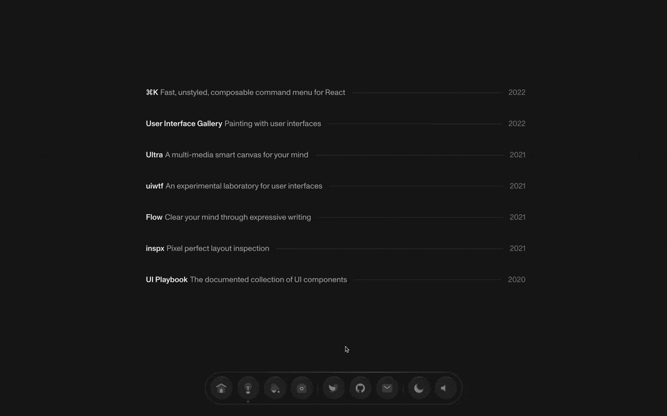

</figure>

## [https://flow.rest](https://flow.rest/)

Interesting [Extracranial](./../.././docs/pages/Extracranial.md) [Tools for Thought](./../.././docs/pages/Tools%20for%20Thought.md) ([Data Capturers](./../.././docs/pages/Data%20Capturers.md))

<figure>

</figure>

## [Ultra](https://ultra.tf/)

- Clipboard goes into [Infinite Canvas](./../.././docs/pages/Infinite%20Canvas.md)

<figure>

</figure>

## Miscellany related to [UI](./../.././docs/pages/UIUX.md)

### [UI Playbook](https://uiplaybook.dev/)

<figure>

</figure>

### [inspx — pixel perfect layout inspection](https://inspx.rauno.xyz/)

<figure>

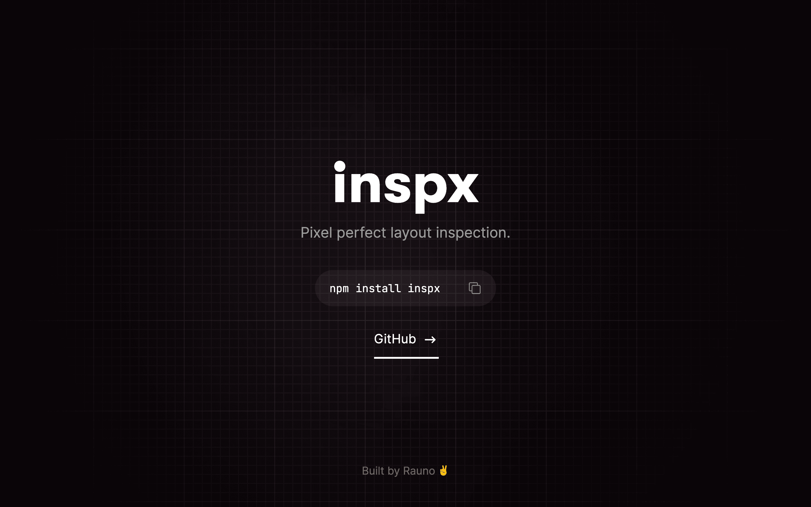

</figure>

### [User Interface Gallery](https://ui.gallery/#dynamic-cards)

<figure>

</figure>

<figure>

</figure>

<figure>

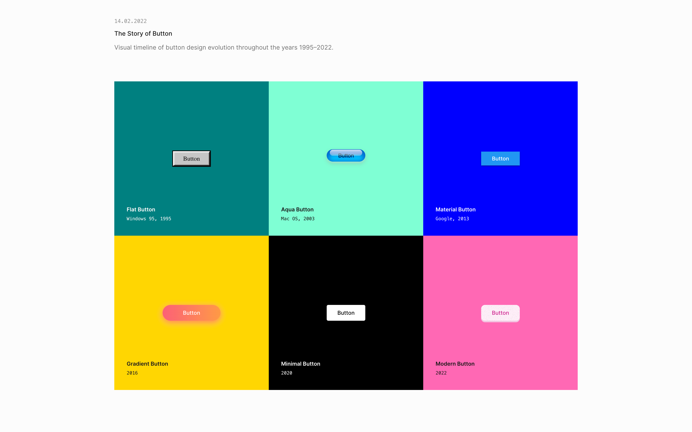

</figure>

<figure>

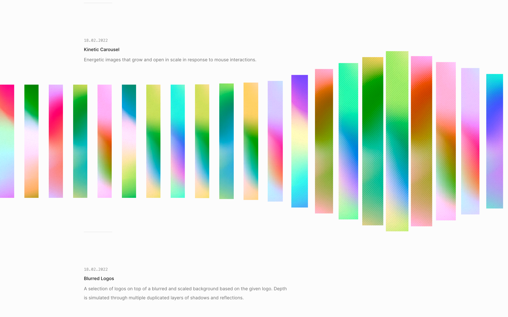

</figure>

<figure>

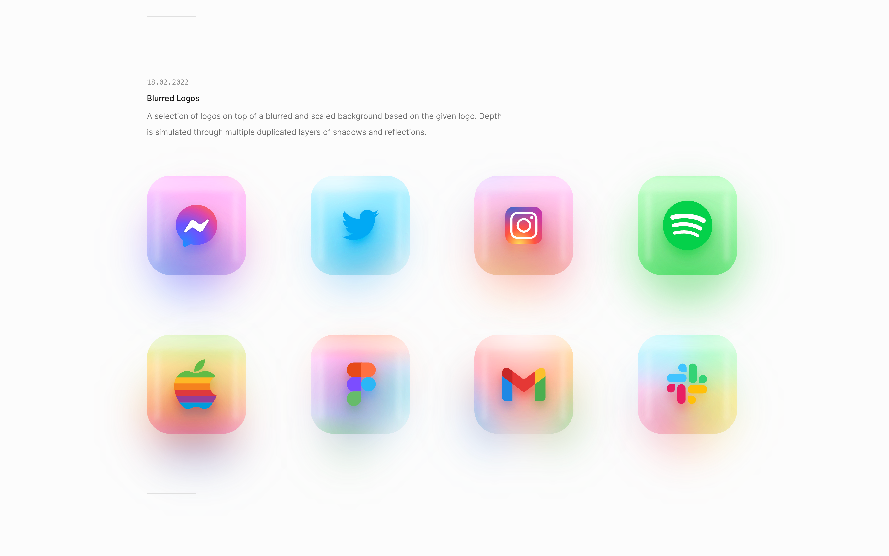

</figure>

<figure>

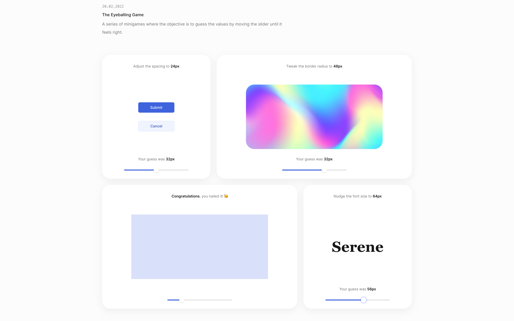

</figure>

## [uiwtf — an experimental laboratory for user interfaces](https://uiw.tf/)

<figure>

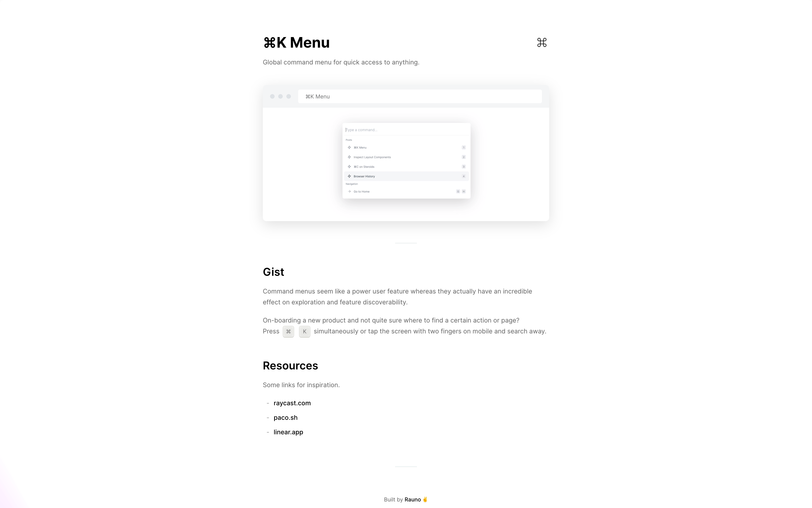

</figure>

<figure>

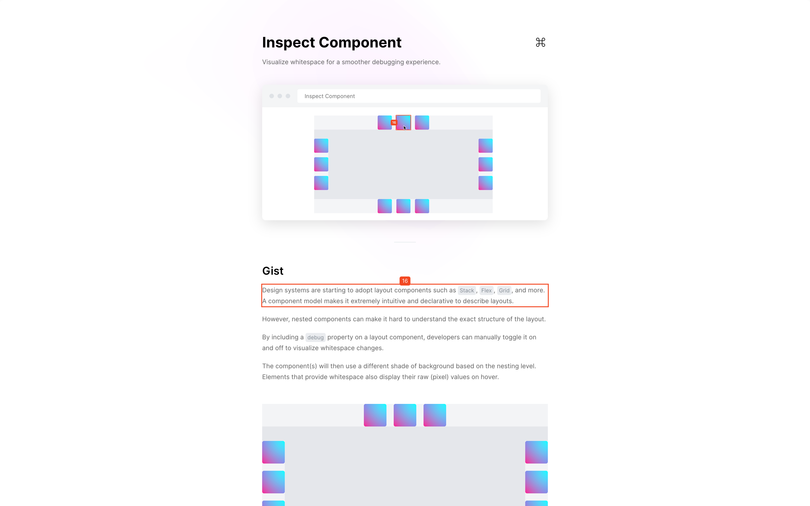

</figure>

<figure>

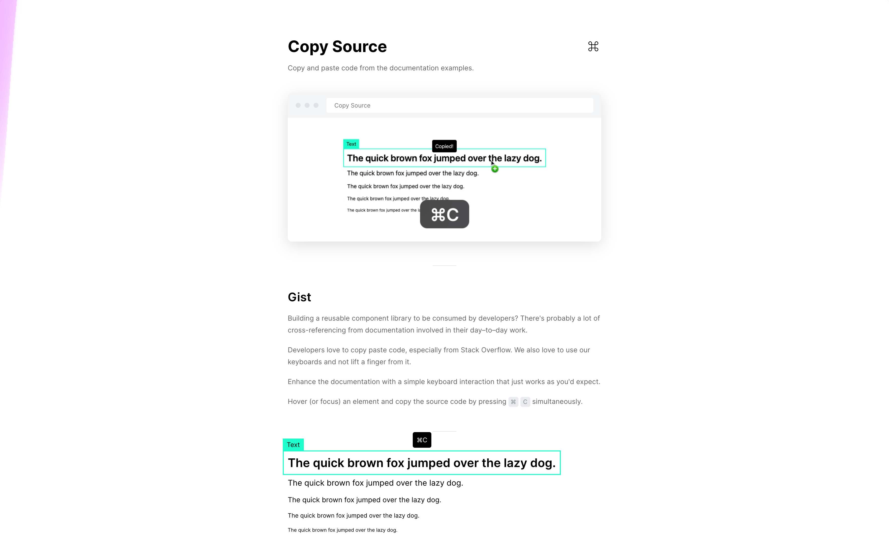

</figure>

<figure>

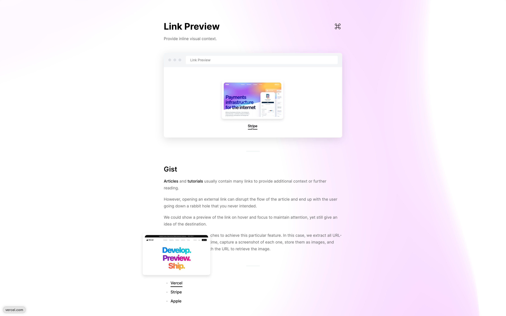

</figure>

<figure>

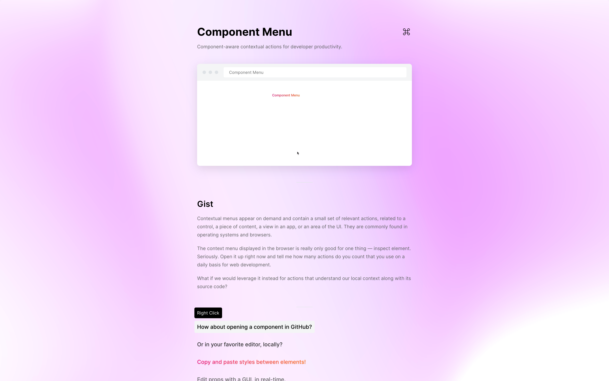

</figure>

<figure>

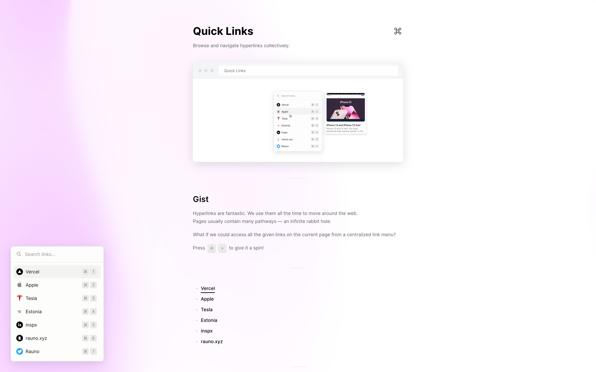

</figure>

<figure>

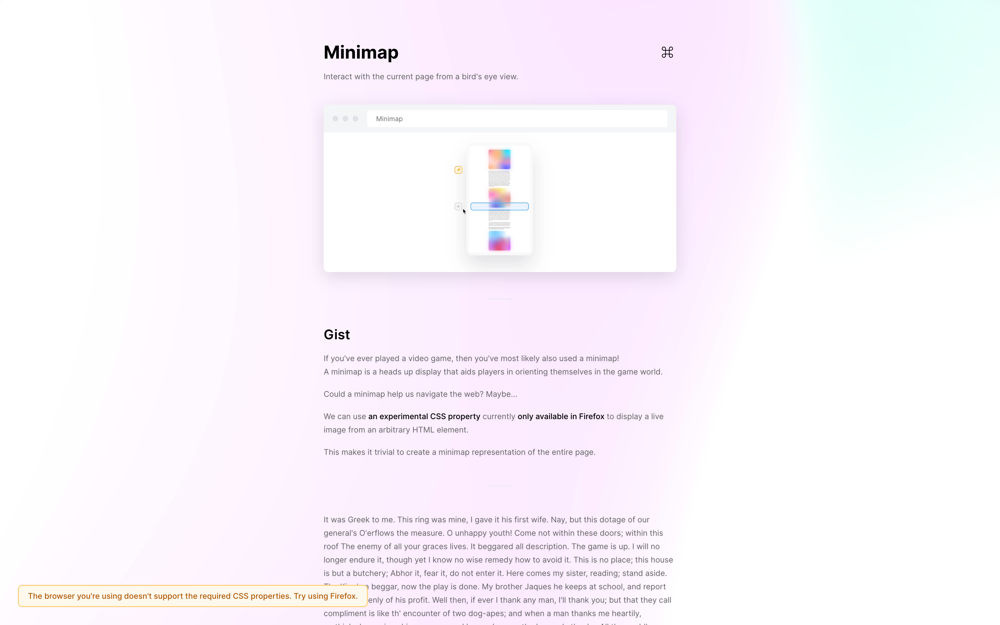

</figure>

<head>
  <html lang="en-US"/>
</head>
