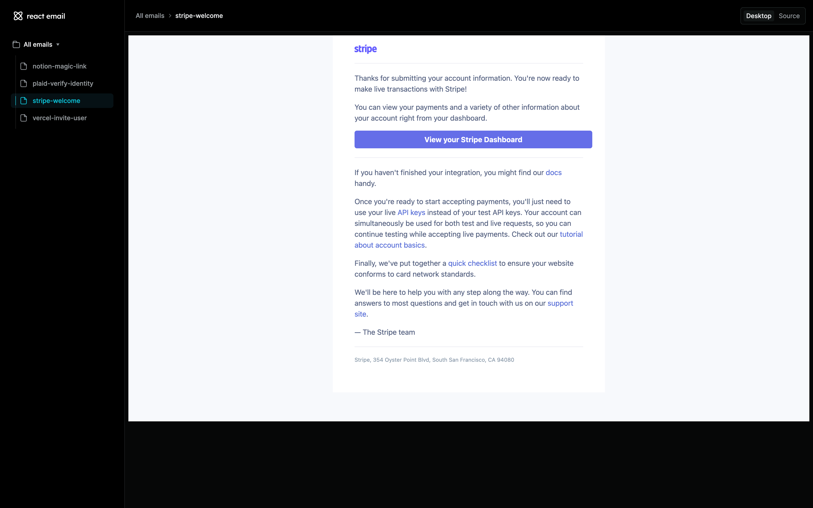

Seems like instead of making emails interactive like [AMP Email](./../.././docs/pages/AMP%20Email.md)

- [React Email](https://react.email/)

<figure>

</figure>

<figure>

</figure>

<head>
  <html lang="en-US"/>
</head>
