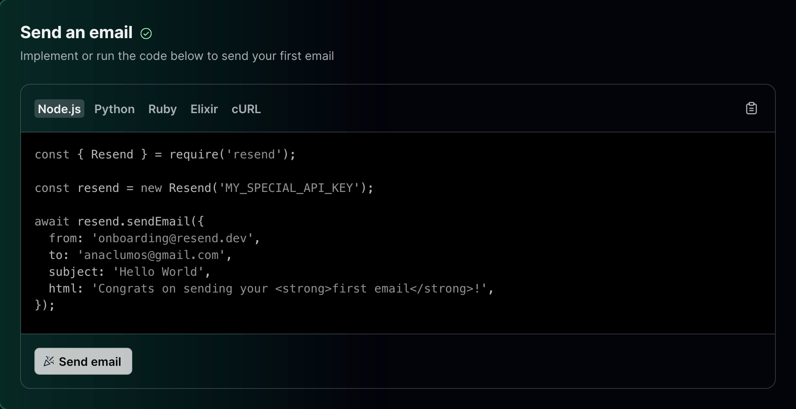

Resend is a powerful and versatile email [API](./../.././docs/pages/API.md) service for developers designed to make the process of sending transactional emails simple, reliable, and effective. It offers a set of tools that can be easily integrated into your codebase, with SDKs available for several popular programming languages.

<figure>

</figure>

<figure>

</figure>

<figure>

</figure>

I am one of the first customers 😃

<figure>

</figure>
