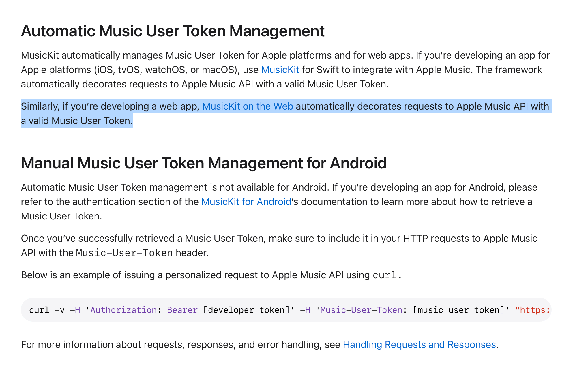
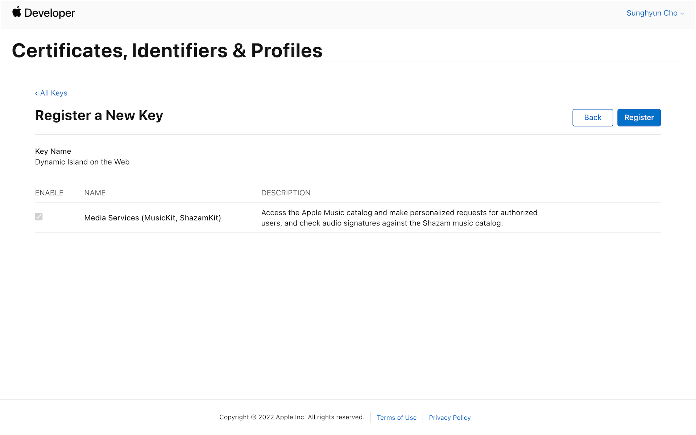
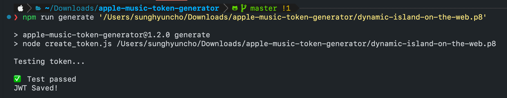
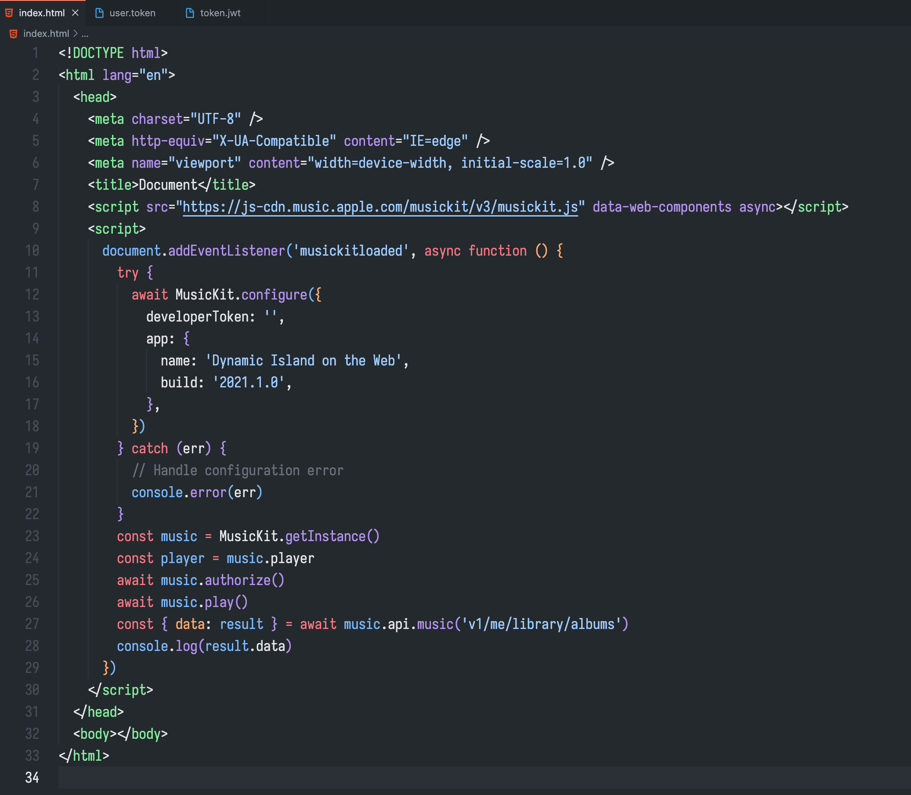
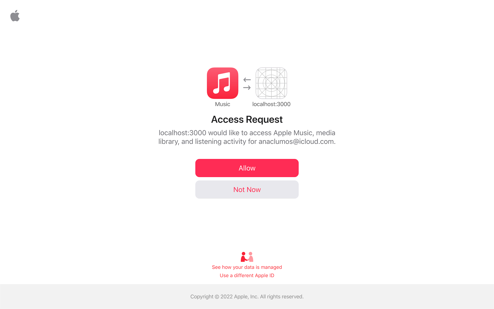
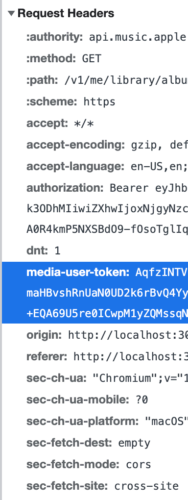
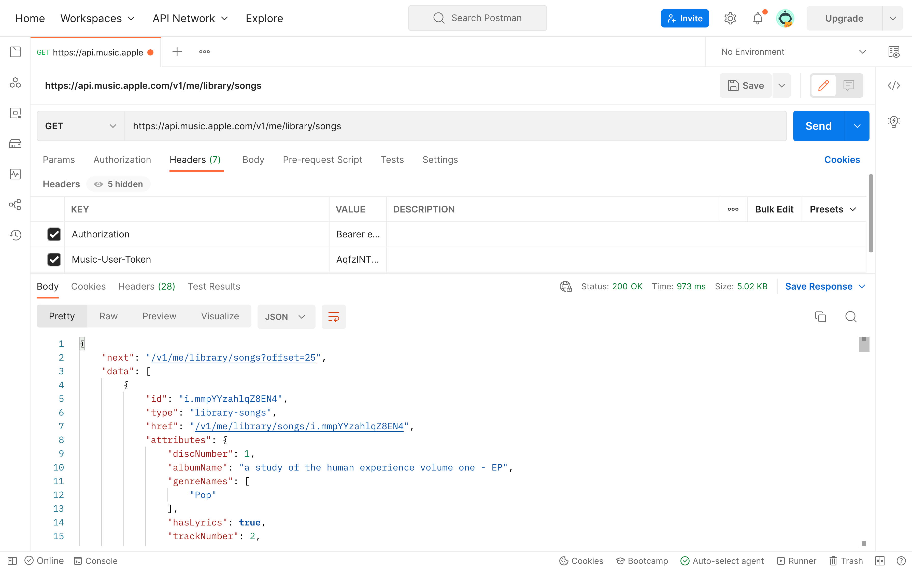
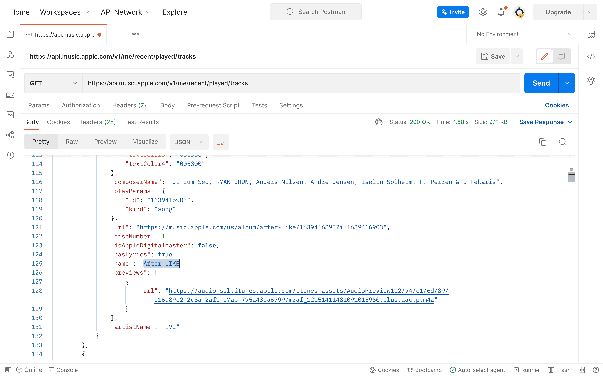
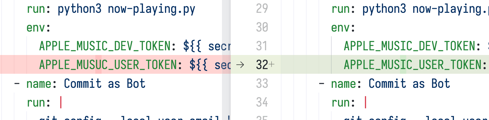

As a part of [Dynamic Island on the Web](./../.././docs/pages/Dynamic%20Island%20on%20the%20Web.md), I reverse-engineered [Apple Music API](./../.././docs/pages/Apple%20Music%20API.md) to get the undocumented Personal Token.
It doesn't mention how to get that token!
[Apple Music API](./../.././docs/pages/Apple%20Music%20API.md) [DX](./../.././docs/pages/DX.md) is way worse than Spotify's.

<figure>

</figure>

## Registering for Apple Developer Key

- Create an Identifier for your Service.
- Register a Key.

<figure>

</figure>

## Creating [Apple Music API](./../.././docs/pages/Apple%20Music%20API.md) Key

- Used [pelauimagineering/apple-music-token-generator](https://github.com/pelauimagineering/apple-music-token-generator) to get the token.

<figure>

</figure>

## Using MusicKit to extract the User Token

- By creating a demo website, I could authenticate with my Apple ID and get the User Token.

<figure>

</figure>

<figure>

</figure>

<figure>

</figure>

## Testing the API Key

<figure>

</figure>

<figure>

</figure>

## Making it into a [GitHub Actions](./../.././docs/pages/GitHub%20Actions.md)

- [anaclumos/now-playing](https://github.com/anaclumos/now-playing)
- This took me an hour to figure out...

<figure>

</figure>

<head>
  <html lang="en-US"/>
</head>
